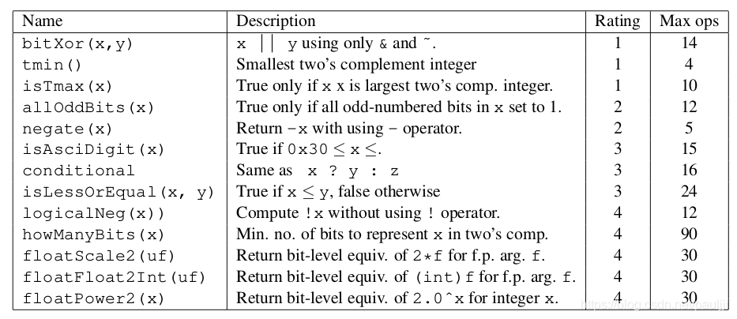
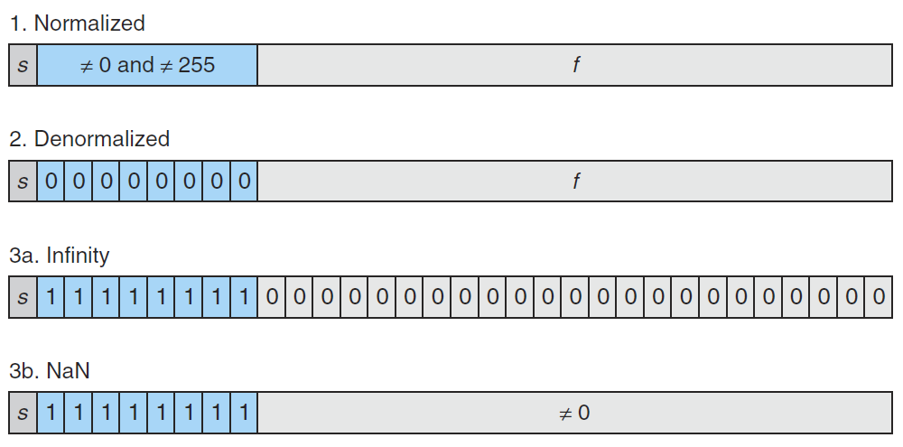
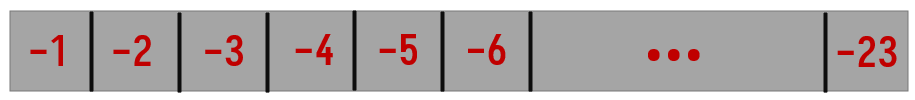
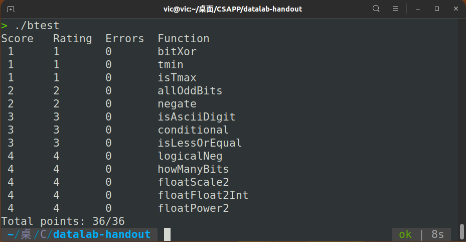

# 总览



# Problem-int

## bitXor

 * bitXor - x^y using only ~ and & 
 * Example: bitXor(4, 5) = 1
 * Legal ops: ~ &
 * Max ops: 14

要求只用“非”和“与”来表示“异或”。首先想到“异或的非=同或”：<!--more-->
$$
\begin{aligned}x\oplus y&=\overline{x}y+x\overline{y}\newline
&=\overline{\overline{\overline{x}y}\cdot\overline{\overline{y}x}}\newline
&=\overline{(x+\overline{y})\cdot(\overline{x}+y)}\newline
&=\overline{xy+\overline{x}\overline{y}}
\end{aligned}
$$
将里面的“或”变成“和”，只需利用德摩根定律：
$$
\begin{aligned}
\overline{xy+\overline{x}\overline{y}}=\overline{x\cdot y}\cdot\overline{\overline{x}\cdot\overline{y}}
\end{aligned}
$$

```c
int bitXor(int x, int y) {
	return ~(x&y)&(~x&~y);
}
```

## tmin

* tmin - return minimum two's complement integer 
 * Legal ops: ! ~ & ^ | + << >>
 * Max ops: 4

对于32位int, Tmin = 0x80000000, 将 1 左移31位即可

```c
int tmin(void) {
	return 1<<31;
}
```

## isTmax

 * isTmax - returns 1 if x is the maximum, two's complement number,
 * and 0 otherwise 
 * Legal ops: ! ~ & ^ | +
 * Max ops: 10

首先，我们知道 Tmax = 0x7FFFFFFF, 不难想到求 Tmax+1 = Tmin = 0x80000000。观察可知，`~(Tmax+1) = Tmax`，只需判断 `~(x+1)` 与 x 是否相等即可得出结论。但是，题目要求不能用等于号，于是利用 x^x = 0 的性质进行判断，即 `return !~(x+1)^x`。

然而，这样是过不了的。仔细揣摩，-1 = 0xFFFFFFFF。对其进行加1后，该操作数会被截断，高位进位无效，使得结果为0x00000000，每一位刚好也和-1的每一位互补。因此，x = -1的情况是需要特判的。

在C语言中，非0即为真。利用 x+1=0 时结果为假这一特点，当 x = -1 时，! (x+1) = 1, 再用 ! (x+1) 与 原判式 !$ \sim $(x+1)^x 进行或运算，即 `(~(x+1)^x)|!(x+1)`, 则该式在 x = -1 时一定为真，x != -1 时真假就一定取决于 `~(x+1)^x` 。

```c
int isTmax(int x) {
	return !(~(x+1)^x|!(x+1));
}
```

## allOddBits

* allOddBits - return 1 if all odd-numbered bits in word set to 1
 * where bits are numbered from 0 (least significant) to 31 (most significant)
 * Examples allOddBits(0xFFFFFFFD) = 0, allOddBits(0xAAAAAAAA) = 1
 * Legal ops: ! $ \sim $ & ^ | + << >>
 * Max ops: 12

这道题本身是很简单的，很容易想到构造一个32位的奇数位全为1的数 y = 0xAAAAAAAA，将其与 x 进行与运算，如果结果仍为 y, 则 x 的奇数位均为 1.

但要注意本实验的一个要求：

> Integer constants 0 through 255 (0xFF), inclusive. You are not allowed to use big constants such as 0xffffffff.

考虑先构造0xAA, 然后利用移位操作得到 0xAAAAAAAA。

```c
int allOddBits(int x) {
	int y = 0xAA + (0xAA << 8);
	y = y + (y << 16);
	return !((x&y)^y);
}
```

## negate

 * negate - return -x 
 * Example: negate(1) = -1.
 * Legal ops: ! ~ & ^ | + << >>
 * Max ops: 5

很基础的结论： `~x + x = -1`

```c
int negate(int x) {
	return ~x+1;
}
```

## isAsciiDigit

 * isAsciiDigit - return 1 if 0x30 <= x <= 0x39 (ASCII codes for characters '0' to '9')
 * Example: 
   * isAsciiDigit(0x35) = 1
   * isAsciiDigit(0x3a) = 0
   * isAsciiDigit(0x05) = 0
 * Legal ops: ! ~ & ^ | + << >>
 * Max ops: 15

0x30 = 0...0 00

11 0000

0x39 = 0...0 0011 1001

1. 先检查高26位是否全为0，作为条件1

   ```c
   int flag1 = !(x >> 6);
   ```

2. 再检查中间是否为0011，作为条件2

   ```c
   int flag2 = !(0b11 ^ (x >> 4));
   ```

3. 最后检查末尾4位是否在0000与1001之间， 先得到最后四位数

   ```c
   int y = x & (0xF);
   ```

4. y 在 0 到 9 之间，则 y - 10 < 0，由于符号限制，我们通过移位后判断符号位来作为条件3。由于不能用减法，可以通过`-x = ~x +1`达到目的

   ```c
   int flag3 = (y + ~0xA + 1) >> 31;
   ```

```c
int isAsciiDigit(int x) {
	return (!(x >> 6)) & (!(0b11 ^ (x >> 4))) & (((x & (0xF)) + ~0xA + 1) >> 31);
}
```

## conditional

 * conditional - same as x ? y : z 
 * Example: conditional(2,4,5) = 4
 * Legal ops: ! ~ & ^ | + << >>
 * Max ops: 16

这个题很基础
$$
F = \overline xz+xy
$$
先将 x 归整化

```c
x = !x
```

当 $x=0$时， y = 0x00000001, 考虑 $\sim y+1 =$ 0xFFFFFFFF

当 $x\neq0$时， y = 0, 考虑 $~\sim(\sim y+1) =$ 0xFFFFFFFF

```c
int conditional(int x, int y, int z) {
	x = ~(!x)+1;
	return (x&z)+(~x&y);
}
```

## isLessOrEqual

* isLessOrEqual - if x <= y  then return 1, else return 0 
 * Example: isLessOrEqual(4,5) = 1.
 * Legal ops: ! ~ & ^ | + << >>
 * Max ops: 24

考虑 x - y

当 y 与 x 同号时，x - y 不会溢出，因此判断 x - y 的符号即可

当 y 与 x 异号时，x - y 可能会溢出，这时只分别判断 y 和 x 的符号即可

首先利用移位操作，分别得到 x, y 的符号位。

```c
int signx = (x >> 31) & 1;
int signy = (y >> 31) & 1;
```

1. 设置情况flag1, x负 y正，满足情况，返回1；x正 y负，返回0

   |  正负   | signx | signy | 返回值 |
   | :-----: | :---: | :---: | :----: |
   | x正 y负 |   0   |   1   |   0    |
   | x负 y正 |   1   |   0   |   1    |

   ```c
   int flag1 = signx & (!signy)
   ```

2. **在x, y 同号的前提下**，计算 x - y，也就是 `x+~y+1`, 移位取符号位。

   但是要注意到：x = y 时，`x+~y+1 = 0`的符号位为0，与 x < y 时的符号位为 1 不同，因此，x = y 的情况需要特判。

   我在这里用了一种较为巧妙的办法，$x\leq y$ 等价于$x <y + 1$ , 使x = y + 1 时，符号位才为0，只需要将`x+ ~y+1`减 1 即可。

   即最终求 `x+~y` 的符号位。

   ```c
   int e = signx ^ signy; //同号
   int flag2 = ((!e) & ((x + ~y) >> 31) & 1);
   ```

```c
int isLessOrEqual(int x, int y) {
	int signx = (x >> 31) & 1;
	int signy = (y >> 31) & 1;
	int flag1 = signx & (!signy);
	int e = signx ^ signy; //同号
	int flag2 = ((!e) & ((x + ~y) >> 31) & 1);
	return flag1 | flag2;
}	
```

## logicalNeg

* logicalNeg - implement the ! operator, using all of 
* the legal operators except !
* Examples: logicalNeg(3) = 0, logicalNeg(0) = 1
* Legal ops: ~ & ^ | + << >>
 * Max ops: 12

当 x = 0 时，-x = 0，两者符号位相同，而当 $x\neq 0$ 时，-x 与 x 的符号位显然不同，由此就可以解决本题。

令 x 与 -x 异或，则若 x = 0, 则异或后的符号位为0，否则为1，取符号位作为结果，则得到的结果刚好与题目中要求的返回值相反。

接下来要解决的问题就是实现 0x00000000 与 0x00000001 的相互转换，只需将其取反再加 2 即可

```c
int logicalNeg(int x) {
	return ~((((~ x + 1) | x) >> 31) & 0x1) + 2;
}
```

**进一步优化：**上述做法使用了 7 个操作符，总给人一种南辕北辙的感觉。原因在于没有利用算术右移的特点

```c
(~ x + 1) | x) >> 31;
```

在这一步中，如果$x\neq 0$, 那么由于符号位为 1 ，右移后的结果便为0x11111111, 令其加 1 ，刚好为 0；显然，当 x = 0 时，令结果加 1 ，刚好为 1 。于是，不需要“与”操作来置0高位，在移位完成后直接将结果加 1 ，便可过掉本题

只用了 5 个操作符

```c
int logicalNeg(int x) {
	return (((~ x + 1) | x) >> 31) + 1;
}
```

## howManyBits

* howManyBits - return the minimum number of bits required to represent x in
* two's complement
 * Examples: 
   * howManyBits(12) = 5
   * howManyBits(298) = 10
   * howManyBits(-5) = 4
   * howManyBits(0)  = 1
   * howManyBits(-1) = 1
   * howManyBits(0x80000000) = 32
 * Legal ops: ! ~ & ^ | + << >>
 * Max ops: 90

**题意理解**

x 为正数，以八位为例：0011 1010，需找到最高位 1，除此以外，还需一位 0 作为符号位；

x 为负数，以八位为例：1100 1001，需找到最高位 0，除此以外，还需更高一位 1 作为符号位

**做法**

1. 为了统一，不妨当 x 为负数时，将其取反，如上例：$\sim $x = 0011 0110, 那么也只需要找到最高位 1 后再加一位就好，这步操作如下

   ```c
   int flag = x >> 31;
   x = ((~flag) & x) | (flag & (~x));
   ```

2. 利用二分的思想，先考虑高16位：

   **0001 1000 1100 0000 | 0000 0100 1000 0000**

   将 x 右移16位 x = x >> 16 ：

   **0000 0000 0000 0000 | 0001 1000 1100 0000**

   进行规格化处理 x = !! x：

   **0000 0000 0000 0000 | 0000 0000 0000 0001**

   若高 16 位有 1，处理后的 x = 0x00000001。需要的位数至少为 16，引入变量 bit_16 记录该权重。怎么做呢？将处理后的 x 左移 4 位即可

   ```c
   int bit_16 = (!!(x >> 16)) << 4; 
   ```

3. 如果高 16 位有 1 ，则将 x 右移 16 位，对右移后的 x 的低 16 位中的高 8 位进行同样的操作，从而二分地在 x 的高16位中找到最大位的 1 ；如果高 16 位没有 1 ，则 x 无需右移， 在 x 的低 16 位中的高 8 位进行同样的操作。

   由此可得右移操作：

   ```c
   x = x >> bit_16;
   ```

4. 同理，分别对高 8 位，4位，2位，1位进行检查，检查后进行同样的操作。

5. 最后将所有权重求和，便是最终结果

**举例**

- 设 x = 1101 1000 1100 0000 | 0000 0100 1000 0000
- 负数取反：y = 0010 0111 0011 1111 | 1111 1011 0111 1111
- 高16位右移：y = 0000 0000 0000 0000 | 0010 0111 0011 1111
- 规格化：y = 0000 0000 0000 0000 | 0000 0000 0000 0001
- bit_16 处理：bit_16 = y << 4 = 16  //说明 x 至少需要 16 位
- x 右移：x = x >> bit_16 = 0000 0000 0000 0000 | 0010 0111 0011 1111


- 低 16 位中的高 8 位右移：y = 0000 0000 0000 0000 | 0000 0000 | 0010 0111

- 规格化：y = 0000 0000 0000 0000 | 0000 0000 | 0000 0001

- bit_8 处理：bit_8 = y << 3 = 8 //说明 x 又需要 8 位

- x 右移：x = x >> bit_8 = 0000 0000 0000 0000 | 0000 0000 | 0010 0111


- 低 8 位的高 4 位右移：y = 0000 0000 0000 0000 | 0000 0000 | 0000 | 0010

- 规格化：y = 0000 0000 0000 0000 | 0000 0000 | 0000 | 0001

- bit_4 处理：bit_4 = y << 2 = 4 //说明 x 又需要 4 位

- x 右移：x = x >> bit_4 = 0000 0000 0000 0000 | 0000 0000 | 0000 | 0010


- 低 4 位的高 2 位右移：y = 0000 0000 0000 0000 | 0000 0000 | 0000 | 00 | 00

- 规格化：y = 0000 0000 0000 0000 | 0000 0000 | 0000 | 00 | 00

- bit_2 处理：bit_2 = y << 1 = 0 //说明 x 这 4 位中的 1 在低 2 位中 

- x 右移：x = x >> bit_2 = 0000 0000 0000 0000 | 0000 0000 | 0000 | 00 | 10 //不移动


- 低 2 位的高 1 位右移：y = 0000 0000 0000 0000 | 0000 0000 | 0000 | 00 | 0 | 1

- 规格化：y = 0000 0000 0000 0000 | 0000 0000 | 0000 | 00 | 0 | 1

- bit_1 处理：bit_1 = y << 0 = 1 //说明 x 又需要1位 

- x 右移：x = x >> bit_1 = 0000 0000 0000 0000 | 0000 0000 | 0000 | 00 | 0 | 1 //不移动


- bit_0 处理：bit_0 = x = 1

- bit_8 + bit_4 + bit_2 + bit_1 + bit_0 + 1= 31 与正确答案符合！

```c
int howManyBits(int x) {
	int flag = x >> 31;
	x = ((~flag) & x) | (flag & (~x));
	int bit_16 = (!!(x >> 16)) << 4; 
	x = x >> bit_16;
	int bit_8 = !!(x>>8)<<3;
	x = x >> bit_8;
  	int bit_4 = !!(x >> 4) << 2;
  	x = x >> bit_4;
  	int bit_2 = !!(x >> 2) << 1;
  	x = x >> bit_2;
  	int bit_1 = !!(x >> 1);
  	x = x >> bit_1;
  	int bit_0 = x;
  	return bit_16+bit_8+bit_4+bit_2+bit_1+bit_0+1;
}
```


# Problem-float

##  floatScale2

* floatScale2 - Return bit-level equivalent of expression 2*f for
 * floating point argument f.
 * Both the argument and result are passed as unsigned int's, but
 * they are to be interpreted as the bit-level representation of
 * single-precision floating point values.
 * When argument is NaN, return argument
 * Legal ops: Any integer/unsigned operations incl. ||, &&. also if, while
 * Max ops: 30

先分别取符号 s，尾数 frac，和阶码 exp

```c
unsigned s = (uf >> 31) & 0x1;
unsigned exp = (uf >> 23) & 0xFF;
unsigned frac = (uf & 0x7FFFFF);
```

1. 非规格化的

   此时，exp == 0，由于此时 frac 就是尾码，直接 frac << 1 即可

2. 规格化的 

   此时，exp!=0 && ！=255，exp ++即可

3. 特殊值

   根据题目要求，返回 uf

```c
unsigned floatScale2(unsigned uf) {
	unsigned s = (uf >> 31) & 0x1;
	unsigned exp = (uf >> 23) & 0xFF;
	unsigned frac = (uf & 0x7FFFFF);
	//NaN
	if(exp == 0xFF) 
		return uf;
	//
	else if(exp == 0){
		frac <<= 1;
		return (s << 31) | (exp << 23) | frac;
	}
	//else
	exp++;
	return (s << 31) | (exp << 23) | frac;
	
}
```

## floatFloat2Int

* floatFloat2Int - Return bit-level equivalent of expression (int) f
* for floating point argument f.
* Argument is passed as unsigned int, but
* it is to be interpreted as the bit-level representation of a
* single-precision floating point value.
* Anything out of range (including NaN and infinity) should return0x80000000u.
* Legal ops: Any integer/unsigned operations incl. ||, &&. also if, while
* Max ops: 30



与上题一样，先取符号 s，尾数 frac，和阶码 exp

```c
unsigned s = (uf >> 31) & 0x1;
unsigned exp = (uf >> 23) & 0xFF;
unsigned frac = (uf & 0x7FFFFF);
```

1. 非规格化的

   此时，exp == 0，而 E = 1 - Bias = 1 - 127 = -126, M < 1。显然，return 0

2. 规格化的 

   此时，exp!=0 && exp！=255。我们把 frac 作为基数进行修改，最后返回 frac 。首先由于这是规格化的，所以要加上开头的“1”。

   ```c
   int E = exp - 127;
   frac = frac | (1 << 23);
   ```

   $$
   V = (-1)^s\times M\times2^E
   $$

   - 当 E < 0 时，显然 V < 1, return 0

   - frac 为 23 位，若 E > 23, 则进行加权时，能在 frac 的末尾添加 (E - 23) 个 0

   - 若 E < 23, 则 frac 末尾的 (23 - E)个数无法保留
   - 若 E >= 31, 显然为 infinity ，return 0x80000000u

3. 特殊值 exp == 0xFF, return  0x80000000u

3. 还要注意考虑负数的情况，根据 s 的值进行判断，最后利用我们前面用到的取负技巧即可。

```c
int floatFloat2Int(unsigned uf) {
	unsigned s = (uf >> 31) & 0x1;
	unsigned exp = (uf >> 23) & 0xFF;
	unsigned frac = (uf & 0x7FFFFF);
	int E = exp - 127;
	frac = frac | (1 << 23);
	if(E < 0) return 0;
	else if(E >= 31) return 0x1 << 31;
	else{
		if(E<23) {
            frac>>=(23 - E);
        }else{
            frac <<= (E - 23);
        }
	}
	if (s)
        return ~frac + 1;
    return frac;
}
```

## floatPower2

* floatPower2 - Return bit-level equivalent of the expression 2.0^x
 * (2.0 raised to the power x) for any 32-bit integer x.
 * The unsigned value that is returned should have the identical bit
 * representation as the single-precision floating-point number 2.0^x.
 * If the result is too small to be represented as a denorm, return 0
 * If too large, return +INF.
 * Legal ops: Any integer/unsigned operations incl. ||, &&. Also if, while 
 *   Max ops: 30 

要做这道题，首先要导出浮点数非规格化和规格化分别表示的浮点数的范围。

1. 非规格化的

   此时，E = 1 - Bias = 1 - 127 = -126, 而$M_{min} = 0.00\dots1 = 2^{-23}$, 所以非规格化浮点最小为 $2^{-23}\times 2^{-126} = 2^{-149}$, $M_{max}=2^{-1}+2^{-2}+\dots +2^{-23} = 1-2^{-23}$, 所以非规格化浮点最大为 $2^{-126}\times (1-2^{-23})$

2. 规格化的

   $M_{min} = 1$,  $E_{min} = 1-127=-126$ 所以规格化的最小为$2^{-126}$

   $M_{max}=1.11\dots11$, $E_{MINT}=1111\quad1110=2^{127}$ 所以规格化最大为不到$2^{128}$

可得下表：

|   格式   |   最小值   |            最大值            |
| :------: | :--------: | :--------------------------: |
|  规格化  | $2^{-126}$ | $2^{127}\times (2-2^{-23})$  |
| 非规格化 | $2^{-149}$ | $2^{-126}\times (1-2^{-23})$ |

所以：

- x > 127 时，返回 Nan
- x <= -149时，返回 0
- -126<= x <=127 时，为规格化的。直接让尾码为全0，控制阶码即可，由 x = expr - bias => exp = x + 127
- -149 < x < -126 时，为非规格化的，阶码值为 E = 1 - bias = -126。这时候只能通过控制尾码来计算。由

$$
M\times2^{-126}=2^x
$$

知尾码的值是二次幂的形式，所以，尾码的值一定是通过一个“1”左移得到的。尾码各位以2的次幂形式的权值如下



设1左移n位，则 x+126 = -(23 - n)，得 n = x + 149

```c
unsigned floatPower2(int x) {
	if(x < -149)
		return 0;
	else if(x < -126)
		return 1 << (x + 149);
	else if(x <= 127)
		return (x + 127) << 23;
	else
		return (0xFF) << 23;
}
```

# 完结纪念：



# 总结

- DataLab 让我了解到我有多么菜。看似简单的数据操作，想要在有限的条件下写得天衣无缝需要敏锐的观察力以及强大的逻辑思维能力。
- 本实验耗时5天，约7小时。
