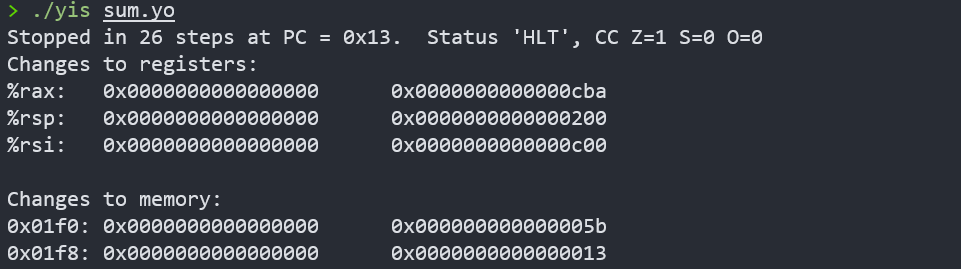
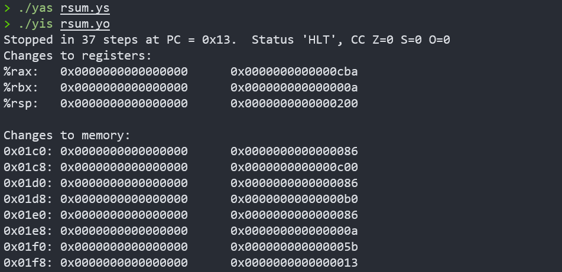
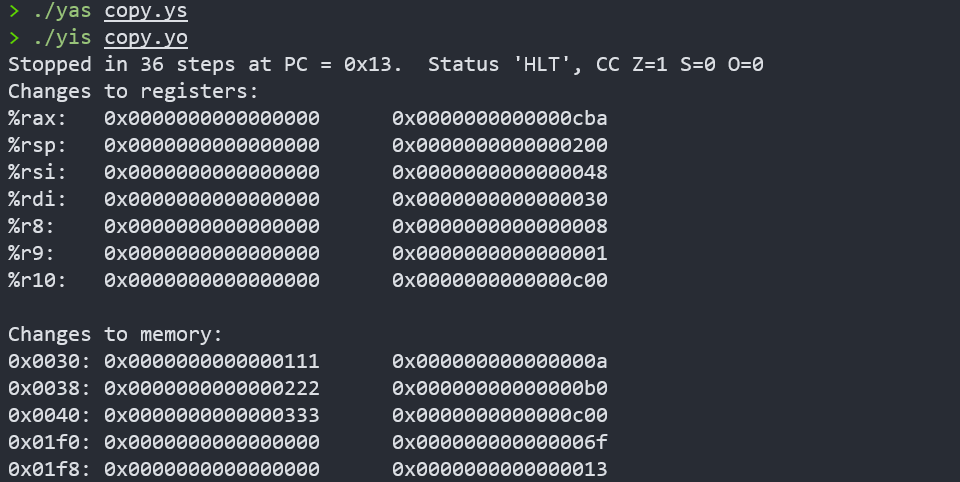
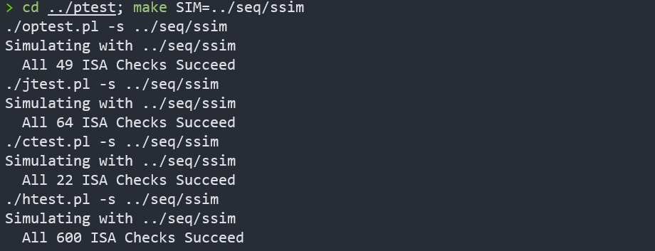
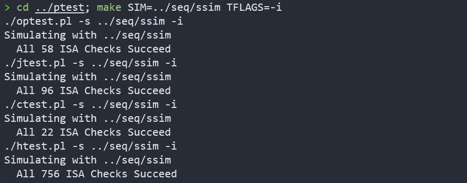
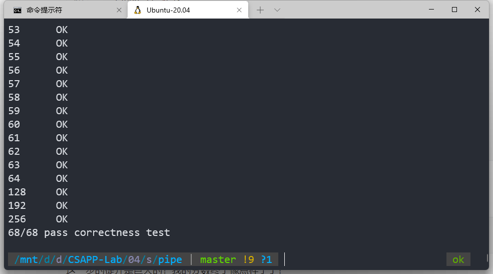
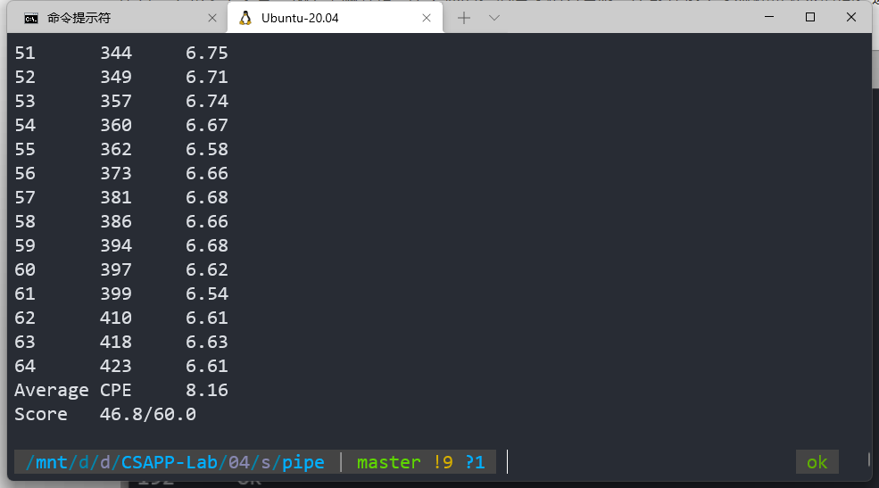

> 穷且益坚，不坠青云之志。

# 实验概览

Arch Lab 实验分为三部分。在 A 部分中，需要我们写一些简单的`Y86-64`程序，从而熟悉`Y86-64`工具的使用；在 B 部分中，我们要用一个新的指令来扩展`SEQ`；C 部分是本实验的核心，我们要通过理解流水线的过程以及利用新的指令来优化程序。

实验材料中有一个`archlab.pdf`，按照文档一步步往下走就可以了。`make`时，可能会缺少相关依赖，安装如下软件即可

```bash
sudo apt install tcl tcl-dev tk tk-dev
sudo apt install flex
sudo apt install bison
```

# Part A

在这部分，要用`Y86-64`汇编代码实现`examples.c`中的三个函数。这三个函数都是与链表有关的操作，链表结点定义如下

```c
/* linked list element */
typedef struct ELE {
    long val;
    struct ELE *next;
} *list_ptr;
```

在编写汇编代码之前，我们先回顾一下`Y86-64`的指令集：

```assembly
# movq i-->r: 从立即数到寄存器...
irmovq, rrmovq, mrmovq, rmmovq

# Opq
addq, subq, andq, xorq

# 跳转 jXX
jmp, jle, jl, je, jne, jge, jg

# 条件传送 cmovXX
cmovle, cmovl, cmove, cmovne, cmovge, cmovg

call, ret
pushq, popq

# 停止指令的执行
halt

# 寄存器
%rax, %rcx, %rdx
%rbx, %rsp, %rbp
%rsi, %rdi, %r8
%r9, %r10, %r11
%r12, %r13, %r14
```

## sum_list

```c
/* sum_list - Sum the elements of a linked list */
long sum_list(list_ptr ls)
{
    long val = 0;
    while (ls) {
        val += ls->val;
        ls = ls->next;
    }
    return val;
}
```

本题就是一个链表求和，非常简单。但要注意，这里不仅要写出函数段，还应该写出测试的代码段。直接给出转换后的汇编代码：

```assembly
# sum_list - Sum the elements of a linked list
# author: Deconx

# Execution begins at address 0
        .pos 0
        irmovq stack, %rsp      # Set up stack pointer
        call main               # Execute main program
        halt                    # Terminate program

# Sample linked list
        .align 8
ele1:
        .quad 0x00a
        .quad ele2
ele2:
        .quad 0x0b0
        .quad ele3
ele3:
        .quad 0xc00
        .quad 0

main:
        irmovq ele1,%rdi
        call sum_list
        ret

# long sum_list(list_ptr ls)
# start in %rdi
sum_list:
        irmovq $0, %rax
        jmp test

loop:
        mrmovq (%rdi), %rsi
        addq %rsi, %rax
        mrmovq 8(%rdi), %rdi

test:
        andq %rdi, %rdi
        jne loop
        ret

# Stack starts here and grows to lower addresses
        .pos 0x200
stack: 

```

注意，应在`stack`下方空一行，否则汇编器会报错，报错原因我也不清楚。

利用实验文件中给的`YAS`汇编器进行汇编，`YIS`指令集模拟器运行**测试**

```bash
./yas sum.ys
./yis sum.yo
```

得到结果



返回值`%rax=0xcba=0x00a+0x0b0+0xc00`，**结果正确！**

## rsum_list

```c
/* rsum_list - Recursive version of sum_list */
long rsum_list(list_ptr ls)
{
    if (!ls)
        return 0;
    else {
        long val = ls->val;
        long rest = rsum_list(ls->next);
        return val + rest;
    }
}
```

这是链表求和的递归实现，按照C语言代码的过程模拟即可，思路非常清晰，可以参考我的注释

```assembly
# /* rsum_list - Recursive version of sum_list */
# author: Deconx

# Execution begins at address 0
        .pos 0
        irmovq stack, %rsp      # Set up stack pointer
        call main               # Execute main program
        halt                    # Terminate program

# Sample linked list
        .align 8
ele1:
        .quad 0x00a
        .quad ele2
ele2:
        .quad 0x0b0
        .quad ele3
ele3:
        .quad 0xc00
        .quad 0

main:
        irmovq ele1,%rdi
        call rsum_list
        ret

# long sum_list(list_ptr ls)
# start in %rdi
rsum_list:
        andq %rdi, %rdi
        je return               # if(!ls)
        mrmovq (%rdi), %rbx     # val = ls->val
        mrmovq 8(%rdi), %rdi    # ls = ls->next
        pushq %rbx
        call rsum_list          # rsum_list(ls->next)
        popq %rbx
        addq %rbx, %rax         # val + rest
        ret
return:
        irmovq $0, %rax
        ret


# Stack starts here and grows to lower addresses
        .pos 0x200
stack: 

```

**测试**



**结果正确！**

## copy_block

```c
/* copy_block - Copy src to dest and return xor checksum of src */
long copy_block(long *src, long *dest, long len)
{
    long result = 0;
    while (len > 0) {
        long val = *src++;
        *dest++ = val;
        result ^= val;
        len--;
    }
    return result;
}
```

数组赋值操作，返回值为原数组各项的按位异或

这段代码的架构与书上**图 4-7**的例子完全相同，包括常数的处理，循环的设置技巧，退出循环的判断... 照猫画虎即可，当然，我也在后面附上了注释

```assembly
/* copy_block - Copy src to dest and return xor checksum of src */
# author: Deconx

# Execution begins at address 0
        .pos 0
        irmovq stack, %rsp      # Set up stack pointer
        call main               # Execute main program
        halt                    # Terminate program

# Sample
        .align 8
# Source block
src:
        .quad 0x00a
        .quad 0x0b0
        .quad 0xc00

# Destination block
dest:
        .quad 0x111
        .quad 0x222
        .quad 0x333

main:
        irmovq src, %rdi        # src
        irmovq dest, %rsi       # dest
        irmovq $3, %rdx         # len
        call copy_block
        ret

# long copy_block(long *src, long *dest, long len)
# src in %rdi
# dest in %rsi
# len in %rdx
copy_block:
        irmovq $8, %r8
        irmovq $1, %r9
        irmovq $0, %rax
        andq %rdx, %rdx
        jmp test
loop:
        mrmovq (%rdi), %r10     # val = *src1
        addq %r8, %rdi          # src++
        rmmovq %r10, (%rsi)     # *dest = val
        addq %r8, %rsi          # dest++
        xorq %r10, %rax         # result ^= val
        subq %r9, %rdx          # len--.  Set CC
test:
        jne loop                # Stop when 0
        ret
        
# Stack starts here and grows to lower addresses
        .pos 0x200
stack: 

```

编译运行一下



**结果完全正确**

# Part B

Part B 整合了第 4 章的 homework - 4.51, 4.52。就是实现`iaddq`指令，将立即数与寄存器相加。可以参考`irmovq`和`OPq`指令的计算。在开始之前，我们还是先回顾一下处理一条指令的各个阶段吧！

## 回顾：指令处理框架

- **取址：**根据 PC 的值从内存中读取指令字节
  - 指令指示符字节的两个四位部分，为`icode:ifun`
  - 寄存器指示符字节，为 `rA`, `rB`
  - 8字节常数字，为 `valC`
  - 计算下一条指令地址，为 `valP`
- **译码：**从寄存器读入最多两个操作数
  - 由 `rA`, `rB` 指明的寄存器，读为 `valA`, `valB`
  - 对于指令`popq`, `pushq`, `call`, `ret`也可能从`%rsp`中读
- **执行：**根据`ifun`计算，或计算内存引用的有效地址，或增加或减少栈指针
  - 对上述三者之一进行的操作得到的值为`valE`
  - 如果是计算，则设置条件码
  - 对于条件传送指令，检验条件码和传送条件，并据此更新目标寄存器
  - 对于跳转指令，决定是否选择分支
- **访存：**顾名思义
  - 可能是将数据写入内存
  - 若是从内存中读出数据，则读出的值为`valM`
- **写回：**最多写两个结果到寄存器
- **更新 PC：**将 PC 设置成下一条指令的地址

## `iaddq`指令执行过程

`iaddq`的执行与`Opq`非常相似，后者需要取出`rA`与`rB`分别指示的寄存器进行运算后再写回`rB`指示的寄存器。而前者与后者唯一的区别就是，不需要从`rA`中取数，直接立即数计算即可。

```c
指令为：iaddq V, rB
取指：
	icode:ifun <- M_1[PC]
	rA:rB <- M_1[PC+1]
	valC <- M_8[PC+2]
	valP <- PC+10

译码：
	valB <- R[rB]

执行：
	valE <-  valB + valC
	Set CC

访存：
	
写回：
	R[rB] <- valE

更新PC：
	PC <- valP
```

## 修改`HCL`代码

接下来要在`seq-full.hcl`文件中修改代码。由于`iaddq`的操作与`OPq`和`irmovq`类似，比较取巧的做法是，搜索有这两个指令的描述块进行修改即可。本着学习的目的，我们分阶段对所有信号逐个分析

**取指阶段**

`instr_valid`：判断指令是否合法，当然应该加上。修改后为

```c
bool instr_valid = icode in 
	{ INOP, IHALT, IRRMOVQ, IIRMOVQ, IRMMOVQ, IMRMOVQ,
	       IOPQ, IJXX, ICALL, IRET, IPUSHQ, IPOPQ, IIADDQ };
```

`need_regids`：判断指令是否包括寄存器指示符字节，当然也应该加上

```c
bool need_regids =
	icode in { IRRMOVQ, IOPQ, IPUSHQ, IPOPQ, 
		     IIRMOVQ, IRMMOVQ, IMRMOVQ, IIADDQ };
```

`need_valC`：判断指令是否包括常数字，还是要加上

```c
bool need_valC =
	icode in { IIRMOVQ, IRMMOVQ, IMRMOVQ, IJXX, ICALL, IIADDQ };
```

**译码和写回阶段**

`srcB`：赋为产生`valB`的寄存器。译码阶段要从`rA`, `rB` 指明的寄存器读为 `valA`, `valB`，而`iaddq`有一个`rB`，于是有以下修改

```c
word srcB = [
	icode in { IOPQ, IRMMOVQ, IMRMOVQ, IIADDQ  } : rB;
	icode in { IPUSHQ, IPOPQ, ICALL, IRET } : RRSP;
	1 : RNONE;  # Don't need register
];
```

`dst_E`：表明写端口 E 的目的寄存器，计算出来的值`valE`将放在那里。最终结果要存放在`rB`中，所以要修改

```c
word dstE = [
	icode in { IRRMOVQ } && Cnd : rB;
	icode in { IIRMOVQ, IOPQ, IIADDQ } : rB;
	icode in { IPUSHQ, IPOPQ, ICALL, IRET } : RRSP;
	1 : RNONE;  # Don't write any register
];
```

**执行阶段**

执行阶段`ALU`要对`aluA`和`aluB`进行计算，计算格式为：`aluB OP aluA`。所以`aluaA`可以是`valA`和`valC`或者`+-8`，`aluaB`只能是`valB`。而`iaddq`执行阶段进行的运算是`valB + valC`，于是可知修改

```c
## Select input A to ALU
word aluA = [
	icode in { IRRMOVQ, IOPQ } : valA;
	icode in { IIRMOVQ, IRMMOVQ, IMRMOVQ, IIADDQ } : valC;
	icode in { ICALL, IPUSHQ } : -8;
	icode in { IRET, IPOPQ } : 8;
	# Other instructions don't need ALU
];

## Select input B to ALU
word aluB = [
	icode in { IRMMOVQ, IMRMOVQ, IOPQ, ICALL, 
		      IPUSHQ, IRET, IPOPQ, IIADDQ } : valB;
	icode in { IRRMOVQ, IIRMOVQ } : 0;
	# Other instructions don't need ALU
];
```

`set_cc`：判断是否应该更新条件码寄存器，这里应该加上

```c
bool set_cc = icode in { IOPQ, IIADDQ };
```

**访存阶段**

`iaddq`没有访存阶段，无需修改

**更新PC阶段**

`iaddq`不涉及转移等操作，也无需修改

## 测试`SEQ`

### 编译失败处理办法

编译`ssim`的时候出现了很多问题：


提示不存在`tk.h`这个头文件，这是由于实验文件太老。把`Makefile`修改一下。第 20 行改为

```bash
TKINC=-isystem /usr/include/tcl8.6
```

第 26 行改为

```c
CFLAGS=-Wall -O2 -DUSE_INTERP_RESULT
```

但是接下来还是报错了

```bash
/usr/bin/ld: /tmp/ccKTMI04.o:(.data.rel+0x0): undefined reference to `matherr'
collect2: error: ld returned 1 exit status
make: *** [Makefile:44: ssim] Error 1
```

这是因为较新版本`glibc`弃用了这部分内容

解决办法是注释掉` /sim/pipe/psim.c 806、807 line`和` /sim/seq/ssim.c 844、845 line`。即：有源代码中有`matherr`的一行和它的下一行

接下来就能编译成功了！虽然会有很多 Warning

### 测试

**第一轮测试**

运行一个简单的`Y86-64` 程序，并将结果`ISA`模拟器的结果进行比对，输出如下

```bash
> ./ssim -t ../y86-code/asumi.yo
Y86-64 Processor: seq-full.hcl
137 bytes of code read
IF: Fetched irmovq at 0x0.  ra=----, rb=%rsp, valC = 0x100
IF: Fetched call at 0xa.  ra=----, rb=----, valC = 0x38
Wrote 0x13 to address 0xf8
IF: Fetched irmovq at 0x38.  ra=----, rb=%rdi, valC = 0x18
IF: Fetched irmovq at 0x42.  ra=----, rb=%rsi, valC = 0x4
IF: Fetched call at 0x4c.  ra=----, rb=----, valC = 0x56
Wrote 0x55 to address 0xf0
IF: Fetched xorq at 0x56.  ra=%rax, rb=%rax, valC = 0x0
IF: Fetched andq at 0x58.  ra=%rsi, rb=%rsi, valC = 0x0
IF: Fetched jmp at 0x5a.  ra=----, rb=----, valC = 0x83
IF: Fetched jne at 0x83.  ra=----, rb=----, valC = 0x63
IF: Fetched mrmovq at 0x63.  ra=%r10, rb=%rdi, valC = 0x0
IF: Fetched addq at 0x6d.  ra=%r10, rb=%rax, valC = 0x0
IF: Fetched iaddq at 0x6f.  ra=----, rb=%rdi, valC = 0x8
IF: Fetched iaddq at 0x79.  ra=----, rb=%rsi, valC = 0xffffffffffffffff
IF: Fetched jne at 0x83.  ra=----, rb=----, valC = 0x63
IF: Fetched mrmovq at 0x63.  ra=%r10, rb=%rdi, valC = 0x0
IF: Fetched addq at 0x6d.  ra=%r10, rb=%rax, valC = 0x0
IF: Fetched iaddq at 0x6f.  ra=----, rb=%rdi, valC = 0x8
IF: Fetched iaddq at 0x79.  ra=----, rb=%rsi, valC = 0xffffffffffffffff
IF: Fetched jne at 0x83.  ra=----, rb=----, valC = 0x63
IF: Fetched mrmovq at 0x63.  ra=%r10, rb=%rdi, valC = 0x0
IF: Fetched addq at 0x6d.  ra=%r10, rb=%rax, valC = 0x0
IF: Fetched iaddq at 0x6f.  ra=----, rb=%rdi, valC = 0x8
IF: Fetched iaddq at 0x79.  ra=----, rb=%rsi, valC = 0xffffffffffffffff
IF: Fetched jne at 0x83.  ra=----, rb=----, valC = 0x63
IF: Fetched mrmovq at 0x63.  ra=%r10, rb=%rdi, valC = 0x0
IF: Fetched addq at 0x6d.  ra=%r10, rb=%rax, valC = 0x0
IF: Fetched iaddq at 0x6f.  ra=----, rb=%rdi, valC = 0x8
IF: Fetched iaddq at 0x79.  ra=----, rb=%rsi, valC = 0xffffffffffffffff
IF: Fetched jne at 0x83.  ra=----, rb=----, valC = 0x63
IF: Fetched ret at 0x8c.  ra=----, rb=----, valC = 0x0
IF: Fetched ret at 0x55.  ra=----, rb=----, valC = 0x0
IF: Fetched halt at 0x13.  ra=----, rb=----, valC = 0x0
32 instructions executed
Status = HLT
Condition Codes: Z=1 S=0 O=0
Changed Register State:
%rax:   0x0000000000000000      0x0000abcdabcdabcd
%rsp:   0x0000000000000000      0x0000000000000100
%rdi:   0x0000000000000000      0x0000000000000038
%r10:   0x0000000000000000      0x0000a000a000a000
Changed Memory State:
0x00f0: 0x0000000000000000      0x0000000000000055
0x00f8: 0x0000000000000000      0x0000000000000013
ISA Check Succeeds
```

成功！

**标准测试**

运行一个标准检查程序

```bash
> cd ../y86-code; make testssim
../seq/ssim -t asum.yo > asum.seq
../seq/ssim -t asumr.yo > asumr.seq
../seq/ssim -t cjr.yo > cjr.seq
../seq/ssim -t j-cc.yo > j-cc.seq
../seq/ssim -t poptest.yo > poptest.seq
../seq/ssim -t pushquestion.yo > pushquestion.seq
../seq/ssim -t pushtest.yo > pushtest.seq
../seq/ssim -t prog1.yo > prog1.seq
../seq/ssim -t prog2.yo > prog2.seq
../seq/ssim -t prog3.yo > prog3.seq
../seq/ssim -t prog4.yo > prog4.seq
../seq/ssim -t prog5.yo > prog5.seq
../seq/ssim -t prog6.yo > prog6.seq
../seq/ssim -t prog7.yo > prog7.seq
../seq/ssim -t prog8.yo > prog8.seq
../seq/ssim -t ret-hazard.yo > ret-hazard.seq
grep "ISA Check" *.seq
asum.seq:ISA Check Succeeds
asumr.seq:ISA Check Succeeds
cjr.seq:ISA Check Succeeds
j-cc.seq:ISA Check Succeeds
poptest.seq:ISA Check Succeeds
prog1.seq:ISA Check Succeeds
prog2.seq:ISA Check Succeeds
prog3.seq:ISA Check Succeeds
prog4.seq:ISA Check Succeeds
prog5.seq:ISA Check Succeeds
prog6.seq:ISA Check Succeeds
prog7.seq:ISA Check Succeeds
prog8.seq:ISA Check Succeeds
pushquestion.seq:ISA Check Succeeds
pushtest.seq:ISA Check Succeeds
ret-hazard.seq:ISA Check Succeeds
rm asum.seq asumr.seq cjr.seq j-cc.seq poptest.seq pushquestion.seq pushtest.seq prog1.seq prog2.seq prog3.seq prog4.seq prog5.seq prog6.seq prog7.seq prog8.seq ret-hazard.seq
```

全部都是 Succeeds

**回归测试**

测试除`iaddq`的所有指令



专门测试`iaddq`指令



于是，我们就通过了实验材料中的所有测试用例！

# Part C

Part C 在`sim/pipe`中进行。PIPE 是使用了转发技术的流水线化的`Y86-64`处理器。它相比 Part B 增加了流水线寄存器和流水线控制逻辑。

在本部分中，我们要通过修改`pipe-full.hcl`和`ncopy.ys`来优化程序，通过程序的效率，也就是 CPE 来计算我们的分数，分数由下述公式算出
$$
S=\begin{cases}
	0,                      c>10.5\\
	20\cdot \left( 10.5-c \right) ,     7.50\leqslant c\leqslant 10.50\\
	60,                     c<7.50\\
\end{cases}
$$
首先，`iaddq`是一个非常好的指令，它可以把两步简化为一步，所以我们先修改`pipe-full.hcl`，增加`iaddq`指令，修改参考 Part B 即可。稳妥起见，修改后还是应该测试一下这个模拟器，`Makefile`参考 Part B 部分进行同样的修改后编译。然后执行以下命令进行测试：

```bash
./psim -t ../y86-code/asumi.yo
cd ../ptest; make SIM=../pipe/psim
cd ../ptest; make SIM=../pipe/psim TFLAGS=-i
```

当所有测试都显示 Succeed 后，就可以真正开始本部分的重头戏了！

`ncopy`函数将一个长度为`len`的整型数组`src`复制到一个不重叠的数组`dst`，并返回`src`中正数的个数。C 语言代码如下

```c
/*
 * ncopy - copy src to dst, returning number of positive ints
 * contained in src array.
 */
word_t ncopy(word_t *src, word_t *dst, word_t len)
{
    word_t count = 0;
    word_t val;

    while (len > 0) {
	val = *src++;
	*dst++ = val;
	if (val > 0)
	    count++;
	len--;
    }
    return count;
}
```

原汇编代码如下：

```assembly
# You can modify this portion
	# Loop header
	xorq %rax,%rax		# count = 0;
	andq %rdx,%rdx		# len <= 0?
	jle Done		# if so, goto Done:

Loop:	mrmovq (%rdi), %r10	# read val from src...
	rmmovq %r10, (%rsi)	# ...and store it to dst
	andq %r10, %r10		# val <= 0?
	jle Npos		# if so, goto Npos:
	irmovq $1, %r10
	addq %r10, %rax		# count++
Npos:	irmovq $1, %r10
	subq %r10, %rdx		# len--
	irmovq $8, %r10
	addq %r10, %rdi		# src++
	addq %r10, %rsi		# dst++
	andq %rdx,%rdx		# len > 0?
	jg Loop			# if so, goto Loop:
```

先分别执行以下命令，对原始代码测试一波 CPE

```bash
./correctness.pl
./benchmark.pl
```

得

```c
Average CPE     15.18
Score   0.0/60.0
```

## **利用`iaddq`**

首先能够直观看到，为了`len--/src++/dst++`等操作，对`%rdi`进行了不少次赋值操作，这些都可以用我们新增的`iaddq`指令替代。

替代后代码为

```c
# You can modify this portion
	# Loop header
	xorq %rax,%rax		# count = 0;
	andq %rdx,%rdx		# len <= 0?
	jle Done		# if so, goto Done:

Loop:	
	mrmovq (%rdi), %r10	# read val from src...
	rmmovq %r10, (%rsi)	# ...and store it to dst
	andq %r10, %r10		# val <= 0?
	jle Npos		# if so, goto Npos:
	iaddq $1, %rax		# count++
Npos:	
	iaddq $-1, %rdx		# len--
	iaddq $8, %rdi		# src++
	iaddq $8, %rsi		# dst++
	andq %rdx,%rdx		# len > 0?
	jg Loop			# if so, goto Loop:
```

测试 CPE

```c
Average CPE     12.70
Score   0.0/60.0
```

虽然分数还是0，但已经有了不少提升

## 循环展开

根据文档的提示，可以试试循环展开进行优化。 循环展开通过增加每次迭代计算的元素的数量，减少循环的迭代次数。这样做对效率提升有什么作用呢？

- 减少了索引计算的次数
- 减少了条件分支的判断次数

那么展开几路效率最高呢？我从5路展开开始分别进行了测试

```c
5路：
    Average CPE     9.61
	Score   17.8/60.0

6路：
    Average CPE     9.58
	Score   18.3/60.0
    
7路：
    Average CPE     9.59
	Score   18.2/60.0
    
8路：
    Average CPE     9.62
	Score   17.5/60.0
```

所以，我选择进行6路展开

```assem
	# Loop header
	andq %rdx,%rdx		# len <= 0?
	jmp test
Loop:
	mrmovq (%rdi),%r8
	rmmovq %r8,(%rsi)
	andq %r8,%r8
	jle Loop1
	iaddq $1,%rax
Loop1:
	mrmovq 8(%rdi),%r8
	rmmovq %r8,8(%rsi)
	andq %r8,%r8
	jle Loop2
	iaddq $1,%rax
Loop2:
	mrmovq 16(%rdi),%r8
	rmmovq %r8,16(%rsi)
	andq %r8,%r8
	jle Loop3
	iaddq $1,%rax
Loop3:
	mrmovq 24(%rdi),%r8
	rmmovq %r8,24(%rsi)
	andq %r8,%r8
	jle Loop4
	iaddq $1,%rax
Loop4:
	mrmovq 32(%rdi),%r8
	rmmovq %r8,32(%rsi)
	andq %r8,%r8
	jle Loop5
	iaddq $1,%rax
Loop5:
	mrmovq 40(%rdi),%r8
	rmmovq %r8,40(%rsi)
	iaddq $48,%rdi
	iaddq $48,%rsi
	andq %r8,%r8
	jle test
	iaddq $1,%rax	
test:
	iaddq $-6, %rdx			# 先减，判断够不够6个
	jge Loop				# 6路展开
	iaddq $-8,%rdi
	iaddq $-8,%rsi
	iaddq $6, %rdx
	jmp test2				#剩下的
Lore:
	mrmovq (%rdi),%r8
	rmmovq %r8,(%rsi)
	andq %r8,%r8
	jle test2
	iaddq $1,%rax
test2:
	iaddq $8,%rdi
	iaddq $8,%rsi
	iaddq $-1, %rdx
	jge Lore
```

代码逻辑非常简单：每次循环都对6个数进行复制，每次复制就设置一个条件语句判断返回时是否加1，对于剩下的数据每次循环只对1个数进行复制。

为了方便分析，我把极端的几个例子的情况列下来：

```C
        ncopy
0       26
1       35      35.00
2       47      23.50
3       56      18.67
4       68      17.00
5       77      15.40
6       69      11.50
7       78      11.14
8       90      11.25
9       99      11.00
10      111     11.10
11      120     10.91
12      112     9.33
13      121     9.31
14      133     9.50
15      142     9.47
16      154     9.62
17      163     9.59
18      155     8.61
...
50      391     7.82
51      400     7.84
52      412     7.92
53      421     7.94
54      413     7.65
55      422     7.67
56      434     7.75
57      443     7.77
58      455     7.84
59      464     7.86
60      456     7.60
61      465     7.62
62      477     7.69
63      486     7.71
64      498     7.78
Average CPE     9.58
Score   18.3/60.0
```

观察上表，对于小数据而言， CPE 的值非常大，后续可以考虑对小数据进行优化。我们先优化剩余数据的处理，对他们继续进行循环展开。

## 剩余数据处理

对于剩余数据，我选择3路循环展开。前面的6路与上面代码一样，我就不再贴出来了

```c
# Loop header
	andq %rdx,%rdx		# len <= 0?
	jmp test
Loop:...
Loop1:...
...
Loop4:...
Loop5:...
test:
	iaddq $-6, %rdx			# 先减，判断够不够6个
	jge Loop				# 6路展开
	iaddq $6, %rdx
	jmp test2				#剩下的

L:
	mrmovq (%rdi),%r8
	rmmovq %r8,(%rsi)
	andq %r8,%r8
	jle L1
	iaddq $1,%rax
L1:
	mrmovq 8(%rdi),%r8
	rmmovq %r8,8(%rsi)
	andq %r8,%r8
	jle L2
	iaddq $1,%rax
L2:
	mrmovq 16(%rdi),%r8
	rmmovq %r8,16(%rsi)
	iaddq $24,%rdi
	iaddq $24,%rsi
	andq %r8,%r8
	jle test2
	iaddq $1,%rax
test2:
	iaddq $-3, %rdx			# 先减，判断够不够3个
	jge L
	iaddq $2, %rdx			# -1则不剩了，直接Done,0 剩一个, 1剩2个
    je R0
    jl Done
	mrmovq (%rdi),%r8
	rmmovq %r8,(%rsi)
	andq %r8,%r8
	jle R2
	iaddq $1,%rax
R2:
	mrmovq 8(%rdi),%r8
	rmmovq %r8,8(%rsi)
	andq %r8,%r8
	jle Done
	iaddq $1,%rax
	jmp Done
R0:
	mrmovq (%rdi),%r8
	rmmovq %r8,(%rsi)
	andq %r8,%r8
	jle Done
	iaddq $1,%rax
```

注意对于3路展开的特殊处理。看第38、39行，通过直接判断剩余数据的数量减少一次条件判断

CPE 值为

```c
Average CPE     9.07
Score   28.5/60.0
```

提升了很多，但是依然连一般的分数都还没拿到...

## 消除气泡

注意，程序多次使用了下面的操作：

```c
mrmovq (%rdi), %r8
rmmovq %r8, (%rsi)
```

`Y86-64`处理器的流水线有 F(取指)、D(译码)、E(执行)、M(访存)、W(写回) 五个阶段，D 阶段才读取寄存器，M 阶段才读取对应内存值，

即使使用转发来避免数据冒险，这其中也至少会有一个气泡。像这样

```c
mrmovq (%rdi), %r8
bubble
rmmovq %r8, (%rsi)
```

一个优化办法是，多取一个寄存器，连续进行两次数据复制。

```c
mrmovq (%rdi), %r8
mrmovq 8(%rdi), %r9
rmmovq %r8, (%rsi)
rmmovq %r9, 8(%rsi)
```

像这样，对`%r8`和`%r9`进行读入和读出的操作之间都隔着一条其他指令，就不会有气泡产生了。代码如下：

```c
	# Loop header
	andq %rdx,%rdx		# len <= 0?
	jmp test
Loop:
	mrmovq (%rdi),%r8
	mrmovq 8(%rdi),%r9
	andq %r8,%r8
	rmmovq %r8,(%rsi)
	rmmovq %r9,8(%rsi)
	jle Loop1
	iaddq $1,%rax
Loop1:	
	andq %r9,%r9
	jle Loop2
	iaddq $1,%rax
Loop2:
	mrmovq 16(%rdi),%r8
	mrmovq 24(%rdi),%r9
	andq %r8,%r8
	rmmovq %r8,16(%rsi)
	rmmovq %r9,24(%rsi)
	jle Loop3
	iaddq $1,%rax
Loop3:	
	andq %r9,%r9
	jle Loop4
	iaddq $1,%rax
Loop4:
	mrmovq 32(%rdi),%r8
	mrmovq 40(%rdi),%r9
	andq %r8,%r8
	rmmovq %r8,32(%rsi)
	rmmovq %r9,40(%rsi)
	jle Loop5
	iaddq $1,%rax
Loop5:
	iaddq $48,%rdi
	iaddq $48,%rsi		
	andq %r9,%r9
	jle test
	iaddq $1,%rax
test:
	iaddq $-6, %rdx			# 先减，判断够不够6个
	jge Loop				# 6路展开
	iaddq $6, %rdx
	jmp test2				#剩下的

L:
	mrmovq (%rdi),%r8
	andq %r8,%r8
	rmmovq %r8,(%rsi)
	jle L1
	iaddq $1,%rax
L1:
	mrmovq 8(%rdi),%r8
	andq %r8,%r8
	rmmovq %r8,8(%rsi)
	jle L2
	iaddq $1,%rax
L2:
	mrmovq 16(%rdi),%r8
	iaddq $24,%rdi
	rmmovq %r8,16(%rsi)
	iaddq $24,%rsi
	andq %r8,%r8
	jle test2
	iaddq $1,%rax
test2:
	iaddq $-3, %rdx			# 先减，判断够不够3个
	jge L
	iaddq $2, %rdx			# -1则不剩了，直接Done,0 剩一个, 1剩2个
    je R0
    jl Done
	mrmovq (%rdi),%r8
	mrmovq 8(%rdi),%r9
	rmmovq %r8,(%rsi)
	rmmovq %r9,8(%rsi)
	andq %r8,%r8
	jle R2
	iaddq $1,%rax
R2:
	andq %r9,%r9
	jle Done
	iaddq $1,%rax
	jmp Done
R0:
	mrmovq (%rdi),%r8
	andq %r8,%r8
	rmmovq %r8,(%rsi)
	jle Done
	iaddq $1,%rax
```

注意，只有`rmmovq`不改变条件寄存器的值，所以我们也可以把`andq`插进中间来消除气泡。

CPE 值为

```c
Average CPE     8.16
Score   46.9/60.0
```

这一步的提升是巨大的！我的分数终于像点样子了！

## 进一步优化

这里先留个坑。

暂且截图记录我**目前**为止的最高成就：

运行正确：



分数为：46.8



# 总结

- 读 CSAPP 第 4 章时，我理解得很不通透，部分内容甚至有些迷糊。而做完了本实验，通过亲自设计指令，亲自模拟流水线的工作过程并思考如何优化，我对处理器体系结构有了更深的感悟，有一种了然于胸的感觉。
- CMU 的这两位大神老师 Randal E. Bryant 和 David R. O'Hallaron 简直令我佩服得五体投地。我本以为他们只是从理论层面上将第 4 章的处理器指令，流水线如何设计等等教授给我们。没想到，他们竟然真正设计实现了这样一套完整的`Y86-64`模拟器、测试工具供我们学习。本实验尤其是 Part C 每优化一次就能立即看到自己的分数，这犹如游戏闯关一般的体验令我着迷。这一切要归功于两位老师细致的设计，希望有生之年能见他们一次！
- 作为一个完美主义者，我在 Part C 部分却没有拿到满分，这简直是无法忍受的。但是我着实学业繁忙，不能在这个实验耗费太多时间，只能暂且搁置，暑假回来继续干它！
- 本实验耗时 3 天，约 17 小时

