# 实验概览

Cache Lab 分为两部分，编写一个高速缓存模拟器以及要求优化矩阵转置的核心函数，以最小化对模拟的高速缓存的不命中次数。本实验对我这种代码能力较差的人来说还是很有难度的。

在开始实验前，强烈建议先阅读以下**学习资料**：

实验说明文档：[Writeup](http://csapp.cs.cmu.edu/2e/cachelab.pdf)

CMU 关于 Cache Lab 的 PPT：[Cache Lab Implementation and Blocking](http://www.cs.cmu.edu/afs/cs/academic/class/15213-f15/www/recitations/rec07.pdf)

CMU 关于分块优化的讲解： [Using Blocking to Increase Temporal Locality](http://csapp.cs.cmu.edu/2e/waside/waside-blocking.pdf) 

**本人踩的坑：**我的 lab 环境是 Windows11 + wsl2。由于 wsl2 跨 OS 磁盘访问非常慢，而我是将文件放在 Windows 下进行的实验，Part B 部分的测试结果甚至无法跑出来！所以，建议用虚拟机进行实验，如果你也是 wsl2 用户，请将实验文件放在 wsl2 自己的目录下！

# Part A: Writing a Cache Simulator

Part A 要求在`csim.c`下编写一个高速缓存模拟器来对内存读写操作进行正确的反馈。这个模拟器有 6 个参数：

```c
Usage: ./csim-ref [-hv] -s <s> -E <E> -b <b> -t <tracefile>
	• -h: Optional help flag that prints usage info
	• -v: Optional verbose flag that displays trace info
	• -s <s>: Number of set index bits (S = 2s is the number of sets)
	• -E <E>: Associativity (number of lines per set)
	• -b <b>: Number of block bits (B = 2b is the block size)
	• -t <tracefile>: Name of the valgrind trace to replay
```

其中，输入的 trace 的格式为：`[space]operation address, size`，operation 有 4 种：

- `I`表示加载指令
-  `L` 加载数据
- `S`存储数据
- `M` 修改数据

模拟器不需要考虑加载指令，而`M`指令就相当于先进行`L`再进行`S`，因此，要考虑的情况其实并不多。模拟器要做出的反馈有 3 种：

- `hit`：命中，表示要操作的数据在对应组的其中一行
- `miss`：不命中，表示要操作的数据不在对应组的任何一行
- `eviction`：驱赶，表示要操作的数据的对应组已满，进行了替换操作

## 回顾：Cache 结构

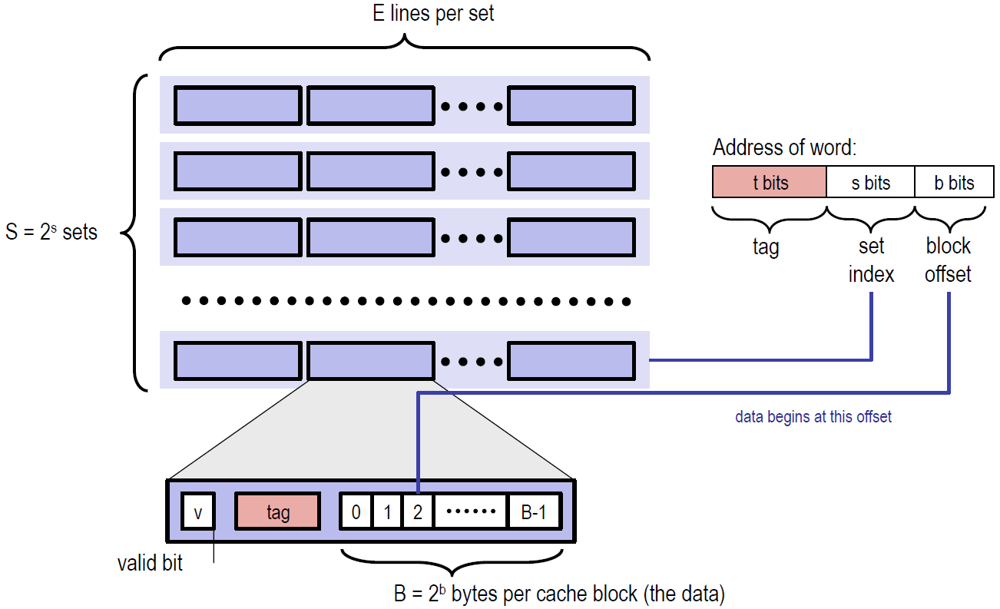

Cache 类似于一个二维数组，它有$S=2^s$组，每组有 E 行，每行存储的字节也是固定的。其中，每行都有一个有效位，和一个标记位。想要查找到对应的字节，我们的地址需要三部分组成：

- s，索引位，找到对应的组序号
- tag，标记位，在组中的每一行进行匹配，判断能否命中
- b，块偏移，表明在找到的行中的具体位置。本实验不考虑块便宜，完全可以忽略。

那么，Cache 中的有效位是干什么的呢？判断该行是否为空。这里有一个概念：**冷不命中**，表示该缓存块为空造成的不命中。而一旦确定不命中不是冷不命中，那么就需要考虑行替换的问题了。我认为，行替换关乎着 Cache 的效率，是 Cache 设计的核心。

## 回顾：替换策略

当 CPU 要处理的字不在组中任何一行，且组中没有一个空行，那就必须从里面选取一个非空行进行替换。选取哪个空行进行替换呢？书上给了我们两种策略：

- LFU，最不常使用策略。替换在过去某个窗口时间内引用次数最少的那一行
- LRU，最近最少使用策略。替换最后一次访问时间最久远的哪一行

本实验要求采取的策略为 **LRU**。

那么代码如何实现呢？我的第一反应是实现 S 个双向链表，每个链表有 E 个结点，对应于组中的每一行，每当访问了其中的一行，就把这个结点移动到链表的头部，后续替换的时候只需要选择链尾的结点就好了。但是，为了简单，我还是选择了 PPT 中提示的相对简单的设置**时间戳**的办法，双向链表以后有时间再写吧。

下面就可以正式开始 Part A 了！我对我写的模拟器的核心部分进行讲解。

## 数据结构

定义了`Cache`结构体

```c
typedef struct cache_
{
    int S;
    int E;
    int B;
    Cache_line **line;
} Cache;
```

用`Cache`表示一个缓存，它包括 S, B, E 等特征，以及前面说过的，每一个缓存类似于一个二位数组，数组的每一个元素就是缓存中的行所以用一个`line`来表示这一信息：

```c
typedef struct cache_line
{
    int valid;     //有效位
    int tag;       //标记位
    int time_tamp; //时间戳
} Cache_line;
```

`valid`以及`tag`不再赘述，这里的`time_tamp`表示时间戳，是 LRU 策略需要用到的特征。Cache 初始值设置如下：

```c
void Init_Cache(int s, int E, int b)
{
    int S = 1 << s;
    int B = 1 << b;
    cache = (Cache *)malloc(sizeof(Cache));
    cache->S = S;
    cache->E = E;
    cache->B = B;
    cache->line = (Cache_line **)malloc(sizeof(Cache_line *) * S);
    for (int i = 0; i < S; i++)
    {
        cache->line[i] = (Cache_line *)malloc(sizeof(Cache_line) * E);
        for (int j = 0; j < E; j++)
        {
            cache->line[i][j].valid = 0; //初始时，高速缓存是空的
            cache->line[i][j].tag = -1;
            cache->line[i][j].time_tamp = 0;
        }
    }
}
```

注意，时间戳初始设置为0。

## LRU 时间戳实现

我的逻辑是时间戳越大则表示该行最后访问的时间越久远。先看 LRU 更新的代码：

```c
void update(int i, int op_s, int op_tag){
    cache->line[op_s][i].valid=1;
    cache->line[op_s][i].tag = op_tag;
    for(int k = 0; k < cache->E; k++)
        if(cache->line[op_s][k].valid==1)
            cache->line[op_s][k].time_tamp++;
    cache->line[op_s][i].time_tamp = 0;
}
```

这段代码在找到要进行的操作行后调用（无论是不命中还是命中，还是驱逐后）。前两行是对有效位和标志位的设置，与时间戳无关，主要关注后几行：

- 遍历组中每一行，并将它们的值加1，也就是说每一行在进行一次操作后时间戳都会变大，表示它离最后操作的时间变久
- 将本次操作的行时间戳设置为最小，也就是0

由此，每次只需要找到时间戳最大的行进行替换就可以了：

```c
int find_LRU(int op_s)
{
    int max_index = 0;
    int max_stamp = 0;
    for(int i = 0; i < cache->E; i++){
        if(cache->line[op_s][i].time_tamp > max_stamp){
            max_stamp = cache->line[op_s][i].time_tamp;
            max_index = i;
        }
    }
    return max_index;
}
```

## 缓存搜索及更新

先解决比较核心的问题，在得知要操作的组`op_s`以及标志位`op_tag`后，判断是`miss`还是`hit`还是应该`eviction`调用`find_LRU`。

先判断是`miss`还是`hit`：

```c
int get_index(int op_s, int op_tag)
{
    for (int i = 0; i < cache->E; i++)
    {
        if (cache->line[op_s][i].valid && cache->line[op_s][i].tag == op_tag)
            return i;
    }
    return -1;
}
```

遍历所有行，如果某一行有效，且标志位相同，则`hit`，返回该索引。否则，`miss`，返回 -1。当接收到-1后，有两种情况：

- 冷不命中。组中有空行，只不过还未操作过，有效位为0，找到这个空行即可
- 所有行都满了。那么就要用到上面得 LRU 进行选择驱逐

所以，设计一个判满的函数：

```c
int is_full(int op_s)
{
    for (int i = 0; i < cache->E; i++)
    {
        if (cache->line[op_s][i].valid == 0)
            return i;
    }
    return -1;
}
```

扫描完成后，得到对应行的索引值，就可以调用 LRU 更新函数进行更新了。整体调用如下：

```c
void update_info(int op_tag, int op_s)
{
    int index = get_index(op_s, op_tag);
    if (index == -1)
    {
        miss_count++;
        if (verbose)
            printf("miss ");
        int i = is_full(op_s);
        if(i==-1){
            eviction_count++;
            if(verbose) printf("eviction");
            i = find_LRU(op_s);
        }
        update(i,op_s,op_tag);
    }
    else{
        hit_count++;
        if(verbose)
            printf("hit");
        update(index,op_s,op_tag);    
    }
}
```

至此，Part A 的核心部分函数就编写完了，下面的内容属于是技巧性的部分，与架构无关。

## 指令解析

设计的数据结构解决了对 Cache 的操作问题，LRU 时间戳的实现解决了核心的驱逐问题，缓存扫描解决了对块中哪一列进行操作的问题，而应该对哪一块进行操作呢？接下来要解决的就是指令的解析问题了。

输入数据为`[space]operation address, size`的形式，`operation`很容易获取，重要的是从`address`中分别获取我们需要的`s`和`tag`，`address`结构如下：


这就用到了第二章以及[Data Lab](https://zhuanlan.zhihu.com/p/472188244)的知识。tag 很容易得到，右移 (b + s) 位即可：

```c
int op_tag = address >> (s + b);
```

获取 s，考虑先右移 b 位，再用无符号 0xFF... 右移后进行与操作将 tag 抹去。为什么要用无符号 0xFF... 右移呢？因为C语言中的右移为算术右移，有符号数右移补位的数为符号位。

```c
int op_s = (address >> b) & ((unsigned)(-1) >> (8 * sizeof(unsigned) - s));
```

由于数据读写对于本模拟器而言是没有区别的，因此不同的指令对应的只是 Cache 更新次数的问题：

```c
void get_trace(int s, int E, int b)
{
    FILE *pFile;
    pFile = fopen(t, "r");
    if (pFile == NULL)
    {
        exit(-1);
    }
    char identifier;
    unsigned address;
    int size;
    // Reading lines like " M 20,1" or "L 19,3"
    while (fscanf(pFile, " %c %x,%d", &identifier, &address, &size) > 0) // I读不进来,忽略---size没啥用
    {
        //想办法先得到标记位和组序号
        int op_tag = address >> (s + b);
        int op_s = (address >> b) & ((unsigned)(-1) >> (8 * sizeof(unsigned) - s));
        switch (identifier)
        {
        case 'M': //一次存储一次加载
            update_info(op_tag, op_s);
            update_info(op_tag, op_s);
            break;
        case 'L':
            update_info(op_tag, op_s);
            break;
        case 'S':
            update_info(op_tag, op_s);
            break;
        }
    }
    fclose(pFile);
}
```

`update_info`就是对 Cache 进行更新的函数，前面已经讲解。如果指令是`M`则一次存储一次加载，总共更新两次，其他指令只用更新一次，而`I`无需考虑。

## 命令行参数获取

通过阅读[Cache Lab Implementation and Blocking](http://www.cs.cmu.edu/afs/cs/academic/class/15213-f15/www/recitations/rec07.pdf)的提示，我们使用`getopt()`函数来获取命令行参数的字符串形式，然后用`atoi()`转换为要用的参数，最后用`switch`语句跳转到对应功能块。

代码如下：

```c
int main(int argc, char *argv[])
{
    char opt;
    int s, E, b;
    /*
     * s:S=2^s是组的个数
     * E:每组中有多少行
     * b:B=2^b每个缓冲块的字节数
     */
    while (-1 != (opt = getopt(argc, argv, "hvs:E:b:t:")))
    {
        switch (opt)
        {
        case 'h':
            print_help();
            exit(0);
        case 'v':
            verbose = 1;
            break;
        case 's':
            s = atoi(optarg);
            break;
        case 'E':
            E = atoi(optarg);
            break;
        case 'b':
            b = atoi(optarg);
            break;
        case 't':
            strcpy(t, optarg);
            break;
        default:
            print_help();
            exit(-1);
        }
    }
    Init_Cache(s, E, b); //初始化一个cache
    get_trace(s, E, b);
    free_Cache();
    // printSummary(hit_count, miss_count, eviction_count)
    printSummary(hit_count, miss_count, eviction_count);
    return 0;
}
```

完整代码太长，可访问我的`Github`仓库查看：

https://github.com/Deconx/CSAPP-Lab

# Part B: Optimizing Matrix Transpose

Part B 是在`trans.c`中编写矩阵转置的函数，在一个 s = 5,  E = 1,  b = 5 的缓存中进行读写，使得 miss 的次数最少。测试矩阵的参数以及 miss 次数对应的分数如下：

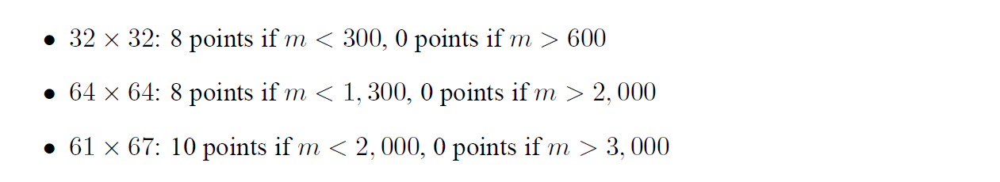

要求最多只能声明12个本地变量。

根据课本以及 PPT 的提示，这里肯定要使用**矩阵分块**进行优化

## 32 × 32

**开始之前，我们先了解一下何为分块？为什么分块？**

 s = 5,  E = 1,  b = 5 的缓存有32组，每组一行，每行存 8 个`int`，如图：

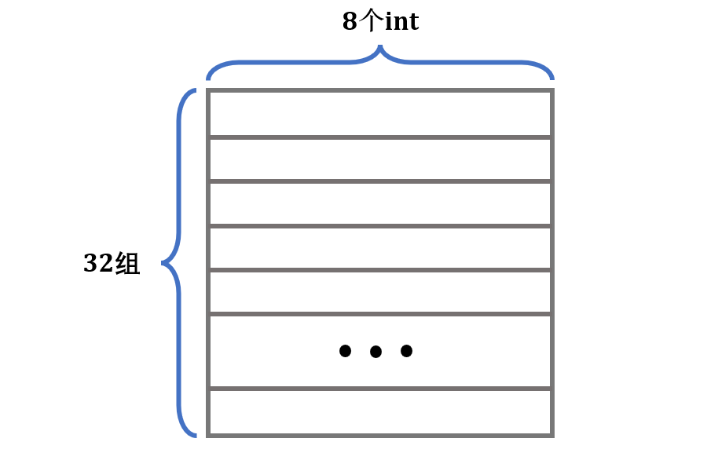

就以这个缓存为例，考虑暴力转置的做法：

```c
void trans_submit(int M, int N, int A[N][M], int B[M][N]) {
    for (int i = 0; i < N; i++) {
        for (int j = 0; j < M; j++) {
            int tmp = A[i][j];
            B[j][i] = tmp;
        }
    }
}
```

这里我们会按行优先读取 `A` 矩阵，然后一列一列地写入 `B` 矩阵。

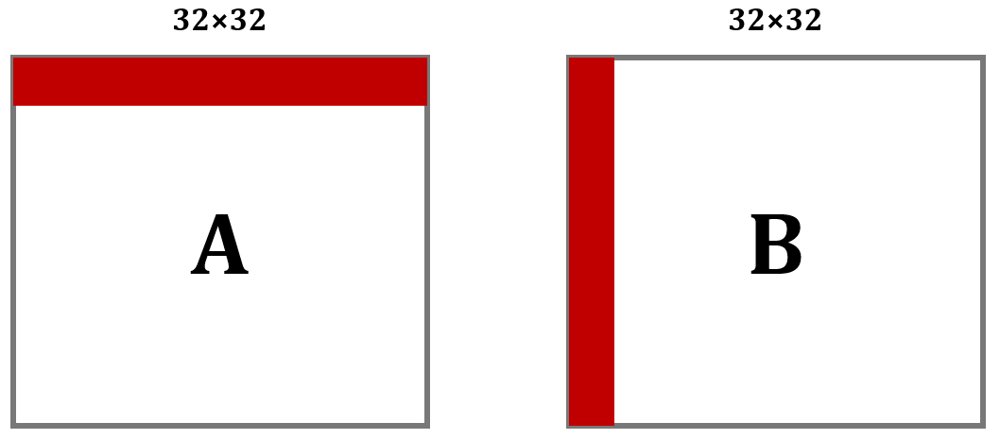

以第1行为例，在从内存读 `A[0][0]` 的时候，除了 `A[0][0]` 被加载到缓存中，它之后的 `A[0][1]---A[0][7]` 也会被加载进缓存。

但是内容写入 `B` 矩阵的时候是一列一列地写入，在列上相邻的元素不在一个内存块上，这样每次写入都不命中缓存。并且一列写完之后再返回，原来的缓存可能被覆盖了，这样就又会不命中。我们来定量分析。

缓存只够存储一个矩阵的四分之一，`A`中的元素对应的缓存行每隔8行就会重复。`A`和`B`的地址由于取余关系，每个元素对应的地址是相同的。各个元素对应缓存行如下：

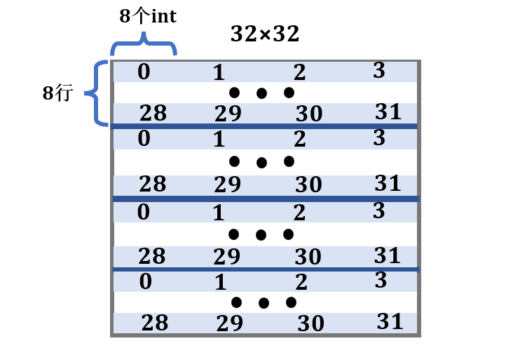

对于`A`，每8个`int`就会占满缓存的一组，所以每一行会有 32/8 = 4 次不命中；而对于`B`，考虑最坏情况，每一列都有 32 次不命中，由此，算出总不命中次数为 4 × 32 + 32 × 32 = 1152。拿程序跑一下：

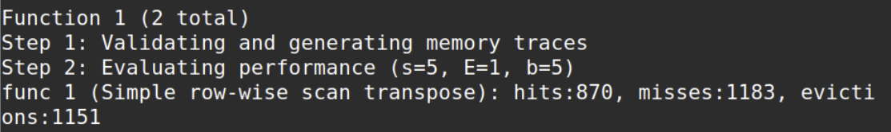

结果为 1183 比预估多了一点，这是对角线部分两者冲突造成的，后面会讲到。

**回过头来，思考暴力做法：**

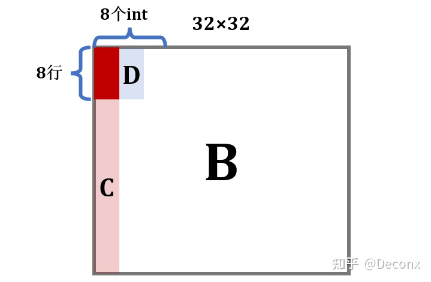

在写入`B`的前 8 行后，`B`的`D`区域就全部进入了缓存，此时如果能对`D`进行操作，那么就能利用上缓存的内容，不会`miss`；但是，暴力解法接下来操作的是`C`，每一个元素的写都要驱逐之前的缓存区，当来到第 2 列继续写`D`时，它对应的缓存行很可能已经被驱逐了，于是又要`miss`，也就是说，暴力解法的问题在于没有充分利用上已经进入缓存的元素。

分块解决的就是同一个矩阵内部缓存块相互替换的问题。

由上述分析，显然应考虑 8 × 8 分块，这样在块的内部不会冲突，接下来判断`A`与`B`之间会不会冲突

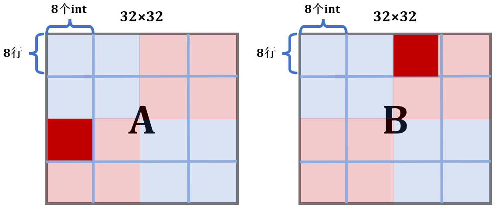

`A`中标红的块占用的是缓存的第 0，4，8，12，16，20，24，28组，而`B`中标红的块占用的是缓存的第2，6，10，14，18，16，30组，刚好不会冲突。事实上，**除了对角线**，`A`与`B`中对应的块都不会冲突。所以，我们的想法是可行的，写出代码：

```c
void transpose_submit(int M, int N, int A[N][M], int B[M][N])
{
    for (int i = 0; i < N; i += 8)
        for (int j = 0; j < M; j += 8)
            for (int k = 0; k < 8; k++)
                for (int s = 0; s < 8; s++)
                    B[j + s][i + k] = A[i + k][j + s];
}
```

对于`A`中每一个操作块，只有每一行的第一个元素会不命中，所以为8次不命中；对于`B`中每一个操作块，只有每一列的第一个元素会不命中，所以也为 8 次不命中。总共`miss`次数为：8 × 16 × 2 = 256

跑出结果：

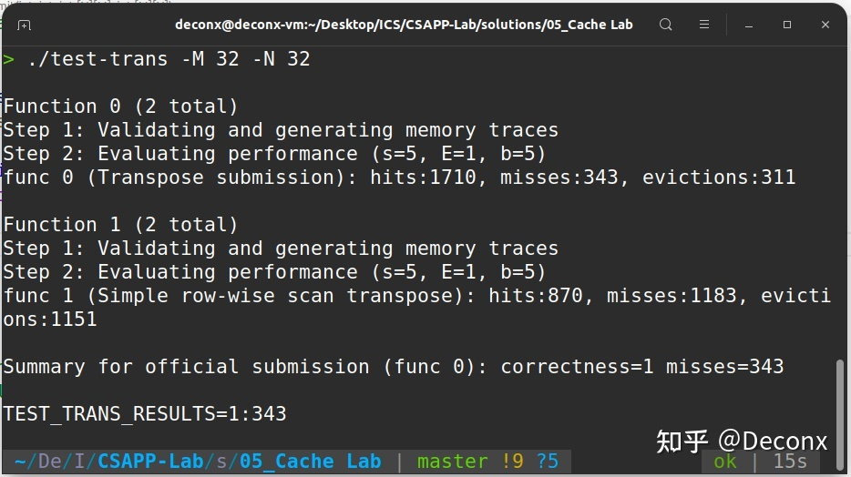

`miss`次数为343，与我们计算的结果差距非常大，没有得到满分，这是为什么呢？这就要考虑到对角线上的块了。`A`与`B`对角线上的块在缓存中对应的位置是相同的，而它们在转置过程中位置不变，所以复制过程中会发生相互冲突。

以`A`的一个对角线块`p`，`B`与`p`相应的对角线块`q`为例，复制前， `p` 在缓存中。 复制时，`q`会驱逐`p`。 下一个开始复制 `p` 又被重新加载进入缓存驱逐 `q`，这样就会多产生两次`miss`。

如何解决这种问题呢？题目给了我们提示：

>You are allowed to define at most 12 local variables of type int per transpose function

考虑使用 8 个本地变量一次性存下 `A` 的一行后，再复制给 `B`。代码如下：

```c
void transpose_submit(int M, int N, int A[N][M], int B[M][N])
{
    for(int i = 0; i < 32; i += 8)
        for(int j = 0; j < 32; j += 8)
            for (int k = i; k < i + 8; k++)
            {
                int a_0 = A[k][j];
                int a_1 = A[k][j+1];
                int a_2 = A[k][j+2];
                int a_3 = A[k][j+3];
                int a_4 = A[k][j+4];
                int a_5 = A[k][j+5];
                int a_6 = A[k][j+6];
                int a_7 = A[k][j+7];
                B[j][k] = a_0;
                B[j+1][k] = a_1;
                B[j+2][k] = a_2;
                B[j+3][k] = a_3;
                B[j+4][k] = a_4;
                B[j+5][k] = a_5;
                B[j+6][k] = a_6;
                B[j+7][k] = a_7;
            }         
}
```

对于非对角线上的块，本身就没有额外的冲突；对于对角线上的块，写入`A`每一行的第一个元素后，这一行的元素都进入了缓存，我们就立即用本地变量存下这 8 个元素，随后再复制给`B`。这样，就避免了第一个元素复制时，`B`把`A`的缓冲行驱逐，导致没有利用上`A`的缓冲。

结果如下：

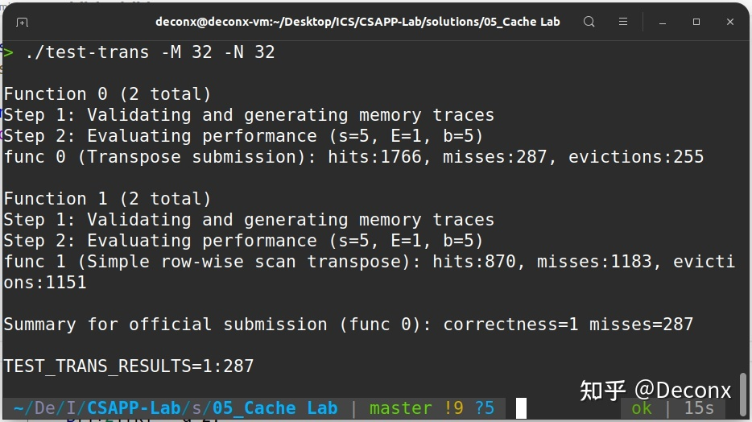

`miss`次数为 287，满分！

## 64 × 64

每 4 行就会占满一个缓存，先考虑 4 × 4 分块，结果如下：

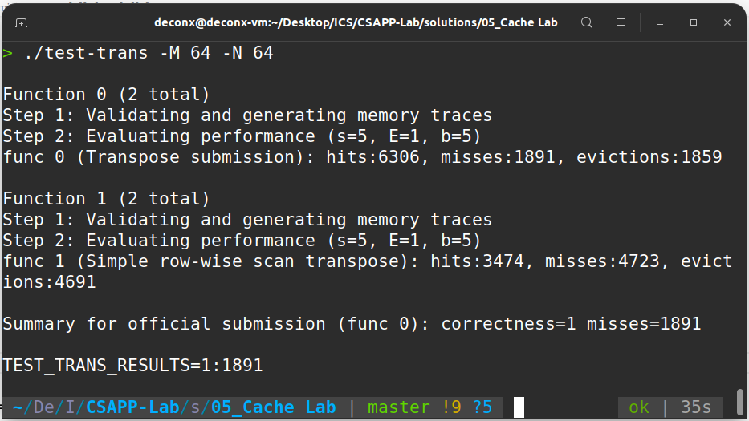

结果还不错，虽然没有得到满分。

还是考虑 8 × 8 分块，由于存在着每 4 行就会占满一个缓存的问题，在分块内部处理时就需要技巧了，我们把分块内部分成 4 个 4 × 4 的小分块分别处理：

- 第一步，将`A`的左上和右上一次性复制给`B`
- 第二步，用本地变量把`B`的右上角存储下来
- 第三步，将`A`的左下复制给`B`的右上
- 第四步，利用上述存储`B`的右上角的本地变量，把`A`的右上复制给`B`的左下
- 第五步，把`A`的右下复制给`B`的右下

画出图解如下：

**这里的`A`和`B`均表示两个矩阵中的 8 × 8 块**

**第 1 步：**

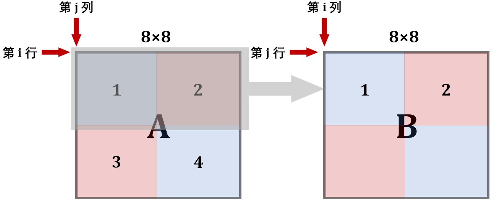

此时`B`的前 4 行就在缓存中了，接下来考虑利用这个缓存 。可以看到，为了利用`A`的缓存，第 2 块放置的位置实际上是错的，接下来就用本地变量保存`B`中 2 块的内容

**第 2 步：**

用本地变量把`B`的 2 块存储下来

```c
for (int k = j; k < j + 4; k++){
	a_0 = B[k][i + 4];
    a_1 = B[k][i + 5];
    a_2 = B[k][i + 6];
    a_3 = B[k][i + 7];
}
```

**第 3 步：**

现在缓存中还是存着`B`中上两块的内容，所以将`A`的 3 块内容复制给它

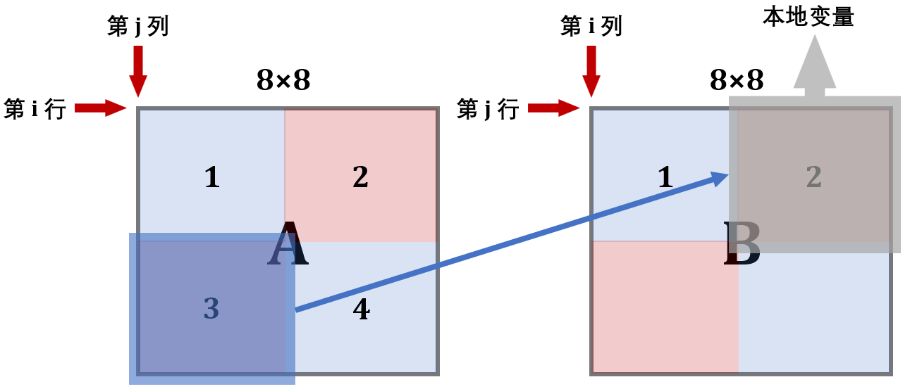

**第 4/5 步：**

现在缓存已经利用到极致了，可以开辟`B`的下面两块了

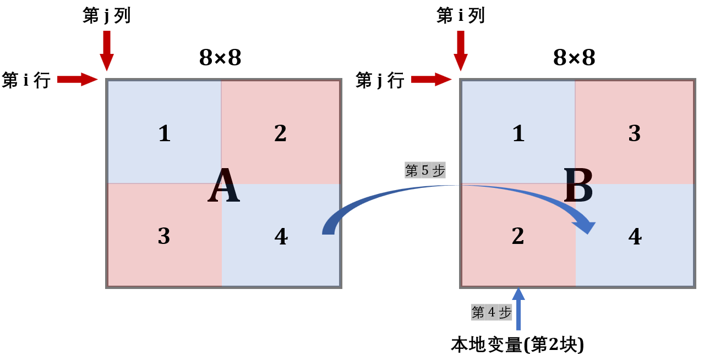

这样就实现了转置，且消除了同一行中的冲突，具体代码如下：

```c
void transpose_64x64(int M, int N, int A[N][M], int B[M][N])
{
    int a_0, a_1, a_2, a_3, a_4, a_5, a_6, a_7;
    for (int i = 0; i < 64; i += 8){
        for (int j = 0; j < 64; j += 8){
            for (int k = i; k < i + 4; k++){
                // 得到A的第1,2块
                a_0 = A[k][j + 0];
                a_1 = A[k][j + 1];
                a_2 = A[k][j + 2];
                a_3 = A[k][j + 3];
                a_4 = A[k][j + 4];
                a_5 = A[k][j + 5];
                a_6 = A[k][j + 6];
                a_7 = A[k][j + 7];
				// 复制给B的第1,2块
                B[j + 0][k] = a_0;
                B[j + 1][k] = a_1;
                B[j + 2][k] = a_2;
                B[j + 3][k] = a_3;
                B[j + 0][k + 4] = a_4;
                B[j + 1][k + 4] = a_5;
                B[j + 2][k + 4] = a_6;
                B[j + 3][k + 4] = a_7;
            }
            for (int k = j; k < j + 4; k++){
                // 得到B的第2块
                a_0 = B[k][i + 4];
                a_1 = B[k][i + 5];
                a_2 = B[k][i + 6];
                a_3 = B[k][i + 7];
				// 得到A的第3块
                a_4 = A[i + 4][k];
                a_5 = A[i + 5][k];
                a_6 = A[i + 6][k];
                a_7 = A[i + 7][k];
				// 复制给B的第2块
                B[k][i + 4] = a_4;
                B[k][i + 5] = a_5;
                B[k][i + 6] = a_6;
                B[k][i + 7] = a_7;
				// B原来的第2块移动到第3块
                B[k + 4][i + 0] = a_0;
                B[k + 4][i + 1] = a_1;
                B[k + 4][i + 2] = a_2;
                B[k + 4][i + 3] = a_3;
            }
            for (int k = i + 4; k < i + 8; k++)
            {
                // 处理第4块
                a_4 = A[k][j + 4];
                a_5 = A[k][j + 5];
                a_6 = A[k][j + 6];
                a_7 = A[k][j + 7];
                B[j + 4][k] = a_4;
                B[j + 5][k] = a_5;
                B[j + 6][k] = a_6;
                B[j + 7][k] = a_7;
            }
        }
    }
}
```

运行结果：

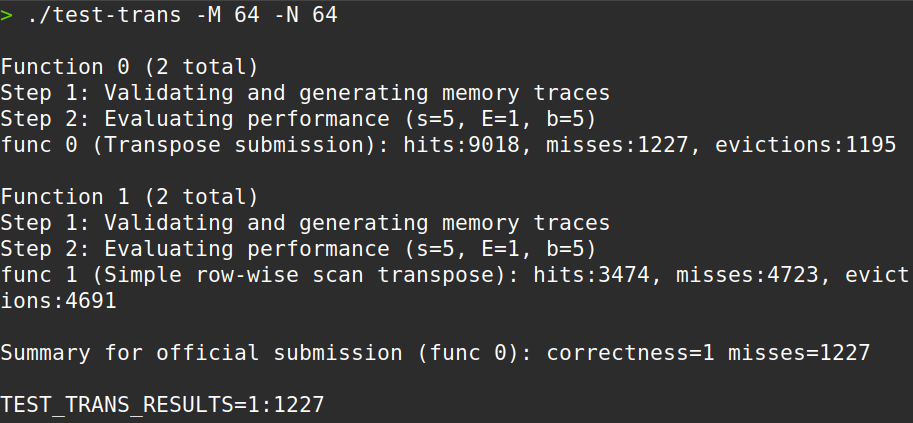

`miss`为 1227，通过！

## 61 × 67

这个矩阵的转置要求很松，`miss`为 2000 以下就可以了。我也无心进行更深入的优化，直接 16 × 16 的分块就能通过。

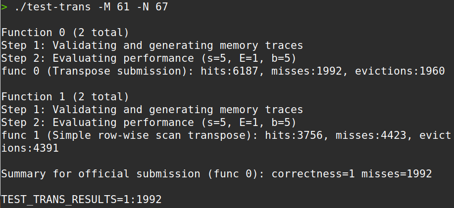

`miss`为 1992，擦线满分！

# 总结

先附上满分完结图：

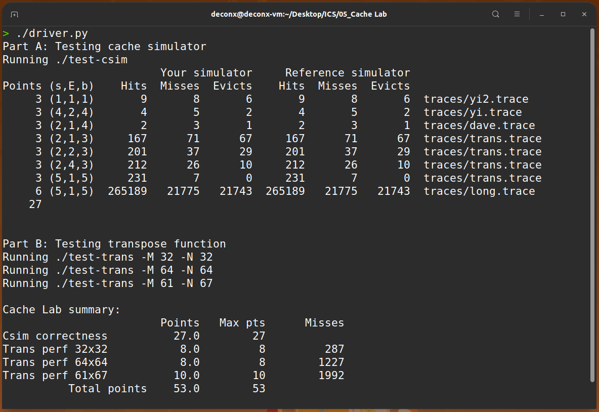

- Cache Lab 是我在做前 5 个实验中感觉最痛苦的一个，主要原因在于我的代码能力较弱，逻辑思维能力较差，以后应该加强这方面的训练
- 这个实验的 Part A 让我对缓存的设计有了更深入的理解，其中替换策略也值得以后继续研究；Part B 为我展示了计算机之美，一个简简单单的转置函数，无论怎么写，时间复杂度都是$O(n^2)$，然而因为缓冲区的问题，不同代码的性能竟然有着天壤之别。编写函数过程中，对`miss`的估量与计算很烧脑，但也很有趣
- 本实验耗时 2 天，约 20 小时
