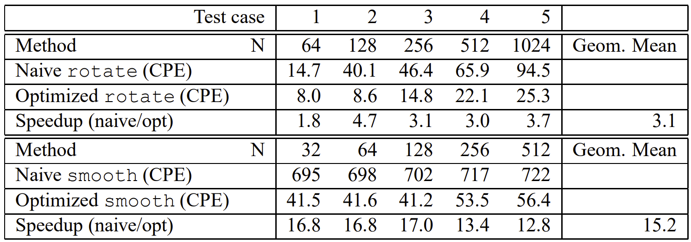
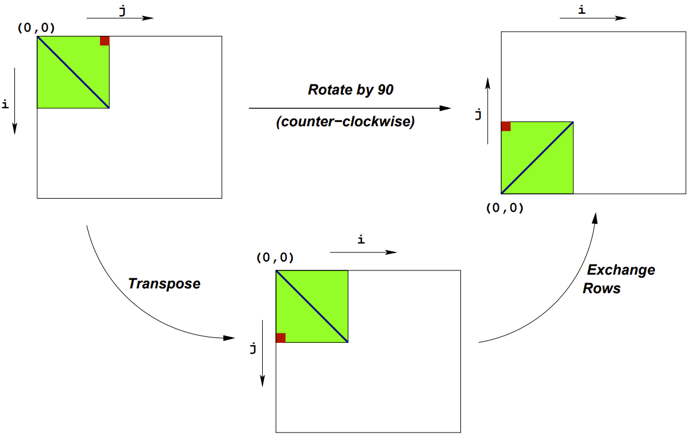
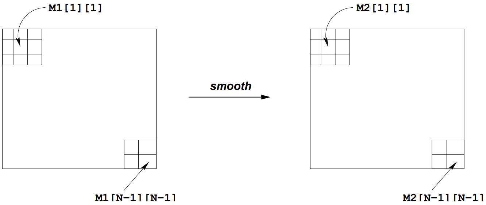

在 CMU，这个实验已经被 Cache Lab 取代了，含金量不高，相比其他实验也粗糙了很多，我不是很建议做。这周，我本打算开干 Shell Lab，奈何对 CSAPP 的第7、8章理解不甚透彻，于是先做做 Performance Lab 缓冲一下。

# 实验概览

要求编写两个图片处理的函数：将图片逆时针旋转90°、利用平均值替换的方式使图片平滑。最后根据函数运行的 CPE 得到分数。测试数据以及计算方式举例如下：



实验的设计者用朴素方法实现了两个函数，运行情况及分数为：

```c
> ./driver
Teamname: Oh!
Member 1: Deconx
Email 1: deconx@vip.qq.com

Rotate: Version = naive_rotate: Naive baseline implementation:
Dim             64      128     256     512     1024    Mean
Your CPEs       1.4     2.0     3.8     7.1     6.3
Baseline CPEs   14.7    40.1    46.4    65.9    94.5
Speedup         10.8    19.9    12.2    9.3     15.1    13.0

Rotate: Version = rotate: Current working version:
Dim             64      128     256     512     1024    Mean
Your CPEs       1.4     2.0     3.9     7.4     6.5
Baseline CPEs   14.7    40.1    46.4    65.9    94.5
Speedup         10.6    20.0    12.0    8.9     14.5    12.7

Smooth: Version = smooth: Current working version:
Dim             32      64      128     256     512     Mean
Your CPEs       40.4    41.9    41.2    41.8    41.8
Baseline CPEs   695.0   698.0   702.0   717.0   722.0
Speedup         17.2    16.6    17.0    17.2    17.3    17.1

Smooth: Version = naive_smooth: Naive baseline implementation:
Dim             32      64      128     256     512     Mean
Your CPEs       39.4    41.2    41.4    42.2    42.7
Baseline CPEs   695.0   698.0   702.0   717.0   722.0
Speedup         17.6    17.0    17.0    17.0    16.9    17.1

Summary of Your Best Scores:
  Rotate: 13.0 (naive_rotate: Naive baseline implementation)
  Smooth: 17.1 (naive_smooth: Naive baseline implementation)
```

# 回顾：程序性能优化方法

做实验的目的在于学习与巩固，趁着这个机会，我将第 5 章的内容总结一下

## 1. 消除循环低效率

考虑如下代码：

```c
int sum(int a[])
{
    int sum = 0;
    for(i = 0; i < length(a); i++){
        sum += a[i];
    }
    return sum;
}
```

过程`sum`调用`length`函数作为`for`循环的测试条件，每次循环迭代时都都会调用这个函数，而数组`a`的长度并不会随着循环的进行而改变，这样就会拖累程序性能，可以改为以下形式：

```c
int sum(int a[])
{
    int i;
    int sum = 0;
    int len = length(a);
    for(i = 0; i < len; i++){
        sum += a[i];
    }
    return sum;
}
```

这种优化办法称为**代码移动**

## 2. 消除内存引用

考虑如下代码：

```c
void mult(int a[], int *dst)
{
    int i;
    int len = length(a);
    for(i = 0; i < len; i++){
		*dst = *dst*a[i];
    }
}
```

该函数的功能是将数组`a`的全部元素都乘到指针`dst`指向的内存中。每次迭代时，累积变量的值都会从`dst`指向的内存中读出，进行运算后再写入，这样的内存读写非常浪费，考虑如下优化：

```c
void mult(int a[], int *dst)
{
    int i;
    int len = length(a);
    int temp = *dst;
    for(i = 0; i < len; i++){
		temp = temp*a[i];
    }
    *dst = temp;
}
```

先将`dst`指向的内存加载到寄存器中，所有操作结束后才写回到内存中，这样就能避免大量的内存读写。

## 3. 循环展开

循环展开在 Architecture Lab 中进行了深入的探讨：

https://zhuanlan.zhihu.com/p/480380496

循环展开通过增加每次迭代计算的元素的数量，减少循环的迭代次数来提升效率，主要有以下两方面原因：

- 减少了索引计算的次数
- 减少了条件分支的判断次数

# rotate

矩阵旋转可以转化为以下两步简单的矩阵操作：

- 转置
- 将第 $i$ 行与第 $N-1-i$ 行交换



实验设计者编写的原始代码如下：

```c
void naive_rotate(int dim, pixel *src, pixel *dst) 
{
    int i, j;

    for (i = 0; i < dim; i++)
	for (j = 0; j < dim; j++)
	    dst[RIDX(dim-1-j, i, dim)] = src[RIDX(i, j, dim)];
}
```

很明显，这里可以进行矩阵分块，分块处理我们已经在 Cache Lab 中进行了深入的研究，这里就不再重复分析了。

## 32 × 32 分块

测试数据的矩阵维数均为 32 的倍数，所以先考虑 32 × 32 分块

32×32 分块

```c
void rotate(int dim, pixel *src, pixel *dst) 
{
    for (int i = 0; i < dim; i += 32){
        for (int j = 0; j < dim; j += 32){
            for (int k = i; k < i+32; k++){
                for (int s = j; s < j+32; s++){
                    dst[RIDX(dim-1-s, k, dim)] = src[RIDX(k, s, dim)];
                }
            }
        }
    }
}
```

结果如下：

```c
Rotate: Version = naive_rotate: Naive baseline implementation:
Dim             64      128     256     512     1024    Mean
Your CPEs       1.4     2.1     3.6     7.8     6.9
Baseline CPEs   14.7    40.1    46.4    65.9    94.5
Speedup         10.2    18.7    12.7    8.4     13.8    12.3

Rotate: Version = rotate: Current working version:
Dim             64      128     256     512     1024    Mean
Your CPEs       1.9     2.1     2.3     2.9     6.9
Baseline CPEs   14.7    40.1    46.4    65.9    94.5
Speedup         7.9     19.5    19.8    22.6    13.8    15.7
```

效果不太理想，考虑消除最内层循环：

```c
void rotate(int dim, pixel *src, pixel *dst) 
{
    for (int i = 0; i < dim; i += 32){
        for (int j = 0; j < dim; j += 32){
            for (int k = i; k < i+32; k++){
                dst[RIDX(dim-1-j, k, dim)] = src[RIDX(k, j+0, dim)];
                dst[RIDX(dim-2-j, k, dim)] = src[RIDX(k, j+1, dim)];
                dst[RIDX(dim-3-j, k, dim)] = src[RIDX(k, j+2, dim)];
                dst[RIDX(dim-4-j, k, dim)] = src[RIDX(k, j+3, dim)];
                dst[RIDX(dim-5-j, k, dim)] = src[RIDX(k, j+4, dim)];
                dst[RIDX(dim-6-j, k, dim)] = src[RIDX(k, j+5, dim)];
                dst[RIDX(dim-7-j, k, dim)] = src[RIDX(k, j+6, dim)];
                dst[RIDX(dim-8-j, k, dim)] = src[RIDX(k, j+7, dim)];
                dst[RIDX(dim-9-j, k, dim)] = src[RIDX(k, j+8, dim)];
                dst[RIDX(dim-10-j, k, dim)] = src[RIDX(k, j+9, dim)];
                dst[RIDX(dim-11-j, k, dim)] = src[RIDX(k, j+10, dim)];
                dst[RIDX(dim-12-j, k, dim)] = src[RIDX(k, j+11, dim)];
                dst[RIDX(dim-13-j, k, dim)] = src[RIDX(k, j+12, dim)];
                dst[RIDX(dim-14-j, k, dim)] = src[RIDX(k, j+13, dim)];
                dst[RIDX(dim-15-j, k, dim)] = src[RIDX(k, j+14, dim)];
                dst[RIDX(dim-16-j, k, dim)] = src[RIDX(k, j+15, dim)];
                dst[RIDX(dim-17-j, k, dim)] = src[RIDX(k, j+16, dim)];
                dst[RIDX(dim-18-j, k, dim)] = src[RIDX(k, j+17, dim)];
                dst[RIDX(dim-19-j, k, dim)] = src[RIDX(k, j+18, dim)];
                dst[RIDX(dim-20-j, k, dim)] = src[RIDX(k, j+19, dim)];
                dst[RIDX(dim-21-j, k, dim)] = src[RIDX(k, j+20, dim)];
                dst[RIDX(dim-22-j, k, dim)] = src[RIDX(k, j+21, dim)];
                dst[RIDX(dim-23-j, k, dim)] = src[RIDX(k, j+22, dim)];
                dst[RIDX(dim-24-j, k, dim)] = src[RIDX(k, j+23, dim)];
                dst[RIDX(dim-25-j, k, dim)] = src[RIDX(k, j+24, dim)];
                dst[RIDX(dim-26-j, k, dim)] = src[RIDX(k, j+25, dim)];
                dst[RIDX(dim-27-j, k, dim)] = src[RIDX(k, j+26, dim)];
                dst[RIDX(dim-28-j, k, dim)] = src[RIDX(k, j+27, dim)];
                dst[RIDX(dim-29-j, k, dim)] = src[RIDX(k, j+28, dim)];
                dst[RIDX(dim-30-j, k, dim)] = src[RIDX(k, j+29, dim)];
                dst[RIDX(dim-31-j, k, dim)] = src[RIDX(k, j+30, dim)];
                dst[RIDX(dim-32-j, k, dim)] = src[RIDX(k, j+31, dim)];
            }
        }
    }
}
```

结果：

```c
Rotate: Version = naive_rotate: Naive baseline implementation:
Dim             64      128     256     512     1024    Mean
Your CPEs       1.4     2.1     3.8     7.4     6.5
Baseline CPEs   14.7    40.1    46.4    65.9    94.5
Speedup         10.3    19.1    12.1    8.9     14.6    12.5

Rotate: Version = rotate: Current working version:
Dim             64      128     256     512     1024    Mean
Your CPEs       1.6     1.8     2.1     2.7     5.7
Baseline CPEs   14.7    40.1    46.4    65.9    94.5
Speedup         9.2     22.8    22.0    24.0    16.5    17.8
```

## 最优分块

经过多轮测试，我发现 8 × 8 分块的效果是最好的，代码如下：

```c
void rotate(int dim, pixel *src, pixel *dst) 
{
    for (int i = 0; i < dim; i += 8){
        for (int j = 0; j < dim; j += 8){
            for (int k = i; k < i+8; k++){
                dst[RIDX(dim-1-j, k, dim)] = src[RIDX(k, j+0, dim)];
                dst[RIDX(dim-2-j, k, dim)] = src[RIDX(k, j+1, dim)];
                dst[RIDX(dim-3-j, k, dim)] = src[RIDX(k, j+2, dim)];
                dst[RIDX(dim-4-j, k, dim)] = src[RIDX(k, j+3, dim)];
                dst[RIDX(dim-5-j, k, dim)] = src[RIDX(k, j+4, dim)];
                dst[RIDX(dim-6-j, k, dim)] = src[RIDX(k, j+5, dim)];
                dst[RIDX(dim-7-j, k, dim)] = src[RIDX(k, j+6, dim)];
                dst[RIDX(dim-8-j, k, dim)] = src[RIDX(k, j+7, dim)];
            }
        }
    }
}
```

测试一下：

```c
Rotate: Version = naive_rotate: Naive baseline implementation:
Dim             64      128     256     512     1024    Mean
Your CPEs       1.4     1.9     3.6     7.0     6.1
Baseline CPEs   14.7    40.1    46.4    65.9    94.5
Speedup         10.8    21.1    13.0    9.5     15.6    13.4

Rotate: Version = rotate: Current working version:
Dim             64      128     256     512     1024    Mean
Your CPEs       1.4     1.6     1.7     1.9     2.4
Baseline CPEs   14.7    40.1    46.4    65.9    94.5
Speedup         10.1    25.5    27.7    34.5    39.3    25.0
```

拿到了 **25 分**，这个结果应该是比较理想了。

# smooth

这部分是将图像光滑处理，将每一个像素点的 RGB 值设置为以它为中心附近最多九块的平均值。要注意边界的情况：



原始代码如下：

```c
typedef struct {
    int red;
    int green;
    int blue;
    int num;
} pixel_sum;
/* Compute min and max of two integers, respectively */
static int min(int a, int b) { return (a < b ? a : b); }
static int max(int a, int b) { return (a > b ? a : b); }
/* 
 * initialize_pixel_sum - Initializes all fields of sum to 0 
 */
static void initialize_pixel_sum(pixel_sum *sum) 
{
    sum->red = sum->green = sum->blue = 0;
    sum->num = 0;
    return;
}
/* 
 * accumulate_sum - Accumulates field values of p in corresponding 
 * fields of sum 
 */
static void accumulate_sum(pixel_sum *sum, pixel p) 
{
    sum->red += (int) p.red;
    sum->green += (int) p.green;
    sum->blue += (int) p.blue;
    sum->num++;
    return;
}
/* 
 * assign_sum_to_pixel - Computes averaged pixel value in current_pixel 
 */
static void assign_sum_to_pixel(pixel *current_pixel, pixel_sum sum) 
{
    current_pixel->red = (unsigned short) (sum.red/sum.num);
    current_pixel->green = (unsigned short) (sum.green/sum.num);
    current_pixel->blue = (unsigned short) (sum.blue/sum.num);
    return;
}
/* 
 * avg - Returns averaged pixel value at (i,j) 
 */
static pixel avg(int dim, int i, int j, pixel *src) 
{
    int ii, jj;
    pixel_sum sum;
    pixel current_pixel;

    initialize_pixel_sum(&sum);
    for(ii = max(i-1, 0); ii <= min(i+1, dim-1); ii++) 
	for(jj = max(j-1, 0); jj <= min(j+1, dim-1); jj++) 
	    accumulate_sum(&sum, src[RIDX(ii, jj, dim)]);

    assign_sum_to_pixel(&current_pixel, sum);
    return current_pixel;
}
/*
 * naive_smooth - The naive baseline version of smooth 
 */
void naive_smooth(int dim, pixel *src, pixel *dst) 
{
    int i, j;

    for (i = 0; i < dim; i++)
	for (j = 0; j < dim; j++)
	    dst[RIDX(i, j, dim)] = avg(dim, i, j, src);
}
```

以上代码有明显的性能缺陷：

- 循环低效率。遍历过程中，对每一个点都调用了`min`函数、
- 没有利用循环展开

思路：

- 先对四角、四边单独处理，然后再对内部进行循环处理，这样就能避免调用`min`和`max`函数

代码如下：

```c
static void set_corner(int cc, pixel *src, pixel *dst, int a1, int a2, int a3){
    dst[cc].blue = (src[cc].blue+src[a1].blue+src[a2].blue+src[a3].blue) >> 2;
    dst[cc].green = (src[cc].green+src[a1].green+src[a2].green+src[a3].green) >> 2;
    dst[cc].red = (src[cc].red+src[a1].red+src[a2].red+src[a3].red) >> 2;
}
static void set_top(int dim, pixel *src, pixel *dst, int j){
    dst[j].blue = (src[j].blue+src[j+dim].blue+src[j-1].blue+src[j+1].blue+src[j+dim-1].blue+src[j+dim+1].blue)/6;
    dst[j].green = (src[j].green+src[j+dim].green+src[j-1].green+src[j+1].green+src[j+dim-1].green+src[j+dim+1].green)/6;
    dst[j].red = (src[j].red+src[j+dim].red+src[j-1].red+src[j+1].red+src[j+dim-1].red+src[j+dim+1].red)/6;
}
static void set_bottom(int dim, pixel *src, pixel *dst, int j){
    dst[j].blue = (src[j].blue+src[j-dim].blue+src[j-1].blue+src[j+1].blue+src[j-dim-1].blue+src[j-dim+1].blue)/6;
    dst[j].green = (src[j].green+src[j-dim].green+src[j-1].green+src[j+1].green+src[j-dim-1].green+src[j-dim+1].green)/6;
    dst[j].red = (src[j].red+src[j-dim].red+src[j-1].red+src[j+1].red+src[j-dim-1].red+src[j-dim+1].red)/6;
}
static void set_left(int dim, pixel *src, pixel *dst, int i){
    dst[i].blue = (src[i].blue+src[i-dim].blue+src[i-dim+1].blue+src[i+1].blue+src[i+dim].blue+src[i+dim+1].blue)/6;
    dst[i].green = (src[i].green+src[i-dim].green+src[i-dim+1].green+src[i+1].green+src[i+dim].green+src[i+dim+1].green)/6;
    dst[i].red = (src[i].red+src[i-dim].red+src[i-dim+1].red+src[i+1].red+src[i+dim].red+src[i+dim+1].red)/6;
}
static void set_right(int dim, pixel *src, pixel *dst, int i){
    dst[i].blue = (src[i].blue+src[i-dim].blue+src[i-dim-1].blue+src[i-1].blue+src[i+dim].blue+src[i+dim-1].blue)/6;
    dst[i].green = (src[i].green+src[i-dim].green+src[i-dim-1].green+src[i-1].green+src[i+dim].green+src[i+dim-1].green)/6;
    dst[i].red = (src[i].red+src[i-dim].red+src[i-dim-1].red+src[i-1].red+src[i+dim].red+src[i+dim-1].red)/6;
}
static void set_in(int dim, pixel *src, pixel *dst, int k){
    dst[k].blue = (src[k].blue+src[k-1].blue+src[k+1].blue+src[k+dim-1].blue+src[k+dim].blue+src[k+dim+1].blue+src[k-dim-1].blue+src[k-dim].blue+src[k-dim+1].blue)/9;
    dst[k].green = (src[k].green+src[k-1].green+src[k+1].green+src[k+dim-1].green+src[k+dim].green+src[k+dim+1].green+src[k-dim-1].green+src[k-dim].green+src[k-dim+1].green)/9;
    dst[k].red = (src[k].red+src[k-1].red+src[k+1].red+src[k+dim-1].red+src[k+dim].red+src[k+dim+1].red+src[k-dim-1].red+src[k-dim].red+src[k-dim+1].red)/9;
}
/*
 * smooth - Your current working version of smooth. 
 * IMPORTANT: This is the version you will be graded on
 */
char smooth_descr[] = "smooth: Current working version";
void smooth(int dim, pixel *src, pixel *dst) 
{
    // 处理四个角
    set_corner(0, src, dst, 1, dim, dim+1);
    set_corner(dim-1, src, dst, dim-2, dim+dim-2, dim+dim-1);
    set_corner(RIDX(dim-1, 0, dim), src, dst, RIDX(dim-1, 1, dim), RIDX(dim-2, 0, dim), RIDX(dim-2, 1, dim));
    set_corner(RIDX(dim-1, dim-1, dim), src, dst, RIDX(dim-1, dim-2, dim), RIDX(dim-2, dim-2, dim), RIDX(dim-2, dim-1, dim));
    // 处理四个边
    for(int j = 1; j <= dim-2; j++){
        set_top(dim, src, dst, j);
        set_bottom(dim, src, dst, dim*dim-dim+j);
        set_left(dim, src, dst, j*dim);
        set_right(dim, src, dst, j*dim+dim-1);
    }
    // 中间部分
    for(int i = 1; i <= dim-2; i++){
        for(int j = 1; j <= dim-2; j++){
            set_in(dim, src, dst, i*dim+j);
        }
    }    
}
```

测试：

```c
Smooth: Version = smooth: Current working version:
Dim             32      64      128     256     512     Mean
Your CPEs       9.3     9.4     9.4     9.2     9.4
Baseline CPEs   695.0   698.0   702.0   717.0   722.0
Speedup         75.0    74.6    74.4    78.0    76.6    75.7

Smooth: Version = naive_smooth: Naive baseline implementation:
Dim             32      64      128     256     512     Mean
Your CPEs       40.2    42.1    42.3    41.8    43.5
Baseline CPEs   695.0   698.0   702.0   717.0   722.0
Speedup         17.3    16.6    16.6    17.1    16.6    16.8
```

性能相比原来提升了近 5 倍，可以说相当不错了。

# 总结

- Performance Lab 设计得很粗糙，没有具体的评分标准，同样的代码每次运行的分数甚至还是不一样的，含金量远远不如 Architeture Lab 的 Part B 和 Cache Lab。

- 这个周末相当于休息了两天，养精蓄锐，迎接下周 Shell Lab 的挑战！

- 本实验耗时 1 天，约 3 小时

  
