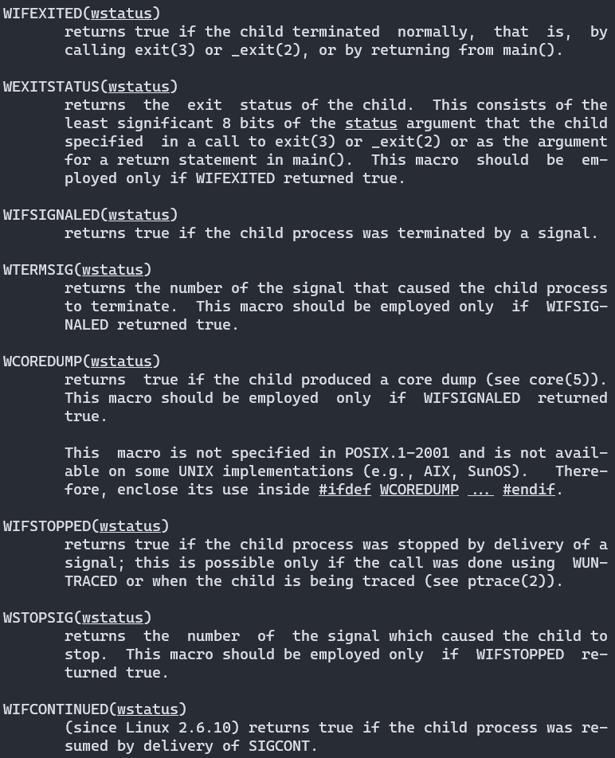
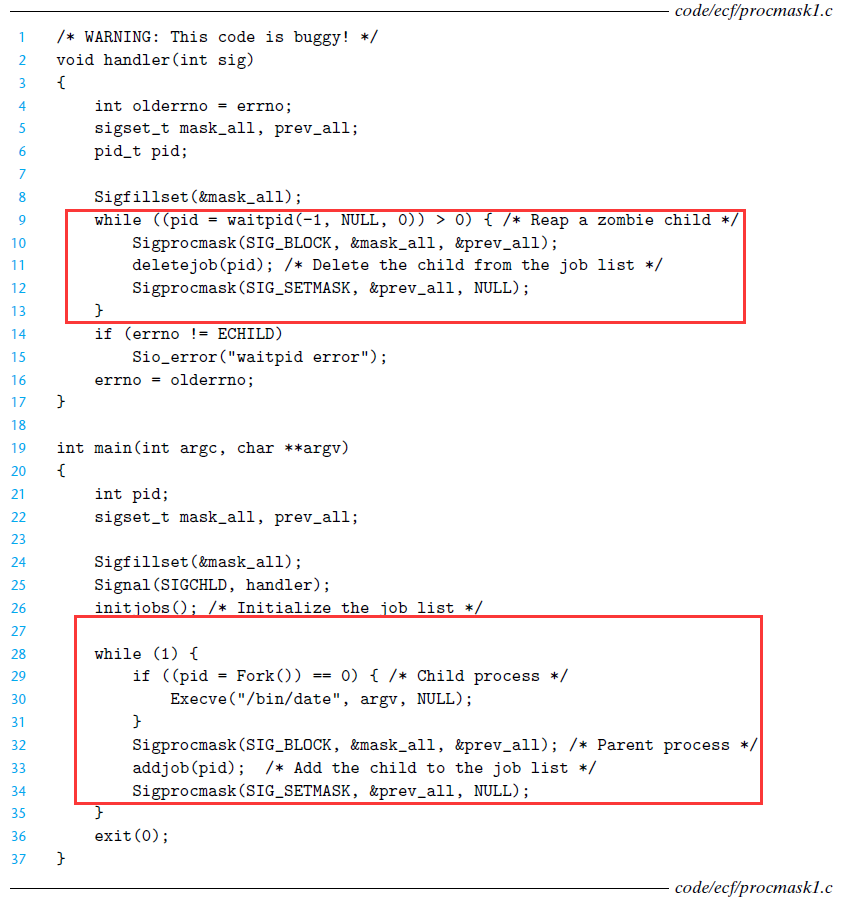
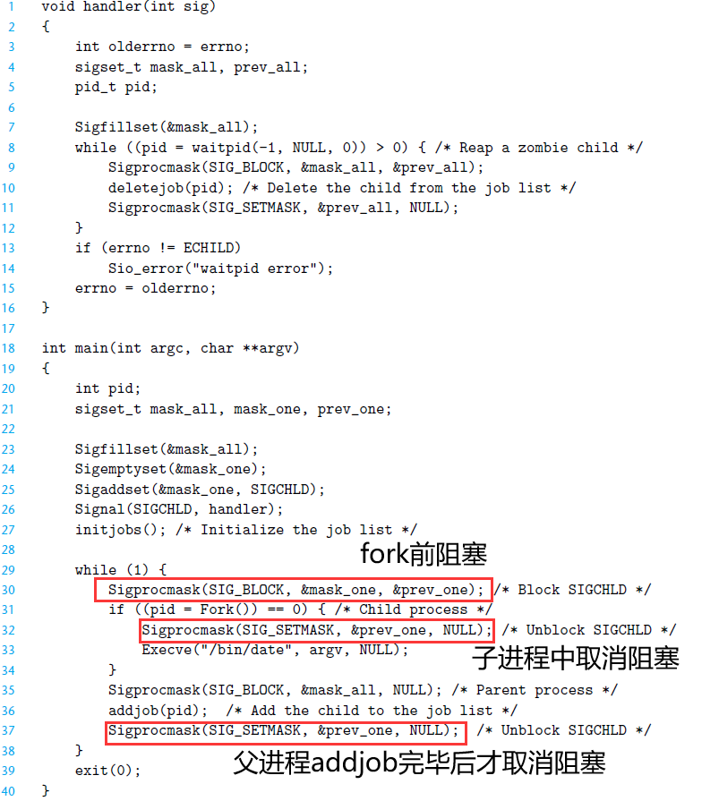
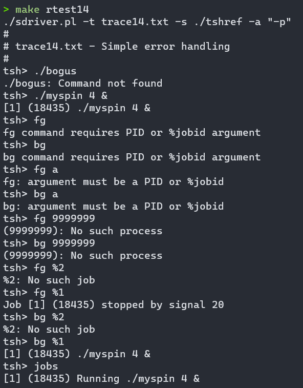
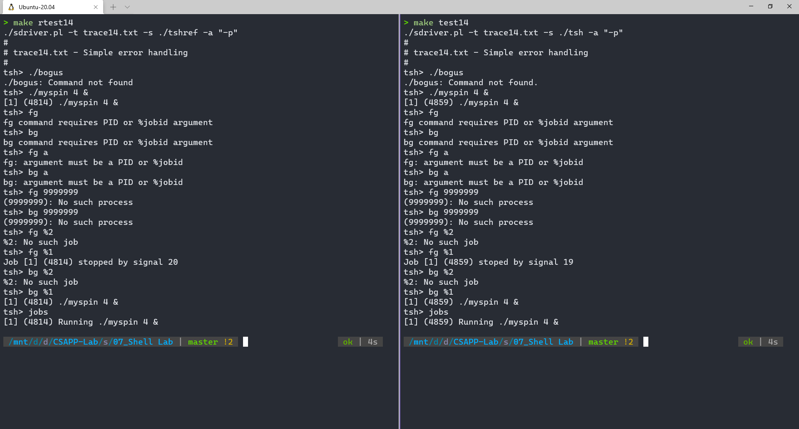
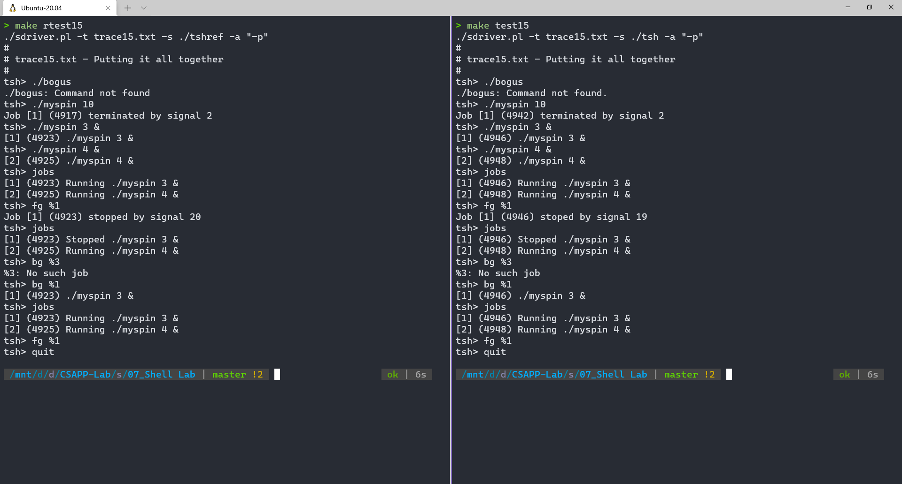
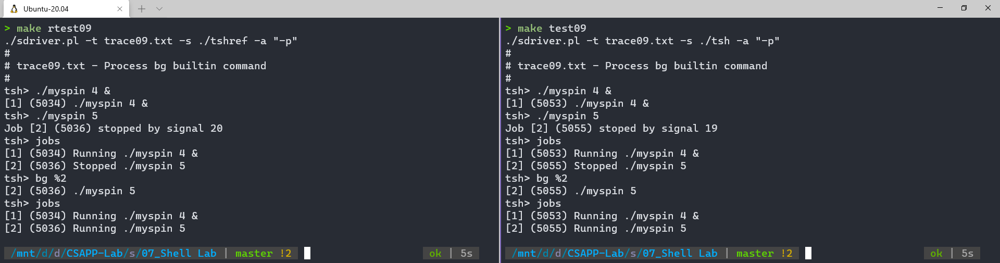

# 实验概览

Shell Lab 要求实现一个带有作业控制的 Unix Shell 程序，需要考虑基础的并发，进程控制以及信号和信号处理。做这个实验之前一定要将 CSAPP 的第八章（异常控制流）仔细研读。

我们需要实现的函数：

- `eval`：解析命令行 **[约 70 行]**
- `builtin_cmd`：检测是否为内置命令`quit`、`fg`、`bg`、`jobs` **[约 25 行]**
- `do_bgfg`：实现内置命令`bg`和`fg` **[约 50 行]**
- `waitfg`：等待前台作业执行完成 **[约 20 行]**
- `sigchld_handler`：处理`SIGCHLD`信号，即子进程停止或者终止 **[约 80 行]**
- `sigint_handler`：处理`SIGINT`信号，即来自键盘的中断`ctrl-c` **[约 15 行]**
- `sigtstp_handler`：处理`SIGTSTP`信号，即来自终端的停止信号 **[约 15 行]**

作者提供的帮助函数及功能：

```c
/* Here are helper routines that we've provided for you */
int parseline(const char *cmdline, char **argv);  //解析命令行参数，如果后台运行则返回 1
void sigquit_handler(int sig);

void clearjob(struct job_t *job);				//清除job结构体
void initjobs(struct job_t *jobs);				//初始化jobs列表
int maxjid(struct job_t *jobs); 				//返回jobs列表中jid最大值
int addjob(struct job_t *jobs, pid_t pid, int state, char *cmdline);	//在jobs列表中添加job
int deletejob(struct job_t *jobs, pid_t pid); 	//在jobs列表中删除pid对应的job
pid_t fgpid(struct job_t *jobs);				//返回前台运行的job的pid
struct job_t *getjobpid(struct job_t *jobs, pid_t pid);	//返回对应pid的job
struct job_t *getjobjid(struct job_t *jobs, int jid); 	//返回对应jid的job
int pid2jid(pid_t pid);		//返回对应pid的job的jid
void listjobs(struct job_t *jobs);	//打印jobs列表

void usage(void);	//帮助信息
void unix_error(char *msg);	//错误信息
void app_error(char *msg);
typedef void handler_t(int);
handler_t *Signal(int signum, handler_t *handler);
```

CMU 文档的一些说明与要求：

- Shell 的提示标记符为 "tsh> "

- 用户键入的命令行应包括命令名称和 0 个或多个参数，所有参数以一个或多个空格分隔。如果 name 是一个内置命令，则 tsh 应该立即处理它并等待下一个命令行。否则，tsh 假定该名称是一个可执行程序的路径，并在在一个初始子进程的上下文中加载并运行
- tsh 不需要支持管道（|）或 I/O 重定向（< 和 >）
- 键入 ctrl-c（ctrl-z）应该会发送一个 SIGINT（SIGTSTP）信号给当前的前台作业以及它的子进程。如果没有前台作业，则该信号应该没有任何作用
- 如果命令行以 ＆ 结束，则 tsh 应该在后台运行该作业。否则，它应该在前台运行
- 每个作业都可以由一个进程 ID（PID）或一个作业 ID（JID）标识，该 ID 是一个由 tsh 分配的正整数。 JID应该在命令行上以前缀 “％” 表示。例如，“％5” 表示 JID 5，“ 5” 表示 PID 5
- tsh 应该支持以下内置命令：
  - quit：终止 tsh 程序。
  - jobs：列出所有后台作业
  - bg <job>：向作业其发送 SIGCONT 信号来重新启动 <job>，然后在后台运行
  - fg  <job>：向作业发送 SIGCONT 信号来重新启动 <job>，然后在前台运行

- tsh 必须回收所有的僵死进程

# 实验前

在正式实验之前，我们还是回顾一下相关知识

## 回顾：回收子进程

一个终止了但是还未被回收的进程称为僵死进程。对于一个长时间运行的程序（比如 Shell）来说，内核不会安排`init`进程去回收僵死进程，而它虽不运行却仍然消耗系统资源，因此实验要求我们回收所有的僵死进程。

`waitpid`是一个非常重要的函数，一个进程可以调用`waitpid`函数来等待它的子进程终止或停止，从而回收子进程，在本实验大量用到，我们必须学习它的用法：

这个函数用来挂起调用进程的执行，直到`pid`对应的等待集合的一个子进程的改变才返回，包括三种状态的改变：

- 子进程终止
- 子进程收到信号停止
- 子进程收到信号重新执行

如果一个子进程在调用之前就已经终止了，那么函数就会立即返回，否则，就会阻塞，直到一个子进程改变状态。

等待集合以及监测那些状态都是用函数的参数确定的，函数定义如下：

```c
pid_t waitpid(pid_t pid, int *wstatus, int options);
```

各参数含义及使用

- **pid：判定等待集合成员**
  - pid > 0 : 等待集合为 pid 对应的单独子进程
  - pid = -1: 等待集合为所有的子进程
  - pid < -1: 等待集合为一个进程组，ID 为 pid 的绝对值
  - pid = 0 : 等待集合为一个进程组，ID 为调用进程的 pid
- **options：修改默认行为**
  - WNOHANG：集合中任何子进程都未终止，立即返回 0
  - WUNTRACED：阻塞，直到一个进程终止或停止，返回 PID
  - WCONTINUED：阻塞，直到一个停止的进程收到 SIGCONT 信号重新开始执行
  - 也可以用或运算把 options 的选项组合起来。例如 WNOHANG | WUNTRACED 表示：立即返回，如果等待集合中的子进程都没有被停职或终止，则返回值为 0；如果有一个停止或终止，则返回值为该子进程的 PID

- **statusp：检查已回收子进程的退出状态**

  - waitpid 会在 status 中放上关于导致返回的子进程的状态信息，很容易理解，这里就不再翻译了

  

## 回顾：并发编程原则

这里仅列出在本实验中用到的原则，后面的解析也会大量提及

1. 注意保存和恢复 errno。很多函数会在出错返回式设置 errno，在处理程序中调用这样的函数可能会干扰主程序中其他依赖于 errno 的部分，解决办法是在进入处理函数时用局部变量保存它，运行完成后再将其恢复
2. 访问全局数据时，阻塞所有信号。这里很容易理解，不再解释了
3. 不可以用信号来对其它进程中发生的事情计数。未处理的信号是不排队的，即每种类型的信号最多只能有一个待处理信号。**举例**：如果父进程将要接受三个相同的信号，当处理程序还在处理一个信号时，第二个信号就会加入待处理信号集合，如果此时第三个信号到达，那么它就会被简单地丢弃，从而出现问题
4. 注意考虑同步错误：竞争。我们在下面单独开一节说明

## 回顾：竞争

看如下例子：



这是一个 Unix Shell 的框架，父进程在一个全局列表中记录子进程，并设置了一个 SIGCHLD 处理程序来回收子进程，乍一看没问题，但是考虑如下可能的事件序列：

- 第 29 行，创建子进程运行
- 假设子进程在父进程运行到 32 行，即运行`addjob`函数之前就结束了，并发送一个 SIGCHLD 信号
- 父进程接收到信号，运行信号处理程序，调用`deletejob`函数，而这个`job`本来就没有添加入列表
- 返回父进程，调用`addjob`函数，而这个子进程已经终止并回收了，`job`已经不存在了

也就是说，在这里，`deletejob`函数的调用发生在了`addjos`之前，导致错误。我们称`addjob`和`deletejob`存在竞争。

解决办法也就很容易想到了，即在父进程`folk`之前就阻塞 SIGCHLD 信号：



这样，父进程在`fork`后，`addjob`前一定不会处理 SIGCHLD 信号，保证了`addjob`一定在`deletejob`之前执行

# 错误处理包装函数

当 Unix 系统及函数遇到错误时，它们通常会返回 -1，并设置全局整型变量`errno`来表示什么出错了。为了能让程序检查错误的同时代码不那么臃肿，按照书本推荐的方式，我编写了一套后面将要用到的错误处理包装函数

```c
/* Error wrapper function */
pid_t Fork(void);
void Sigprocmask(int how, const sigset_t *set, sigset_t *oldset);
void Sigemptyset(sigset_t *set);
void Sigfillset(sigset_t *set);
void Sigaddset(sigset_t *set, int signum);
void Execve(const char *filename, char *const argv[], char *const envp[]);
void Setpgid(pid_t pid, pid_t pgid);
void Kill(pid_t pid, int sig);
pid_t Fork(void){
    pid_t pid;
    if((pid = fork()) < 0)
        unix_error("Fork error");
    return pid;
}
void Sigprocmask(int how, const sigset_t *set, sigset_t *oldset){
    if(sigprocmask(how, set, oldset) < 0)
        unix_error("Sigprocmask error");
}
void Sigemptyset(sigset_t *set){
    if(sigemptyset(set) < 0)
        unix_error("Sigprocmask error");
}
void Sigfillset(sigset_t *set){
    if(sigfillset(set) < 0)
        unix_error("Sigfillset error");
}
void Sigaddset(sigset_t *set, int signum){
    if(sigaddset(set, signum) < 0)
        unix_error("Sigaddset error");
}
void Execve(const char *filename, char *const argv[], char *const envp[]){
    if(execve(filename, argv, envp) < 0){
        printf("%s: Command not found.\n", argv[0]);
    }
}
void Setpgid(pid_t pid, pid_t pgid){
    if(setpgid(pid, pgid) < 0){
        unix_error("Setpid error");
    }
}
void Kill(pid_t pid, int sig){
    if(kill(pid, sig) < 0){
        unix_error("Kill error");
    }
}
```

# eval 

这个函数功能是解析命令行后判断为内置命令还是程序路径，分别执行。如果是前台作业，则要等待其完成，如果是后台作业，则要输出其相应信息

## 代码

```c
/* 
 * eval - Evaluate the command line that the user has just typed in
 * 
 * If the user has requested a built-in command (quit, jobs, bg or fg)
 * then execute it immediately. Otherwise, fork a child process and
 * run the job in the context of the child. If the job is running in
 * the foreground, wait for it to terminate and then return.  Note:
 * each child process must have a unique process group ID so that our
 * background children don't receive SIGINT (SIGTSTP) from the kernel
 * when we type ctrl-c (ctrl-z) at the keyboard.  
*/
void eval(char *cmdline) 
{
    char *argv[MAXARGS];    	//存放解析的参数
    char buf[MAXLINE];      	//解析cmdline
    int bg;                 	//判断程序是前台还是后台执行
    int state;                  //指示前台还是后台运行状态
    pid_t pid;              	//执行程序的子进程的pid
    
    strcpy(buf, cmdline);	
    bg = parseline(buf, argv);	//解析参数
    state = bg? BG:FG;          
    if(argv[0] == NULL)			//空行，直接返回
        return;
    sigset_t mask_all, mask_one, prev_one;
    Sigfillset(&mask_all);
    Sigemptyset(&mask_one);
    Sigaddset(&mask_one, SIGCHLD);
    if(!builtin_cmd(argv)) {                            //判断是否为内置命令
        Sigprocmask(SIG_BLOCK, &mask_one, &prev_one);       //fork前阻塞SIGCHLD信号
        if((pid = Fork()) == 0) {						    //创建子进程
            Sigprocmask(SIG_SETMASK, &prev_one, NULL);      //解除子进程的阻塞
            Setpgid(0, 0);                                  //创建新进程组，ID设置为进程PID
            Execve(argv[0], argv, environ);                 //执行
            exit(0);                                        //子线程执行完毕后一定要退出
        }
        if(state==FG){
            Sigprocmask(SIG_BLOCK, &mask_all, NULL);            //添加工作前阻塞所有信号
            addjob(jobs, pid, state, cmdline);                  //添加至作业列表
            Sigprocmask(SIG_SETMASK, &mask_one, NULL);
            waitfg(pid);                                        //等待前台进程执行完毕
        }         
        else{
            Sigprocmask(SIG_BLOCK, &mask_all, NULL);            //添加工作前阻塞所有信号
            addjob(jobs, pid, state, cmdline);                  //添加至作业列表
            Sigprocmask(SIG_SETMASK, &mask_one, NULL);                                 
            printf("[%d] (%d) %s",pid2jid(pid), pid, cmdline);  //打印后台进程信息
        }
        Sigprocmask(SIG_SETMASK, &prev_one, NULL);          //解除阻塞 
    }
    return;
}
```

## 说明

注释已经写得很详细了，这里用到了消除竞争的方法。我要解释两点：

- 为什么调用`printf`时也阻塞信号？这里打印了全局变量，而`printf`函数是线程不安全的，比如可能会出现读内存的同时另一个线程修改它的情况
- 为什么要在执行前创建新线程组？这里主要是为了将子进程组与 tsh 进程组分开，防止发信号终止子进程组时也将 tsh 进程组终止了

参见 Write UP 中的提示：

> After the fork, but before the execve, the child process should call setpgid(0, 0), which puts the child in a new process group whose group ID is identical to the child’s PID. This ensures that there will be only one process, your shell, in the foreground process group.

# builtin_cmd

这个函数就是简简单单判断是否为内置命令

```c
/* 
 * builtin_cmd - If the user has typed a built-in command then execute
 *    it immediately.  
 */
int builtin_cmd(char **argv) 
{
    if (!strcmp(argv[0], "quit"))
        exit(0);
    if (!strcmp(argv[0], "bg") || !strcmp(argv[0], "fg")) {
        do_bgfg(argv);
        return 1;
    }
    if (!strcmp(argv[0], "jobs")) {
        listjobs(jobs);
        return 1;
    }
    if (!strcmp(argv[0], "&"))
        return 1;
    return 0;     /* not a builtin command */
}
```

# do_bgfg

这个函数要实现内置命令`bg`和`fg`，这两个命令的功能如下：

- `bg <job>`：通过向`<job>`对应的作业发送`SIGCONT`信号来使它重启并放在后台运行 

- `fg <job>`：通过向 `<job>`对应的作业发送`SIGCONT`信号来使它重启并放在前台运行
- 输入时后面的参数有`%`则代表`jid`，没有则代表`pid`

`trace14`主要就是用来测试这个命令，查看标准程序的输出：



## 代码

```c
/* 
 * do_bgfg - Execute the builtin bg and fg commands
 */
void do_bgfg(char **argv) 
{
    struct job_t *job = NULL;        //要处理的job
    int state;                      //输入的命令
    int id;                         //存储jid或pid
    if(!strcmp(argv[0], "bg")) state = BG;
        else state = FG;  
    if(argv[1]==NULL){               //没带参数
        printf("%s command requires PID or %%jobid argument\n", argv[0]);
        return;
    }
    if(argv[1][0]=='%'){             //说明是jid
       if(sscanf(&argv[1][1], "%d", &id) > 0){
            job = getjobjid(jobs, id);  //获得job
            if(job==NULL){
                printf("%%%d: No such job\n", id);
                return;
            }
        }
    }
    else if(!isdigit(argv[1][0])) {  //其它符号，非法输入
        printf("%s: argument must be a PID or %%jobid\n", argv[0]);
        return;
    }
    else{                       //pid
        id = atoi(argv[1]);
        job = getjobpid(jobs, id);
        if(job==NULL){
            printf("(%d): No such process\n", id);
            return;
        }

    }
    Kill(-(job->pid), SIGCONT);       //重启进程, 这里发送到进程组
    job->state = state;
    if(state==BG)
        printf("[%d] (%d) %s",job->jid, job->pid, job->cmdline);
    else 
        waitfg(job->pid);
    return;
}
```

## 说明

这个代码的难点主要在于命令行参数的判断，要考虑健壮性。注意原来的后台进程可能会变成前台进程，所以应修改`job`结构体的相应信息

# waitfg

这个函数从要求实现阻塞父进程，直到当前的前台进程不再是前台进程了。这里显然要显示地等待信号，我们先回顾一下相关知识

## 回顾：显式地等待信号

考虑如下代码：

```c
while(fgpid(jobs) != 0)
    pause();
```

这里会有一个竞争，并且它可能引起致命的错误！考虑如下事件序列：

- 父进程调用`fgpid`函数，此时有一个子进程仍然在前台运行，所以判断条件为真，进入循环
- 假定父进程在进入循环后，而执行`pause`前，子进程终止
- 父进程接收到 SIGCHLD 信号，并处理结束后才调用`pause`

由于`pause`仅在捕捉到信号后返回，而之后不会再有任何信号抵达，那么父进程就会永远休眠！

解决办法是用`sleep`函数：因为它不依赖信号来返回，通过每次循环来监测子进程状态

也可以用`sigsuspend`函数，这个函数相当于如下代码：

```c
sigprocmask(SIG_SETMASK, &mask, &prev);
pause();
sigprocmask(SIG_SETMASK, &prev, NULL);
```

在调用`sigsuspend`之前阻塞 SIGCHLD 信号，调用时又通过`sigprocmask`函数，在执行`pause`函数之前解除对信号的阻塞，从而正常休眠。有同学可能会问了：这里并没有消除竞争啊？如果在第 1 行和第 2 行之间子进程终止不还是会发生永久休眠吗？

这就是`sigsuspend`与上述代码的不同之处了，它相当于上述代码的原子版本，即第 1 行和第 2 行总是一起发生的，不会被中断！

##  代码

```c
/* 
 * waitfg - Block until process pid is no longer the foreground process
 */
void waitfg(pid_t pid)
{
    sigset_t mask;
    Sigemptyset(&mask);   
    while (fgpid(jobs) != 0){
        sigsuspend(&mask);      //暂停时取消阻塞,见sigsuspend用法
    }
    return;
}
```

经过上面的回顾，这段代码就很容易理解了。

# 信号处理函数实现

除了前面的 4 个函数，还要实现 3 个信号处理函数。由于他们非常相像，我放在了一起

## sigchld_handler

实现一个 SIGCHLD 信号处理函数，能够回收所有僵死进程

```C
/* 
 * sigchld_handler - The kernel sends a SIGCHLD to the shell whenever
 *     a child job terminates (becomes a zombie), or stops because it
 *     received a SIGSTOP or SIGTSTP signal. The handler reaps all
 *     available zombie children, but doesn't wait for any other
 *     currently running children to terminate.  
 */
void sigchld_handler(int sig) 
{
    int olderrno = errno;   //由于errno是全局变量,注意保存和恢复errno
    int status;
    pid_t pid;
    struct job_t *job;
    sigset_t mask, prev;
    sigfillset(&mask);
    while ((pid = waitpid(-1, &status, WNOHANG | WUNTRACED)) > 0){      //立即返回该子进程的pid
        sigprocmask(SIG_BLOCK, &mask, &prev);   //阻塞所有信号
        if (WIFEXITED(status)){                 //正常终止
            deletejob(jobs, pid);
        }
        else if (WIFSIGNALED(status)){          //因为信号而终止, 打印
            printf ("Job [%d] (%d) terminated by signal %d\n", pid2jid(pid), pid, WTERMSIG(status));
            deletejob(jobs, pid);
        }
        else if (WIFSTOPPED(status)){           //因为信号而停止, 打印
            printf ("Job [%d] (%d) stoped by signal %d\n", pid2jid(pid), pid, WSTOPSIG(status));
            job = getjobpid(jobs, pid);
            job->state = ST;
        }
        sigprocmask(SIG_SETMASK, &prev, NULL);          
    }
    errno = olderrno;
    return;
}
```

这里用到了并发编程原则 1，后面就是利用`waitpid`函数（前面讲解很清楚了），检测子进程的退出状态来实现相应操作，如回收子进程，打印相关信息等等。

## sigint_handler

实现一个 SIGINT 信号处理函数，将信号传送给前台进程

```c
/* 
 * sigint_handler - The kernel sends a SIGINT to the shell whenver the
 *    user types ctrl-c at the keyboard.  Catch it and send it along
 *    to the foreground job.  
 */
void sigint_handler(int sig) 
{
    int olderrno = errno;
    int pid;
    sigset_t mask_all, prev;
    Sigfillset(&mask_all);
    Sigprocmask(SIG_BLOCK, &mask_all, &prev);   //jobs为全局变量
    if((pid = fgpid(jobs)) != 0){
        Sigprocmask(SIG_SETMASK, &prev, NULL);
        Kill(-pid, SIGINT);
    }
    errno = olderrno;
    return;
}
```

为什么要在调用`fpgid`函数之前阻塞信号，我在`waitfg`实现中已经讲解了，这里不再赘述。

## sigstp_handler

实现一个 SIGSTOP 信号处理函数，将信号传送给前台进程

```c
/*
 * sigtstp_handler - The kernel sends a SIGTSTP to the shell whenever
 *     the user types ctrl-z at the keyboard. Catch it and suspend the
 *     foreground job by sending it a SIGTSTP.  
 */
void sigtstp_handler(int sig) 
{
    int olderrno = errno;
    int pid;
    sigset_t mask_all, prev;
    Sigfillset(&mask_all);
    Sigprocmask(SIG_BLOCK, &mask_all, &prev);
    if((pid = fgpid(jobs)) > 0){
        Sigprocmask(SIG_SETMASK, &prev, NULL);
        Kill(-pid, SIGSTOP);
    }
    errno = olderrno;
    return;
}
```

代码与上个函数几乎完全相同

# tsh 测试

实验文件还包括了作者制作的参考 tsh，以及 16 个测试用例，通过跑用例查看结果与参考 tsh 是否相同，就能判断我们写的 tsh 有无问题，我这里仅放出其中几个用例的测试截图（左边为参考 tsh，右边为我的 tsh）：

trace 14：



trace 15：



trace 09：



# 总结

- 本实验还是相当有趣的，我们每天都在用 Shell，而它的一个最基础的作业控制就要考虑如此多的东西：回收进程，避免竞争等，着实令我大开眼界
- 读 CSAPP 第 8 章时，我对很多地方都不甚理解。而做完了本实验，通过亲自编写多线程的代码，考虑如何避免竞争，不断调试由于并发带来的 BUG，我对书上的例程一下子就领悟了，感谢 CMU 提供的实验材料！
- 这是我计算机生涯中第一次真正接触并发，所以很多地方只会照猫画虎，希望以后我的水平能不断提高，甚至能写出像 zsh 这样强大的终端工具
- 本实验耗时 2 天，约 9 小时
