> 朝闻道，夕死可矣。

# 实验概览

Malloc Lab 要求用 C 语言编写一个动态存储分配器，即实现 malloc，free 和 realloc 函数。

性能表现主要考虑两点：

- 空间利用率：mm_malloc 或 mm_realloc 函数分配且未被 mm_free 释放的内存与堆的大小的比值。应该找到好的策略使碎片最小化，以使该比率尽可能接近 1
- 吞吐率：每单位时间完成的最大请求数，即要使时间复杂度尽可能小

分数计算公式：

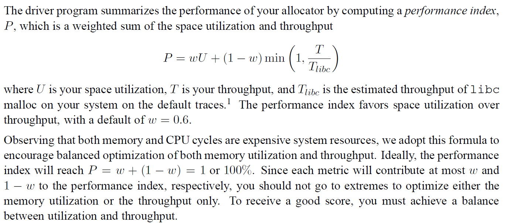

# 实现思路

动态内存分配器维护着一个进程的**虚拟内存**区域，称为堆。如图：

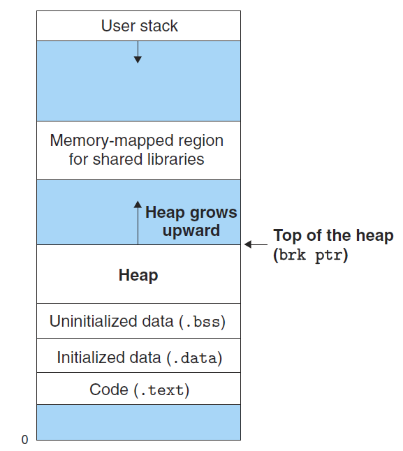

分配器将堆视为一组大小不同的块的集合来维护，且它们的地址是连续的。将块标记为两种，已分配的块供应用程序使用，空闲块用来分配

怎样来组织这些块呢？课本为我们提供了三种实现方式：

## Implicit Free List

把所有块连接起来，每次分配时从头到尾扫描合适的空闲块，我在实验的第一部分实现了这个做法

## Explicit Free Lists

它是 Implicit Free List 的进一步优化，在所有空闲块中记录两个指针，分别指向前一个空闲块和后一个空闲块，相当于在链表中又嵌套了一个链表，这样分配的时候就不需要遍历已分配块了，将分配时间从块总数的线性时间缩短为空闲块数量的线性时间

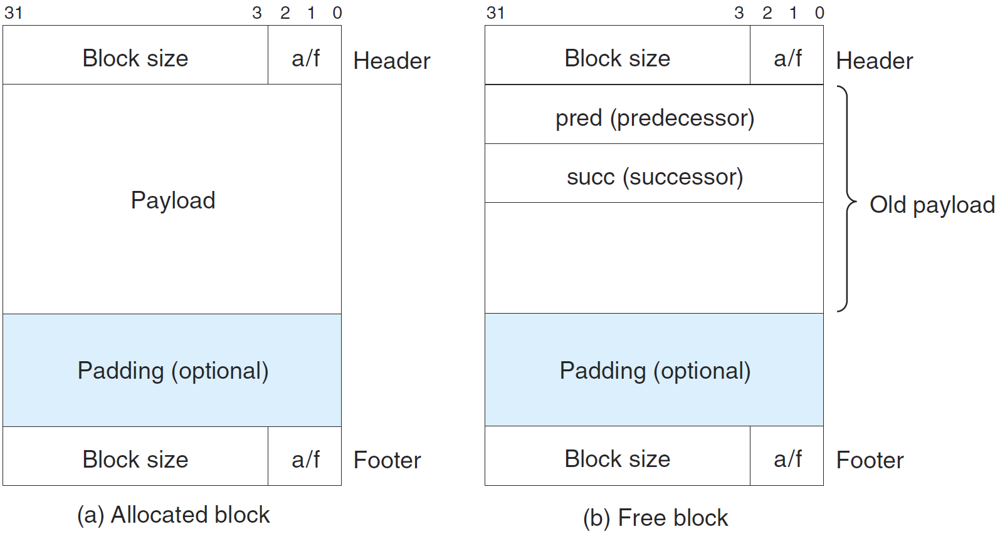

## Segregated Free Lists

维护多个空闲链表，每个链表中的块有大致相等的大小，分配器维护着一个空闲链表数组，每个大小类一个空闲链表，当需要分配块时只需要在对应的空闲链表中搜索就好了，书上描述了两种分离存储的方法

**Simple Segregated Storage**

从不合并与分离，每个块的大小就是大小类中最大元素的大小。例如大小类为 {17~32}，则需要分配块的大小在这个区间时均在此对应链表进行分配，并且都是分配大小为 32 的块。这样做，显然分配和释放都是常数级的，但是空间利用率较低

**Segregated Fit**

每个大小类的空闲链表包含大小不同的块，分配完一个块后，将这个块进行分割，并根据剩下的块的大小将其插入到适当大小类的空闲链表中。这个做法平衡了搜索时间与空间利用率，C 标准库提供的 GNU malloc 包就是采用的这种方法。我在实验的第二部分实现了这个做法

# Implicit Free List 实现

CSAPP 详细讲述了基于隐式空闲链表，使用立即边界合并方式的实现，我们回顾一下。

要想分数尽可能高，我们需要使吞吐率尽可能高，空间利用率尽可能小，如果从不重复利用任何块，函数的吞吐率会非常好，而空间利用率会很差；而若进行空闲块的分割合并等操作又会影响吞吐率，因而，就要设计合适的数据结构与算法来平衡两者的关系。

- 空闲块组织：利用隐式空闲链表记录空闲块
- 放置策略：如何选择合适的空闲块分配？
  - 首次适配：从头开始搜索空闲链表，选择第一个合适的空闲块
  - 下一次适配：从上一次查询结束的地方开始搜索选择第一个合适的空闲块
  - 最佳适配：搜索能放下请求大小的最小空闲块
- 分割：在将一个新分配的块放置到某个空闲块后，剩余的部分要进行处理
- 合并：释放某个块后，要让它与相邻的空闲块合并

无论用什么策略，放置的时间复杂度都为 O(n)，性能很差

## 空闲块组织

每个空闲块的结构如下：

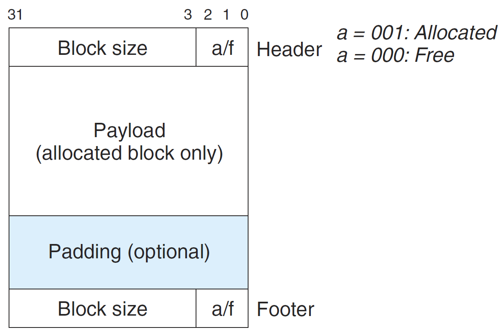

- 脚部与头部是相同的，均为 4 个字节，用来存储块的大小，以及表明这个块是已分配还是空闲块
- 由于要求块双字对齐，所以块大小就总是 8 的倍数，低 3 位总是为 0，因而，我们只需要利用头部和脚部的高 29 位存储块的大小，剩下 3 位的最低位来指明这个块是否空闲，000 为空闲，001 为已分配

为什么既设置头部又设置尾部呢？这是为了能够以常数时间来进行块的合并。无论是与下一块还是与上一块合并，都可以通过他们的头部或尾部得知块大小，从而定位整个块，避免了从头遍历链表。

空闲块怎么组织呢？如图：

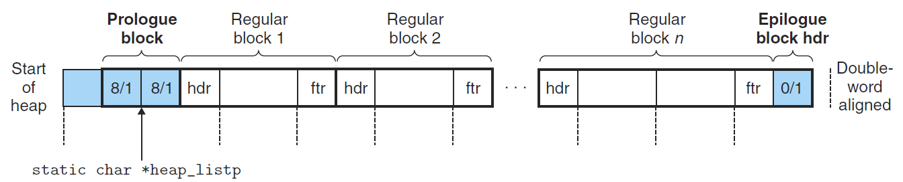

堆有两个特殊的标记：

- 序言块：8 个字节，由一个头部和一个脚部组成
- 结尾块：大小为 0 的头部

为了消除合并空闲块时边界的考虑，将序言块和结尾块的分配位均设置为已分配。为了保证双字对齐，在序言块的前面还设置了 4 个字节作为填充。

根据上述结构，可以定义一些方便操作的宏：

```c
/* 头部/脚部的大小 */
#define WSIZE 4
/* 双字 */
#define DSIZE 8

/* 扩展堆时的默认大小 */
#define CHUNKSIZE (1 << 12)

/* 设置头部和脚部的值, 块大小+分配位 */
#define PACK(size, alloc) ((size) | (alloc))

/* 读写指针p的位置 */
#define GET(p) (*(unsigned int *)(p))
#define PUT(p, val) ((*(unsigned int *)(p)) = (val))

/* 从头部或脚部获取大小或分配位 */
#define GET_SIZE(p) (GET(p) & ~0x7)
#define GET_ALLOC(p) (GET(p) & 0x1)

/* 给定有效载荷指针, 找到头部和脚部 */
#define HDRP(bp) ((char*)(bp) - WSIZE)
#define FTRP(bp) ((char*)(bp) + GET_SIZE(HDRP(bp)) - DSIZE)

/* 给定有效载荷指针, 找到前一块或下一块 */
#define NEXT_BLKP(bp) ((char*)(bp) + GET_SIZE(((char*)(bp) - WSIZE)))
#define PREV_BLKP(bp) ((char*)(bp) - GET_SIZE(((char*)(bp) - DSIZE)))
```

## 合并与分割

先**初始化堆**

```c
/* 
 * mm_init - initialize the malloc package.
 */
int mm_init(void)
{
    /* 申请四个字节空间 */
    if((heap_list = mem_sbrk(4*WSIZE)) == (void *)-1)
        return -1;
    PUT(heap_list, 0);                              /* 对齐 */
    /* 
     * 序言块和结尾块均设置为已分配, 方便考虑边界情况
     */
    PUT(heap_list + (1*WSIZE), PACK(DSIZE, 1));     /* 填充序言块 */
    PUT(heap_list + (2*WSIZE), PACK(DSIZE, 1));     /* 填充序言块 */
    PUT(heap_list + (3*WSIZE), PACK(0, 1));         /* 结尾块 */

    heap_list += (2*WSIZE);

    /* 扩展空闲空间 */
    if(extend_heap(CHUNKSIZE/WSIZE) == NULL)
        return -1;
    return 0;
}
```

重点在**扩展堆**

```c
/*
 * 扩展heap, 传入的是字节数
*/
void *extend_heap(size_t words)
{
    /* bp总是指向有效载荷 */
    char *bp;
    size_t size;
    /* 根据传入字节数奇偶, 考虑对齐 */
    size = (words % 2) ? (words+1) * WSIZE : words * WSIZE;

    /* 分配 */
    if((long)(bp = mem_sbrk(size)) == -1)
        return NULL;
    
    /* 设置头部和脚部 */
    PUT(HDRP(bp), PACK(size, 0));           /* 空闲块头 */
    PUT(FTRP(bp), PACK(size, 0));           /* 空闲块脚 */
    PUT(HDRP(NEXT_BLKP(bp)), PACK(0, 1));   /* 片的新结尾块 */

    /* 判断相邻块是否是空闲块, 进行合并 */
    return coalesce(bp);
}
```

扩展堆每次在原始堆的尾部申请空间，`mem_sbrk`函数返回指向旧堆尾部的指针，因此，可以直接将原始堆的尾部位置设置新空闲块的头部。

接下来就是 **free**，设置一下头部和脚部即可，free 完后注意合并空闲块

```c
/*
 * mm_free - Freeing a block does nothing.
 */
void mm_free(void *ptr)
{
    if(ptr==0)
        return;
    size_t size = GET_SIZE(HDRP(ptr));

    PUT(HDRP(ptr), PACK(size, 0));
    PUT(FTRP(ptr), PACK(size, 0));
    coalesce(ptr);
}
```

**分割空闲块**要考虑剩下的空间是否足够放置头部和脚部

```c
/*
 * 分离空闲块
 */
void place(void *bp, size_t asize)
{
    size_t csize = GET_SIZE(HDRP(bp));
    
    /* 判断是否能够分离空闲块 */
    if((csize - asize) >= 2*DSIZE) {
        PUT(HDRP(bp), PACK(asize, 1));
        PUT(FTRP(bp), PACK(asize, 1));
        bp = NEXT_BLKP(bp);
        PUT(HDRP(bp), PACK(csize - asize, 0));
        PUT(FTRP(bp), PACK(csize - asize, 0));
    }
    /* 设置为填充 */
    else{
        PUT(HDRP(bp), PACK(csize, 1));
        PUT(FTRP(bp), PACK(csize, 1));
    }
}
```

**合并**要分四种情况进行处理：

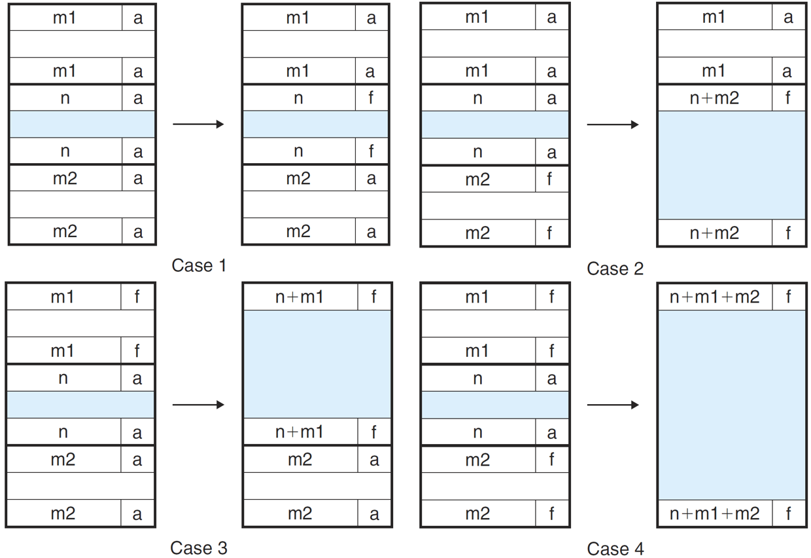

代码：

```c
/*
 * 合并空闲块
*/
void *coalesce(void *bp)
{
    size_t prev_alloc = GET_ALLOC(FTRP(PREV_BLKP(bp)));     /* 前一块大小 */
    size_t next_alloc = GET_ALLOC(HDRP(NEXT_BLKP(bp)));     /* 后一块大小 */
    size_t size = GET_SIZE(HDRP(bp));                       /* 当前块大小 */

    /*
     * 四种情况：前后都不空, 前不空后空, 前空后不空, 前后都空
     */
    /* 前后都不空 */
    if(prev_alloc && next_alloc){
        return bp;
    }
    /* 前不空后空 */
    else if(prev_alloc && !next_alloc){
        size += GET_SIZE(HDRP(NEXT_BLKP(bp)));  //增加当前块大小
        PUT(HDRP(bp), PACK(size, 0));           //先修改头
        PUT(FTRP(bp), PACK(size, 0));           //根据头部中的大小来定位尾部
    }
    /* 前空后不空 */
    else if(!prev_alloc && next_alloc){
        size += GET_SIZE(HDRP(PREV_BLKP(bp)));  //增加当前块大小
        PUT(FTRP(bp), PACK(size, 0));
        PUT(HDRP(PREV_BLKP(bp)), PACK(size, 0));
        bp = PREV_BLKP(bp);                     //注意指针要变
    }
    /* 都空 */
    else{
        size += GET_SIZE(HDRP(PREV_BLKP(bp))) + GET_SIZE(FTRP(NEXT_BLKP(bp)));  //增加当前块大小
        PUT(FTRP(NEXT_BLKP(bp)), PACK(size, 0));
        PUT(HDRP(PREV_BLKP(bp)), PACK(size, 0));
        bp = PREV_BLKP(bp);
    }
    return bp;
}
```

## 放置策略

**首次适配**：

```c
void *find_fit(size_t asize)
{
    void *bp;
    for(bp = heap_list; GET_SIZE(HDRP(bp)) > 0; bp = NEXT_BLKP(bp)){
        if((GET_SIZE(HDRP(bp)) >= asize) && (!GET_ALLOC(HDRP(bp)))){
            return bp;
        }
    }
    return NULL;
}
```

**最佳适配**：

```c
void *best_fit(size_t asize){
	void *bp;
    void *best_bp = NULL;
	size_t min_size = 0;
    for(bp = heap_list; GET_SIZE(HDRP(bp)) > 0; bp = NEXT_BLKP(bp)){
        if((GET_SIZE(HDRP(bp)) >= asize) && (!GET_ALLOC(HDRP(bp)))){
            if(min_size ==0 || min_size > GET_SIZE(HDRP(bp))){
                min_size = GET_SIZE(HDRP(bp));
                best_bp = bp;
            }
        }
    }
    return best_bp;
} 
```

## 分配块

最后就是主体部分 mm_malloc 函数，对申请的空间大小按 8 对齐进行舍入，然后根据放置策略查找有无合适的空闲块，如果没有则申请扩展堆

```c
void *mm_malloc(size_t size)
{
    size_t asize;
    size_t extendsize;
    char *bp;
    if(size == 0)
        return NULL;
    if(size <= DSIZE)
        asize = 2*DSIZE;
    else
        asize = DSIZE * ((size + (DSIZE) + (DSIZE-1)) / DSIZE);
    /* 寻找合适的空闲块 */
    if((bp = best_fit(asize)) != NULL){
        place(bp, asize);
        return bp;
    }
    /* 找不到则扩展堆 */
    extendsize = MAX(asize, CHUNKSIZE);
    if((bp = extend_heap(extendsize/WSIZE)) == NULL)
        return NULL;
    place(bp, asize);
    return bp;
}
```

## 测试结果及分数

使用首次适配：

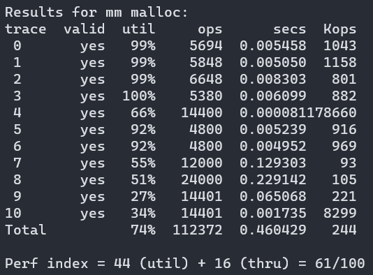

使用最佳适配：

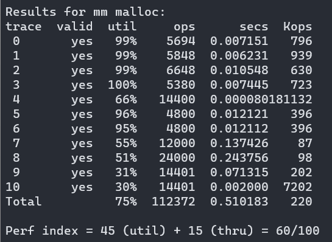

最佳适配的分数反而更低一些，原因是虽然空间利用率提高了，但是时间增加太多了。

# Segregated Free Lists实现

尝试课本推荐的 Segregated Fit（分离适配）方式实现

## 结构设置

空闲块设置如图结构：

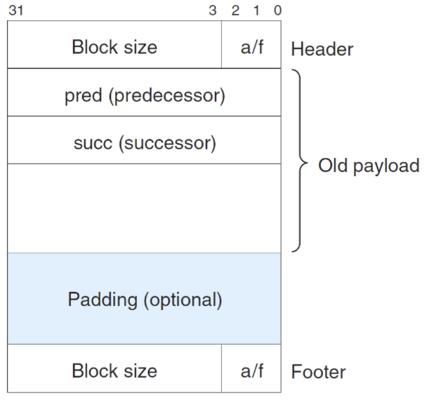

每一个块都有一个头部和脚部，在有效载荷中又分别存放着指向前一个块和后一个块的指针。所以每个空闲块最小为 16 个字节

堆的结构也是在原来的 Implict Free List 中进行略微改进，如图：

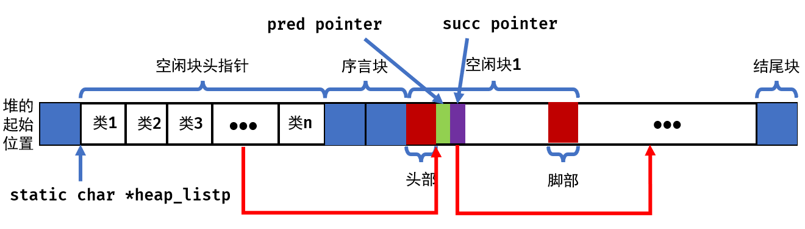

相当于在原来的堆结构中增加了两点：

- 堆结构的前面放置不同等价类空闲块的头指针
- 每个空闲块的有效载荷分出一部分作为前驱和后继指针

也就是说，我们的这个做法与 Implicit Free List 非常相似，只不过多维护了 n 个链表

根据链表的结构特点，增加了几个操作宏：

```c
/* 读写指针p的位置 */
#define GET(p) (*(unsigned int *)(p))
/* 给定序号，找到链表头节点位置 */
#define GET_HEAD(num) ((unsigned int *)(long)(GET(heap_list + WSIZE * num)))
/* 给定bp,找到前驱和后继 */
#define GET_PRE(bp) ((unsigned int *)(long)(GET(bp)))
#define GET_SUC(bp) ((unsigned int *)(long)(GET((unsigned int *)bp + 1)))
```

这里指针转换很繁杂，操作完后，一定要将其强制转换为`unsigned int *`，这样，返回的指针加 1 相当于加 32 个字节，便于定位块中其他部位。

## 大小类设置

由上述结构，每个空闲块最小也要 16 个字节，理论上来说，设置的大小类越多，时间性能要越好，因而设置 20 个大小类：$\{ 16\}, \{ 17 \sim 32\}, \{ 33 \sim 64\},\cdots , \{ 2049 \sim 4096\}, \{ 4097 \sim 9194 \}, \cdots, \{ 2^{22}+1 \sim \infty \}$

## 结构建立

先看初始化函数

```c
int mm_init(void)
{
    /* 申请四个字节空间 */
    if((heap_list = mem_sbrk((4+CLASS_SIZE)*WSIZE)) == (void *)-1)
        return -1;
    /* 初始化20个大小类头指针 */
    for(int i = 0; i < CLASS_SIZE; i++){
        PUT(heap_list + i*WSIZE, NULL);
    }
    /* 对齐 */
    PUT(heap_list + CLASS_SIZE * WSIZE, 0);
    /* 
     * 序言块和结尾块均设置为已分配, 方便考虑边界情况
     */
    PUT(heap_list + ((1 + CLASS_SIZE)*WSIZE), PACK(DSIZE, 1));     /* 填充序言块 */
    PUT(heap_list + ((2 + CLASS_SIZE)*WSIZE), PACK(DSIZE, 1));     /* 填充序言块 */
    PUT(heap_list + ((3 + CLASS_SIZE)*WSIZE), PACK(0, 1));         /* 结尾块 */


    /* 扩展空闲空间 */
    if(extend_heap(CHUNKSIZE/WSIZE) == NULL)
        return -1;
    return 0;
}
```

见上面画的结构图，在序言块之前放置 20 个空闲链表头指针，剩下的结构与原来完全一样。而扩展堆是在结尾块后进行扩展，因而扩展块操作也与原来相同

```c
/*
 * 扩展heap, 传入的是字节数
*/
void *extend_heap(size_t words)
{
    /* bp总是指向有效载荷 */
    char *bp;
    size_t size;
    /* 根据传入字节数奇偶, 考虑对齐 */
    size = (words % 2) ? (words+1) * WSIZE : words * WSIZE;

    /* 分配 */
    if((long)(bp = mem_sbrk(size)) == -1)
        return NULL;
    
    /* 设置头部和脚部 */
    PUT(HDRP(bp), PACK(size, 0));           /* 空闲块头 */
    PUT(FTRP(bp), PACK(size, 0));           /* 空闲块脚 */
    PUT(HDRP(NEXT_BLKP(bp)), PACK(0, 1));   /* 片的新结尾块 */

    /* 判断相邻块是否是空闲块, 进行合并 */
    return coalesce(bp);
}
```

## 维护链表

在知道要请求块的大小后，我们要先根据大小定位到相应大小类的头结点：

```c
/* 
 * search - 找到块大小对应的等价类的序号
 */
int search(size_t size)
{
    int i;
    for(i = 4; i <=22; i++){
        if(size <= (1 << i))
            return i-4;
    }
    return i-4;
}
```

注意，头结点位置下标是从 0 开始，所以返回`i-4`。这里还可以写一个二分查找的形式，但是优化作用不大。

找到头结点后，就涉及到双向链表的插入和删除了，下面编写这两个函数

```c
/*
 *  插入块, 将块插到表头
 */
void insert(void *bp)
{
    /* 块大小 */
    size_t size = GET_SIZE(HDRP(bp));
    /* 根据块大小找到头节点位置 */
    int num = search(size);
    /* 空的，直接放 */
    if(GET_HEAD(num) == NULL){
        PUT(heap_list + WSIZE * num, bp);
        /* 前驱 */
        PUT(bp, NULL);
		/* 后继 */
        PUT((unsigned int *)bp + 1, NULL);
	} else {
        /* bp的后继放第一个节点 */
		PUT((unsigned int *)bp + 1, GET_HEAD(num));
		/* 第一个节点的前驱放bp */
        PUT(GET_HEAD(num), bp);
        /* bp的前驱为空 */  	
		PUT(bp, NULL);
        /* 头节点放bp */
		PUT(heap_list + WSIZE * num, bp);
	}
}
```

这个函数还是比较容易编写的，主要是要注意以下几点：

- 插入块总是插入到表头
- 指针问题要细致考虑。比如：`heap_list + WSIZE * num`是对应大小类头结点在堆中的位置，而`GET_HEAD(num)`是大小类头结点存放的第一个块的地址

```c
/*
 *  删除块,清理指针
 */
void delete(void *bp)
{
    /* 块大小 */
    size_t size = GET_SIZE(HDRP(bp));
    /* 根据块大小找到头节点位置 */
    int num = search(size);
    /* 
     * 唯一节点,后继为null,前驱为null 
     * 头节点设为null
     */
	if (GET_PRE(bp) == NULL && GET_SUC(bp) == NULL) { 
		PUT(heap_list + WSIZE * num, NULL);
	} 
    /* 
     * 最后一个节点 
     * 前驱的后继设为null
     */
    else if (GET_PRE(bp) != NULL && GET_SUC(bp) == NULL) {
		PUT(GET_PRE(bp) + 1, NULL);
	} 
    /* 
     * 第一个结点 
     * 头节点设为bp的后继
     */
    else if (GET_SUC(bp) != NULL && GET_PRE(bp) == NULL){
		PUT(heap_list + WSIZE * num, GET_SUC(bp));
		PUT(GET_SUC(bp), NULL);
	}
    /* 
     * 中间结点 
     * 前驱的后继设为后继
     * 后继的前驱设为前驱
     */
    else if (GET_SUC(bp) != NULL && GET_PRE(bp) != NULL) {
		PUT(GET_PRE(bp) + 1, GET_SUC(bp));
		PUT(GET_SUC(bp), GET_PRE(bp));
	}
}
```

- 考虑四种情况就好，注释写得很详细了
- 同样要注意指针的问题。比如：`GET_PRE(bp) + 1`是`bp`指向的块的前驱的后继的**位置**；而`GET_PRE(bp+1)`是`bp`指向的块的后继。我在这里因为 segmentation fault 卡了好久。

## 合并与分割

合并操作还是与 Implict Free List 一样，是根据空闲块在堆中位置相邻来合并的，与链表排列无关

```c
/*
 * 合并空闲块
*/
void *coalesce(void *bp)
{
    size_t prev_alloc = GET_ALLOC(FTRP(PREV_BLKP(bp)));     /* 前一块大小 */
    size_t next_alloc = GET_ALLOC(HDRP(NEXT_BLKP(bp)));     /* 后一块大小 */
    size_t size = GET_SIZE(HDRP(bp));                       /* 当前块大小 */

    /*
     * 四种情况：前后都不空, 前不空后空, 前空后不空, 前后都空
     */
    /* 前后都不空 */
    if(prev_alloc && next_alloc){
        insert(bp);
        return bp;
    }
    /* 前不空后空 */
    else if(prev_alloc && !next_alloc){
        /* 将后面的块从其链表中删除 */
        delete(NEXT_BLKP(bp));
        size += GET_SIZE(HDRP(NEXT_BLKP(bp)));  //增加当前块大小
        PUT(HDRP(bp), PACK(size, 0));           //先修改头
        PUT(FTRP(bp), PACK(size, 0));           //根据头部中的大小来定位尾部
    }
    /* 前空后不空 */
    else if(!prev_alloc && next_alloc){
        /* 将其前面的快从链表中删除 */
        delete(PREV_BLKP(bp));
        size += GET_SIZE(HDRP(PREV_BLKP(bp)));  //增加当前块大小
        PUT(FTRP(bp), PACK(size, 0));
        PUT(HDRP(PREV_BLKP(bp)), PACK(size, 0));
        bp = PREV_BLKP(bp);                     //注意指针要变
    }
    /* 都空 */
    else{
        /* 将前后两个块都从其链表中删除 */
        delete(NEXT_BLKP(bp));
        delete(PREV_BLKP(bp));
        size += GET_SIZE(HDRP(PREV_BLKP(bp))) + GET_SIZE(FTRP(NEXT_BLKP(bp)));  //增加当前块大小
        PUT(FTRP(NEXT_BLKP(bp)), PACK(size, 0));
        PUT(HDRP(PREV_BLKP(bp)), PACK(size, 0));
        bp = PREV_BLKP(bp);
    }
    /* 空闲块准备好后,将其插入合适位置 */
    insert(bp);
    return bp;
}
```

- 操作与 Implict Free List 几乎相同
- 额外的操作就是合并前要将前后的空闲块从它的原链表中删除，合并完成后要将新的空闲块插入对应的空闲链表中

```c
/*
 * 分离空闲块
 */
void place(void *bp, size_t asize)
{
    size_t csize = GET_SIZE(HDRP(bp));
    
    /* 块已分配，从空闲链表中删除 */
    delete(bp);
    if((csize - asize) >= 2*DSIZE) {
        PUT(HDRP(bp), PACK(asize, 1));
        PUT(FTRP(bp), PACK(asize, 1));
        /* bp指向空闲块 */
        bp = NEXT_BLKP(bp);
        PUT(HDRP(bp), PACK(csize - asize, 0));
        PUT(FTRP(bp), PACK(csize - asize, 0));
        /* 加入分离出来的空闲块 */
        insert(bp);
    }
    /* 设置为填充 */
    else{
        PUT(HDRP(bp), PACK(csize, 1));
        PUT(FTRP(bp), PACK(csize, 1));
    }
}
```

- 分离空闲块也只是加入了将分离出来的空闲块插入相应空闲链表的操作

## 分配块

Segregated Fit 的分配策略就很清晰了：

- 先从对应的大小类的空闲链表中查找
- 如果找不到，则到下一个更大的大小类查找
- 如果都找不到，则扩展堆

```c
/*
 * 适配
 */
void *find_fit(size_t asize)
{
    int num = search(asize);
    unsigned int* bp;
    /* 如果找不到合适的块，那么就搜索下一个更大的大小类 */
    while(num < CLASS_SIZE) {
        bp = GET_HEAD(num);
        /* 不为空则寻找 */
        while(bp) {
            if(GET_SIZE(HDRP(bp)) >= asize){
                return (void *)bp;
            }
            /* 用后继找下一块 */
            bp = GET_SUC(bp);
        }
        /* 找不到则进入下一个大小类 */
        num++;
    }
    return NULL;
}
```

## 测试结果及分数

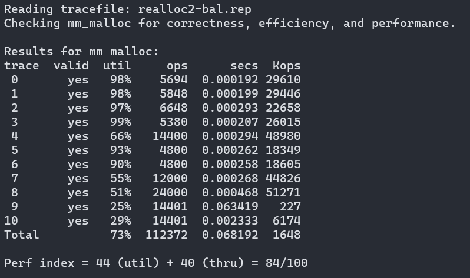

这个提升是巨大的！与 Implict Free List 进行对比，发现本方法空间利用率略微降低了，而吞吐量提高了近 50 倍！

完整代码见：

https://github.com/Deconx/CSAPP-Lab/blob/master/solutions/08_Malloc%20Lab/mm.c

# 总结

- 这个实验写得人头皮发麻，欲罢不能。定义一堆宏，指针满天飞，写时一时爽，debug 火葬场。我整个周末几乎都在与 segmentation fault 打交道，随意一个小笔误就要找几个小时，唉。
- CSAPP 课本编排的很有意思，Implict Free List 花费了大量篇幅讲解，给出了所有代码，而后面的 Segregated Free Lists 却几乎是一笔带过。现在做完了实验才知道，原来是要把这部分放进实验考察，果然读 CSAPP 一定要做实验，两者是相得益彰的。
- 犹记得周日晚十一点四十，在被 segmentation fault 折腾的万念俱灰的我又一次编译运行，发现程序跑通时的欣喜若狂，那一刻，仿佛整个世界都是我的，或许，这就是计算机人的浪漫吧。
- 我的实现还有很多可以优化的地方，比如我没有重新实现`realloc`函数，空闲块的也可以用更加高效的平衡树来组织。由于学业繁忙，这些等我码力更强时再回来挑战！

- 本实验耗时 3 天，约 16 小时

