# 实验概览

Web Proxy 是 Web 浏览器和服务器之间的一个中间程序。我们日常使用浏览器访问某个网站时，浏览器不是直接请求服务器来获取内容的，而是联系 Proxy，Proxy 转发请求到服务器，服务器回复 Proxy 后，Proxy 再将回复发送到浏览器。

即原来的客户端-服务器是这样：

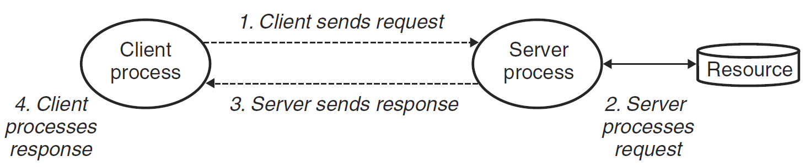

加了 Proxy 变成这样

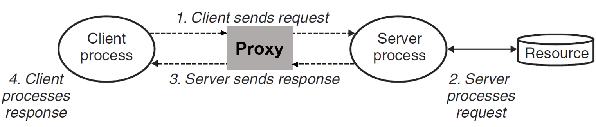

本实验就是要实现一个支持**多线程带缓存**的 Web 代理，分为三个部分来进行：

- **Part 1**：实现一个最基础的顺序代理
- **Part 2**：进一步优化，使代理支持多线程（生产者-消费者模型）
- **Part 3**：使用 LRU 策略缓存 Web 中的对象（读者-写者模型）

# TINY Web 服务器详解

代理相对于客户端来说充当了服务端的角色，相对于服务端来说又充当了客户端的角色，所以可以大量利用书中讲解服务器的代码。

CSAPP 课本用 250 行代码为我们实现了一个非常简单的 Web 服务器，在做实验之前，深刻理解它是非常重要的。

首先要做的事就是解析 HTTP 请求

## 解析 HTTP 请求

HTTP 请求的组成是这样的：一个请求行，后面跟随零个或更多个请求报头，在跟随一个空的文本行来终止报头列表。请求行的形式是：`method URI version`，本服务器只支持 GET 方法

将 URI 解析出来后，需要判断请求的是静态内容还是动态内容，分别执行。给出函数`doit`

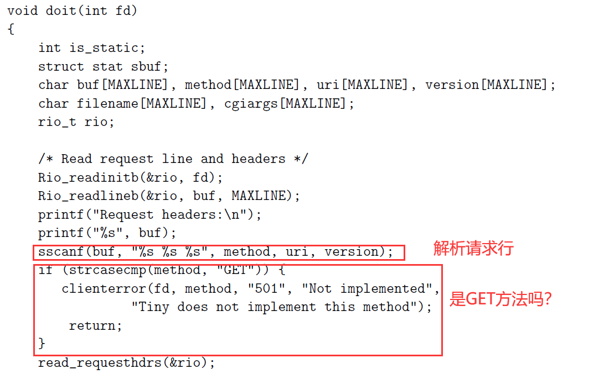

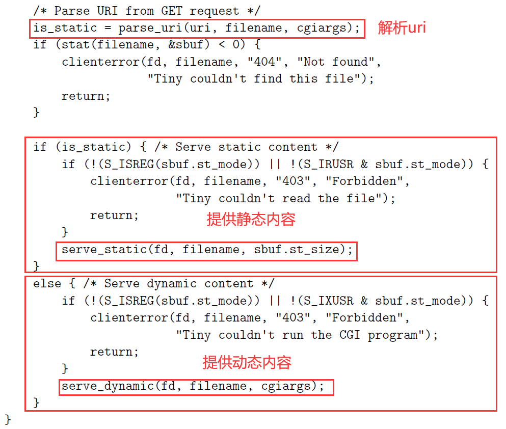

解析 URI 都是细节上的问题，这里不再分析

## 提供静态内容

一个 HTTP 响应的组成是这样的：一个响应行，后面跟随着零个或更多的相应报头，再跟随着一个终止报头的空行，随后跟随响应主体，相应行的格式为`version status-code status-massage`。于是给出函数`serve_static`

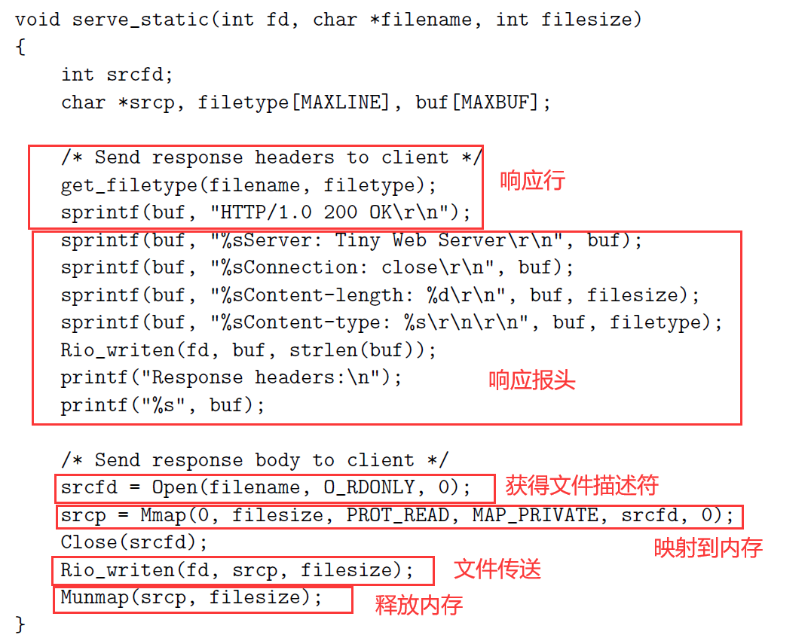

## 提供动态内容

TINY 派生一个子进程并在子进程的上下文中运行一个 CGI 程序

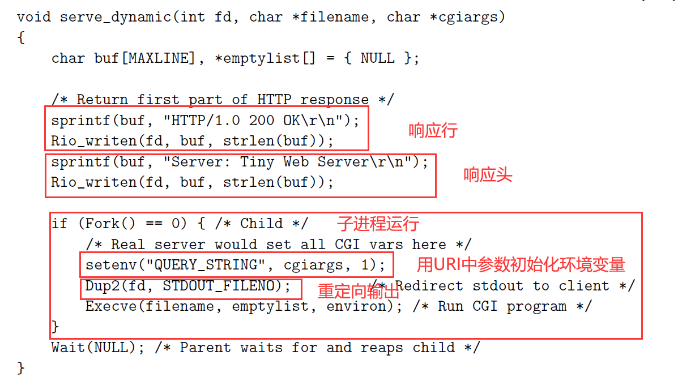

## 主函数

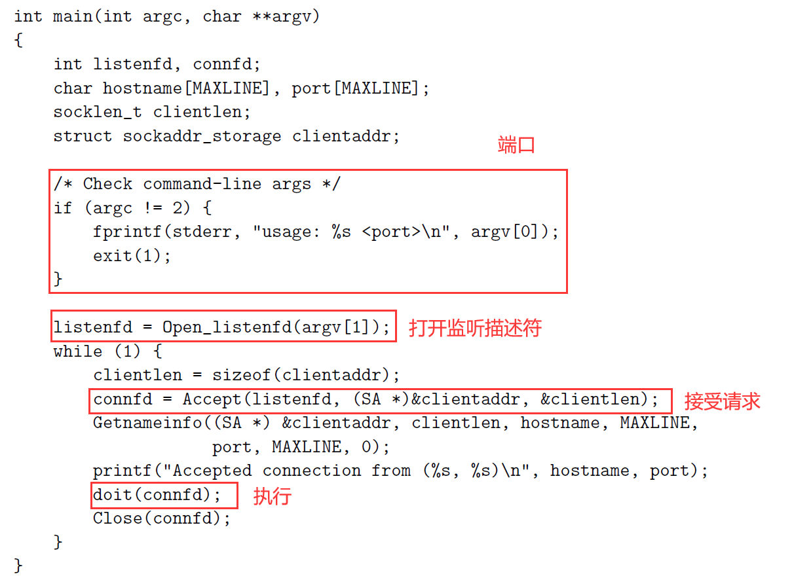

# Part 1: Implementing A sequential web proxy

要求：

- 实现一个处理 HTTP/1.0 GET 请求的基本顺序 web 代理
- 如果接收到一个浏览器请求为 HTTP/1.1 版本，则应将它作为 HTTP/1.0 请求转发

- 转发合法的 HTTP 请求
  - 假设请求为 `GET http://www.cmu.edu/hub/index.html HTTP/1.1`
  - 则主机名为 `www.cmu.edu`
  - 请求的页面为 `/hub/index.html`
  - HTTP 请求每行以 `\r\n` 结束，以一个空行 `\r\n` 结尾

- 代理发送的请求的 header 为：

  - `Host`: 如 `Host: www.cmu.edu`

  - `User-Agent`: 如 `User-Agent: Mozilla/5.0 (X11; Linux x86_64; rv:10.0.3) Gecko/20120305 Firefox/10.0.3`

  - `Connection`: 必须发送 `Connection: close`

  - `Proxy-Connection`: 必须发送 `Proxy-Connection: close`

- 要处理过早关闭的连接，即必须捕获 SIGPIPE 信号

这部分没什么好说的

## 等待客户端连接

首先是我们的`main`函数，不断等待客户端的连接，代码与 TINY服务器代码完全相同，不再讲解

```c
int main(int argc, char **argv)
{
    int listenfd, connfd;
    socklen_t clientlen;
    char hostname[MAXLINE], port[MAXLINE];

    struct sockaddr_storage clientaddr;
    if (argc != 2)
    {
        fprintf(stderr, "usage :%s <port> \n", argv[0]);
        exit(1);
    }
    signal(SIGPIPE, sigpipe_handler);	//捕获SIGPIPE信号
    listenfd = Open_listenfd(argv[1]);
    while (1)
    {
        clientlen = sizeof(clientaddr);
        connfd = Accept(listenfd, (SA *)&clientaddr, &clientlen);

        Getnameinfo((SA *)&clientaddr, clientlen, hostname, MAXLINE, port, MAXLINE, 0);
        printf("Accepted connection from (%s %s).\n", hostname, port);

        doit(connfd);
        //关闭客户端的连接描述符
        Close(connfd);
    }
    return 0;
}
```

## 转发与回复

`doit`函数前半部分与 TINY 服务器相似，不同的是将后半部分的请求处理改为转发给服务器，再将服务器的回复回复给客户端

```c
void doit(int connfd)
{
    char buf[MAXLINE], method[MAXLINE], uri[MAXLINE], version[MAXLINE];
    char server[MAXLINE];
 
    rio_t rio, server_rio;

    Rio_readinitb(&rio, connfd);
    Rio_readlineb(&rio, buf, MAXLINE);
    sscanf(buf, "%s %s %s", method, uri, version);

    if (strcasecmp(method, "GET"))
    {
        printf("Proxy does not implement the method");
        return;
    }

    struct Uri *uri_data = (struct Uri *)malloc(sizeof(struct Uri));
    //解析uri
    parse_uri(uri, uri_data);
    
    //设置header
    build_header(server, uri_data, &rio);

    //连接服务器
    int serverfd = Open_clientfd(uri_data->host, uri_data->port);
    if (serverfd < 0)
    {
        printf("connection failed\n");
        return;
    }
	//转发给服务器
    Rio_readinitb(&server_rio, serverfd);
    Rio_writen(serverfd, server, strlen(server));

    size_t n;
    //回复给客户端
    while ((n = Rio_readlineb(&server_rio, buf, MAXLINE)) != 0)
    {
        printf("proxy received %d bytes,then send\n", (int)n);
        Rio_writen(connfd, buf, n);
    }
    //关闭服务器描述符
    Close(serverfd);
}
```

## 解析uri

根据 uri 结构定义一个结构体：

```c
struct Uri
{
    char host[MAXLINE]; //hostname
    char port[MAXLINE]; //端口
    char path[MAXLINE]; //路径
};
```

解析函数：

```c
//解析uri
void parse_uri(char *uri, struct Uri *uri_data)
{
    char *hostpose = strstr(uri, "//");
    //默认端口为80
    if (hostpose == NULL)
    {
        char *pathpose = strstr(uri, "/");
        if (pathpose != NULL)
            strcpy(uri_data->path, pathpose);
        strcpy(uri_data->port, "80");
        return;
    }
    else
    {
        char *portpose = strstr(hostpose + 2, ":");
        if (portpose != NULL)
        {
            int tmp;
            sscanf(portpose + 1, "%d%s", &tmp, uri_data->path);
            sprintf(uri_data->port, "%d", tmp);
            *portpose = '\0';
        }
        else
        {
            char *pathpose = strstr(hostpose + 2, "/");
            if (pathpose != NULL)
            {
                strcpy(uri_data->path, pathpose);
                strcpy(uri_data->port, "80");
                *pathpose = '\0';
            }
        }
        strcpy(uri_data->host, hostpose + 2);
    }
    return;
}
```

## 测试与结果

不知道为什么，这个`driver.sh`在 wsl 上总是出问题，只好拿出我的 vm 虚拟机来跑了

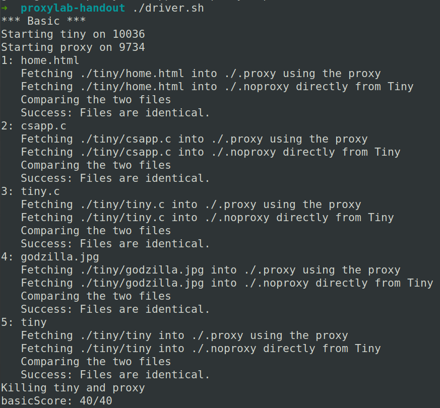

40 分全部拿到！

# Part 2: Dealing with multiple concurrent requests

设计多线程并发处理客户端请求，这里采用预线程化的技术，如图：

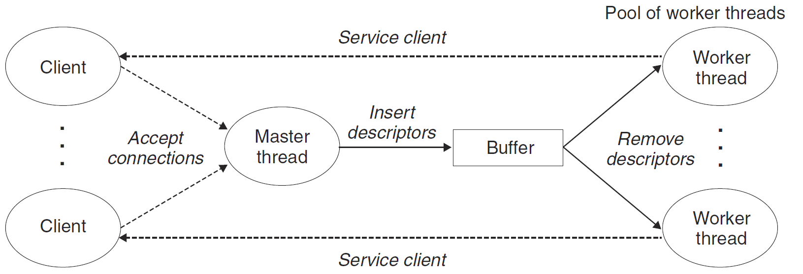

这是一个生产者-消费者模型，我们回顾一下：

## 生产者-消费者模型

生产者和消费者线程共享一个有 n 个槽的优先缓冲区，生产者反复地生成新的项目，并把它们插入到缓冲区中。消费者线程不断从缓冲区中取出，这些项目然后使用它们。因为插入和取出项目都涉及更新共享变量，所以我们必须保证对缓冲区地访问是互斥的，并调度对缓冲区地访问：

- 如果没有槽位：生产者必须等待
- 如果没有项目：消费者必须等待

在预线程化的服务器中，客户端就是生产者，不断产生连接；Proxy 就是消费者，不断选中客户端连接

为此，开发一个 SBUF 包来实现这个缓冲区地调度。缓冲区设计：

```c
typedef struct {
    int *buf;          /* Buffer array */         
    int n;             /* Maximum number of slots */
    int front;         /* buf[(front+1)%n] is first item */
    int rear;          /* buf[rear%n] is last item */
    sem_t mutex;       /* Protects accesses to buf */
    sem_t slots;       /* Counts available slots */
    sem_t items;       /* Counts available items */
} sbuf_t;
```

- 其中有 3 个信号量
  - mutex 初始化为 1，保证对缓冲区的访问是互斥的
  - slots 初始化为 n，记录槽位
  - items 初始化为 0，记录项目数

由此，设计客户端向缓冲区插入函数：

```c
void sbuf_insert(sbuf_t *sp, int item)
{
    P(&sp->slots);                          /* Wait for available slot */
    P(&sp->mutex);                          /* Lock the buffer */
    sp->buf[(++sp->rear)%(sp->n)] = item;   /* Insert the item */
    V(&sp->mutex);                          /* Unlock the buffer */
    V(&sp->items);                          /* Announce available item */
}
```

- 首先有一个对 slots 的 P 操作，保证了如果槽位已满，则客户端被挂起，不会继续往缓冲区写入请求
- 然后是一个 mutex 的 P 操作，保证了对缓冲区互斥的访问
- 缓冲区插入完成后，释放所有的锁

设计 Proxy 从缓冲区读入的函数：

```c
int sbuf_remove(sbuf_t *sp)
{
    int item;
    P(&sp->items);                          /* Wait for available item */
    P(&sp->mutex);                          /* Lock the buffer */
    item = sp->buf[(++sp->front)%(sp->n)];  /* Remove the item */
    V(&sp->mutex);                          /* Unlock the buffer */
    V(&sp->slots);                          /* Announce available slot */
    return item;
}
```

- 首先有一个对 items 的 P 操作，保证了如果没有项目，则 Proxy 被挂起，不会继续往缓冲区读出客户端
- 然后是一个 mutex 的 P 操作，保证了对缓冲区互斥的访问
- 缓冲区读出完成后，释放所有的锁，返回其中一个客户端的描述符

## 基于预线程化的 Proxy

大部分代码与第 1 部分一样

```c
int main(int argc, char **argv)
{
    int listenfd, connfd;
    socklen_t clientlen;
    char hostname[MAXLINE], port[MAXLINE];

    struct sockaddr_storage clientaddr;

    pthread_t tid;

    if (argc != 2)
    {
        fprintf(stderr, "usage :%s <port> \n", argv[0]);
        exit(1);
    }
    signal(SIGPIPE, sigpipe_handler);
    listenfd = Open_listenfd(argv[1]);

    sbuf_init(&sbuf, SBUFSIZE);
    //创建工作者线程
    for(int i = 0; i < NTHREADS; i++)
    {
        Pthread_create(&tid, NULL, thread, NULL);
    }

    while (1)
    {
        clientlen = sizeof(clientaddr);
        connfd = Accept(listenfd, (SA *)&clientaddr, &clientlen);
        //向缓冲区写入这个描述符
        sbuf_insert(&sbuf, connfd);
        Getnameinfo((SA *)&clientaddr, clientlen, hostname, MAXLINE, port, MAXLINE, 0);
        printf("Accepted connection from (%s %s).\n", hostname, port);
    }
    return 0;
}
```

然后是线程执行函数：

```c
void *thread(void *vargp)
{
    Pthread_detach(pthread_self());
    while(1){
    //从缓冲区中读出描述符
    int connfd = sbuf_remove(&sbuf);
    //转发
    doit(connfd);
    //关闭客户端的连接描述符
    Close(connfd);}
}
```

## 测试与结果

**这里有一个大坑！**

测试第 2 部分，总是有如下提示：

```c
Timeout waiting for the server to grab the port reserved for it
```

我一直以为是我的程序有 bug，细心阅读了好多遍。后来查看他人博客，发现是`driver.sh`文件写的有问题：

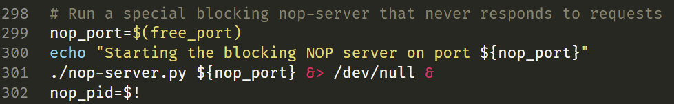

这一部分，作者写了一个`nop-server.py`脚本模拟一个永远不会响应的服务器，来测试我们 Proxy 的并发性能。301 行这里应该改为：

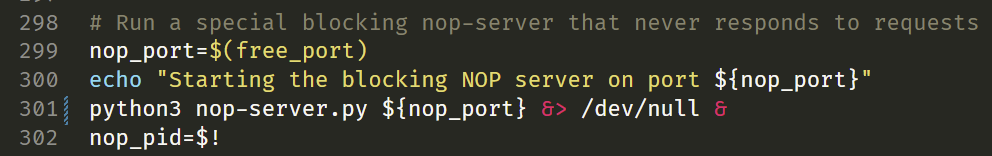

测试结果如下：

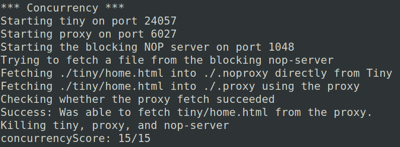

15 分满分！

# Part 3: Caching web objects

果然是万物皆可加一层 Cache。在 Proxy 中，当多个客户端或一个客户端多次访问同一个服务端的同一对象时，Proxy 每次都要从服务端请求，这是很耗费时间的。如果 Proxy 能把访问过的对象存储下来，那么再次遇到同样的请求时，就不需要再连接到服务端了，可以直接回复给客户端。而 Cache 的大小并不是无限的，所以就又要考虑替换策略，本实验要求使用 LRU。

LRU 和 Cache 在 Cache Lab 中有详细的讲述。因此 Cache 的实现在这里就不再讲解了，可前往查看：

https://zhuanlan.zhihu.com/p/484657229

这里主要讲解一下读者-写者模型

## 读者-写者模型

一组并发的线程要访问同一个共享对象时，将只读对象的线程叫做读者，只修改对象的进程叫做写者。写者必须拥有对对象的独占的访问，而读者可以与其它读者共享对象。该模型分为两类：

- 读优先：要求不让读者等待
- 写优先：要求在写者之后到达的读者必须等待

对于读者优先，只要有其它读者，则就应让读者先读，因此设置一个 read_cnt 记录读者数量，这个变量对于读者来说也是互斥的，所以设置一个 mutex 信号量来保护，读的过程中不允许写者写，写的过程不允许读者读，所以设置 w 来保护共享对象

读优先代码：

```c
int read_cnt;
sem_t mutex, w;    //都初始化为1

void reader(void) 
{
    while(1){
        P(&mutex);
        readcnt++;
        if(readcnt==1)
            P(&w);
        V(&mutex);
        
        P(&mutex);
        readcnt--;
        if(readcnt==0)
            V(&w);
        V(&mutex);
    }
}

void writer(void)
{
	while(1){
        P(&w);
        
        ...
        
        V(&w)
    }
}
```

- 只有第一个读者对 w 加锁，最后一个读者解锁。因此一旦有一个读者加锁，写者就无法访问这个共享对象了，而其它读者可以随意访问

## Cache 结构

在本实验中，对 Cache 的访问就是一个经典的读者-写者问题。有的线程要从 Cache 中读出，有的线程要写入 Cache。显然，为了 Proxy 更加高效，这里应该用读优先的模型。 

定义如下的 Cache 结构

```c
// Cache结构
typedef struct
{
    char obj[MAX_OBJECT_SIZE];
    char uri[MAXLINE];
    int LRU;
    int isEmpty;

    int read_cnt; //读者数量
    sem_t w;      //Cache信号量
    sem_t mutex;  //read_cnt信号量

} block;

typedef struct
{
    block data[MAX_CACHE];
    int num;
} Cache;
```

## 代码

在`doit`函数中，得到一个请求后，先根据 uri 判断 Cache 中是否存在这个内容，如果存在，则直接回复；如果不存在，则连接服务器，回复结束后，把内容写进 Cache

```c
void doit(int connfd)
{
    char buf[MAXLINE], method[MAXLINE], uri[MAXLINE], version[MAXLINE];
    char server[MAXLINE];

    rio_t rio, server_rio;

    char cache_tag[MAXLINE];
    Rio_readinitb(&rio, connfd);
    Rio_readlineb(&rio, buf, MAXLINE);
    sscanf(buf, "%s %s %s", method, uri, version);
    strcpy(cache_tag, uri);

    if (strcasecmp(method, "GET"))
    {
        printf("Proxy does not implement the method");
        return;
    }

    struct Uri *uri_data = (struct Uri *)malloc(sizeof(struct Uri));
    //判断uri是否缓存，若缓存，直接回复
    int i;
    if ((i = get_Cache(cache_tag)) != -1)
    {
        //加锁
        P(&cache.data[i].mutex);
        cache.data[i].read_cnt++;
        if (cache.data[i].read_cnt == 1)
            P(&cache.data[i].w);
        V(&cache.data[i].mutex);

        Rio_writen(connfd, cache.data[i].obj, strlen(cache.data[i].obj));

        P(&cache.data[i].mutex);
        cache.data[i].read_cnt--;
        if (cache.data[i].read_cnt == 0)
            V(&cache.data[i].w);
        V(&cache.data[i].mutex);
        return;
    }

    //解析uri
    parse_uri(uri, uri_data);

    //设置header
    build_header(server, uri_data, &rio);

    //连接服务器
    int serverfd = Open_clientfd(uri_data->host, uri_data->port);
    if (serverfd < 0)
    {
        printf("connection failed\n");
        return;
    }

    Rio_readinitb(&server_rio, serverfd);
    Rio_writen(serverfd, server, strlen(server));

    char cache_buf[MAX_OBJECT_SIZE];
    int size_buf = 0;
    size_t n;
    while ((n = Rio_readlineb(&server_rio, buf, MAXLINE)) != 0)
    {
        //注意判断是否会超出缓存大小
        size_buf += n;
        if(size_buf < MAX_OBJECT_SIZE)
            strcat(cache_buf, buf);
        printf("proxy received %d bytes,then send\n", (int)n);
        Rio_writen(connfd, buf, n);
    }
    Close(serverfd);
    
    if(size_buf < MAX_OBJECT_SIZE){
        write_Cache(cache_tag, cache_buf);
    }
}
```

- 要注意，每次读写缓存时，都要加相应的锁

Cache 以及 LRU 具体实现的代码，请前往我的 Cache Lab 解析查看，这里就不再讲解了。

## 测试与结果

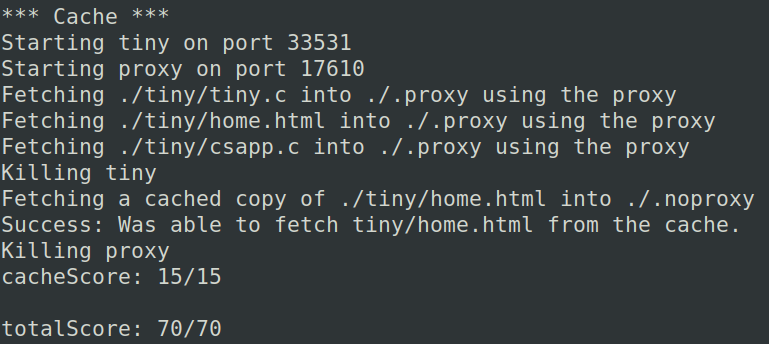

满分！

# FireFox 实战测试

首先打开 Proxy，监听 15213 端口

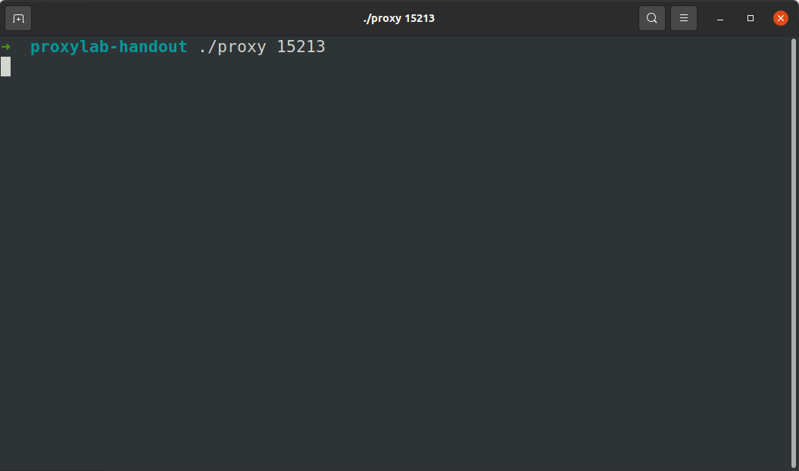

配置火狐的代理设置：

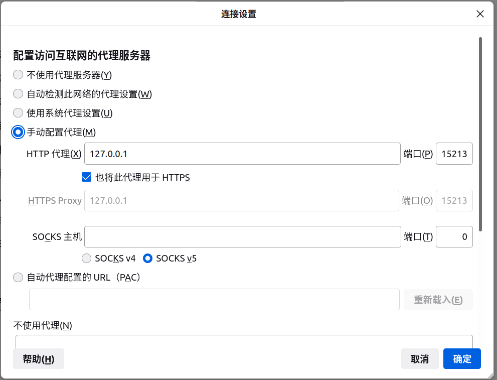

随便打开百度试试

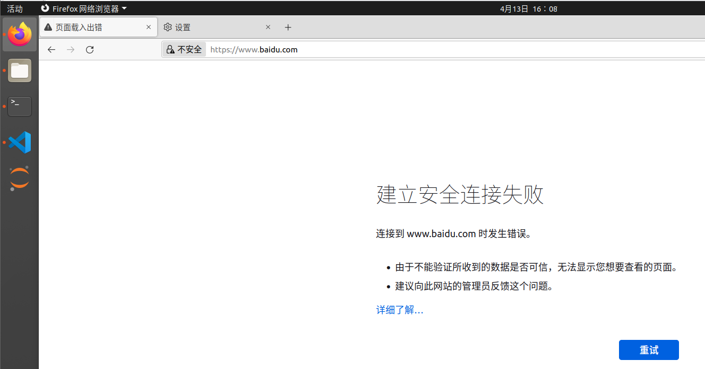

不出意外，没有连接成功。查看一下 Proxy 打印的信息

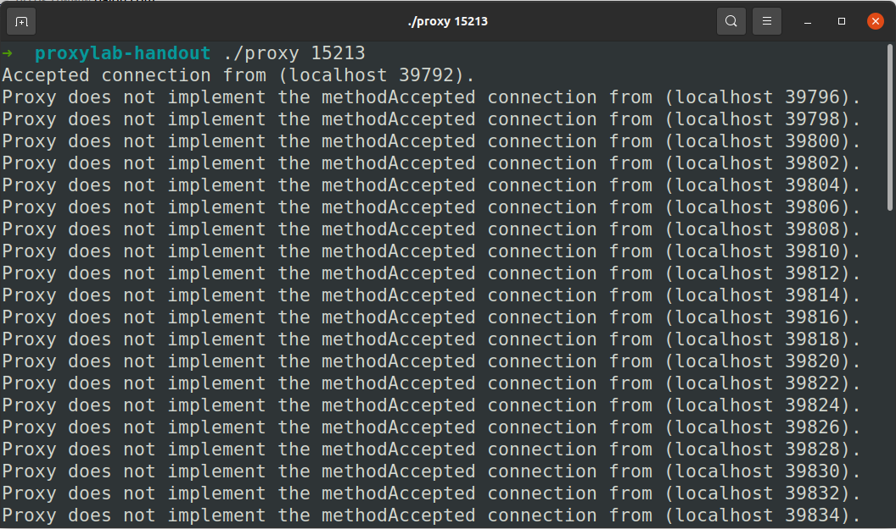

是因为请求的都不是 GET 方法

那就只好访问一下 TINY 服务器试试了，先打开服务器，设置端口为 15214

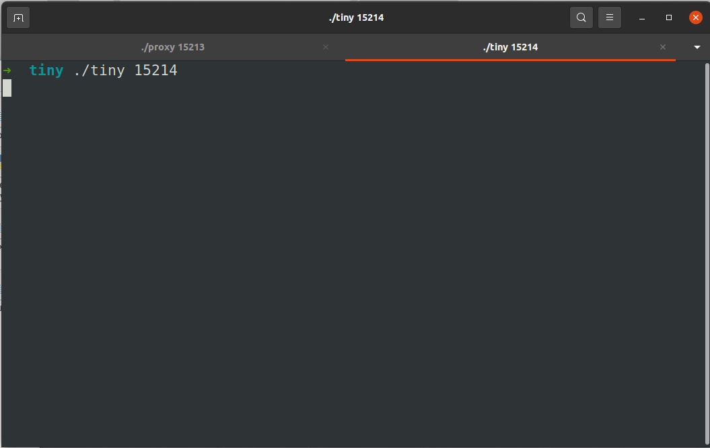

FireFox 访问：`localhost: 15214`

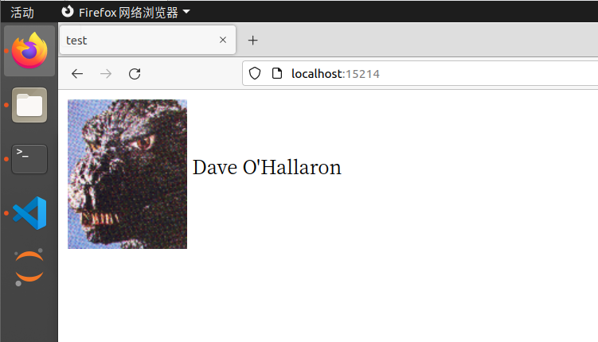

访问成功了！甚至显示出了哥斯拉！

Proxy 打印出一些转发信息：

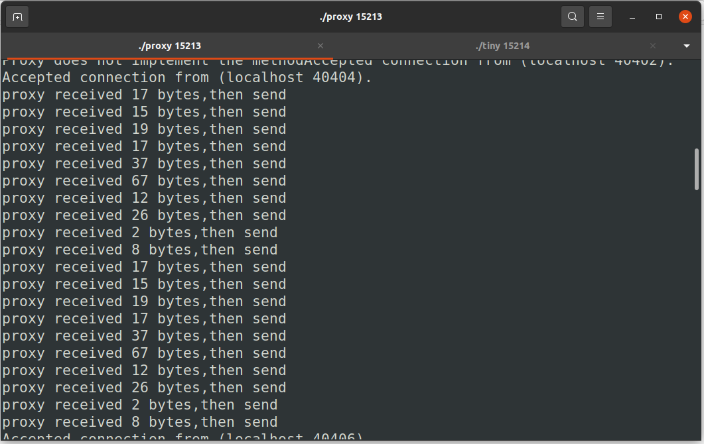

# 总结

- 我做这个实验感受非常痛苦。原因在于 CSAPP 的后三章讲得太简略了，对于我这种没有学过操作系统与计算机网络的人来说，弄懂它们是很艰难的。比如，从信号量的 P、V 操作到读者-写者模型就花费了我半天来理解
- 当然，完成实验也是成就感满满。尤其是最后打开 FireFox，连接上 TINY ，看到哥斯拉跳出来的那一刻，一种无与伦比的喜悦由内而外迸发，一切辛苦都值得了。
- 这个实验还会继续更新的，希望有一天能用它访问所有的网页
- 本实验耗时 2 天，约 16 小时

# 写在最后

课本早已在上周就读完了，而这也是 CSAPP 的最后一个实验

至此，CSAPP 的学习算是告一段落了。可以说， CSAPP 是我计算机的启蒙教材，真正为我打开了计算机领域的大门，往后，我将以它为纲，往更深处学习

还有更深的感想与总结等有时间了再单开一篇文章写吧

最后，以侯捷老师的一段话结束我这三个月的冒险之旅

>作为一个好的学习者，背景不是重点，重要的是，你是否具备正确的学习态度，起步固然可以从轻松小品开始，但如果碰上大部头巨著就退避三舍、逃之夭夭，面对任何技术只求快餐速成，学语言却从来不写程序，那就绝对没有成为高手乃至专家的一天。
>有些人学习，自练就一身钢筋铁骨，可以在热带丛林中披荆斩棘，在莽莽草原中追奔逐北。有些人的学习，既未习惯大部头书，也为习惯严谨格调，更未习惯自修勤学，是温室里的一朵花，没有自立自强的本钱。
